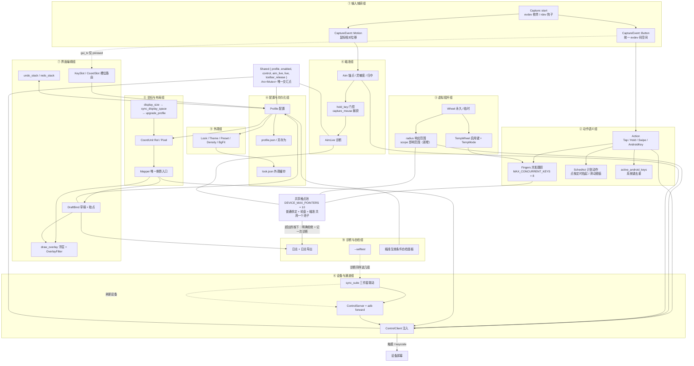
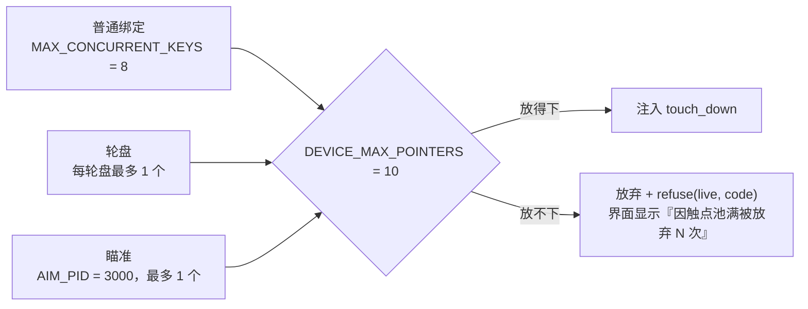
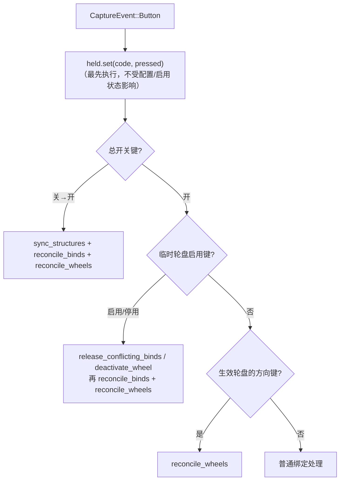
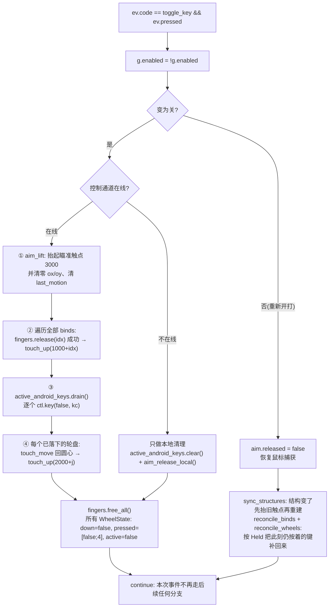
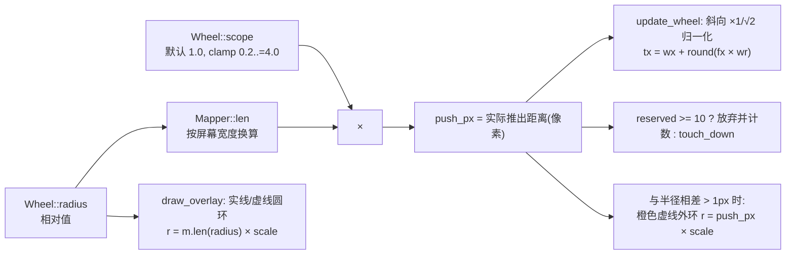
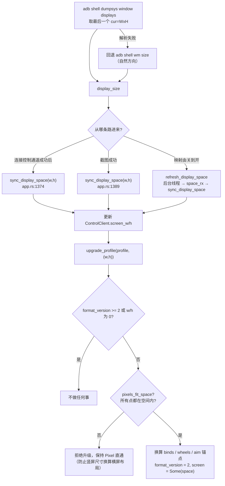
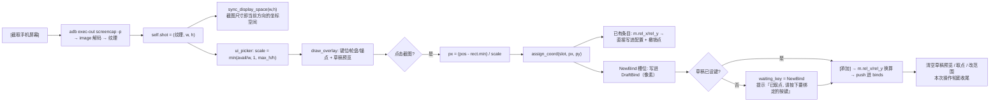
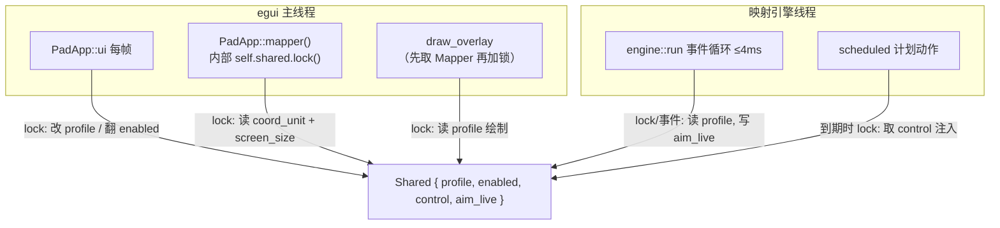
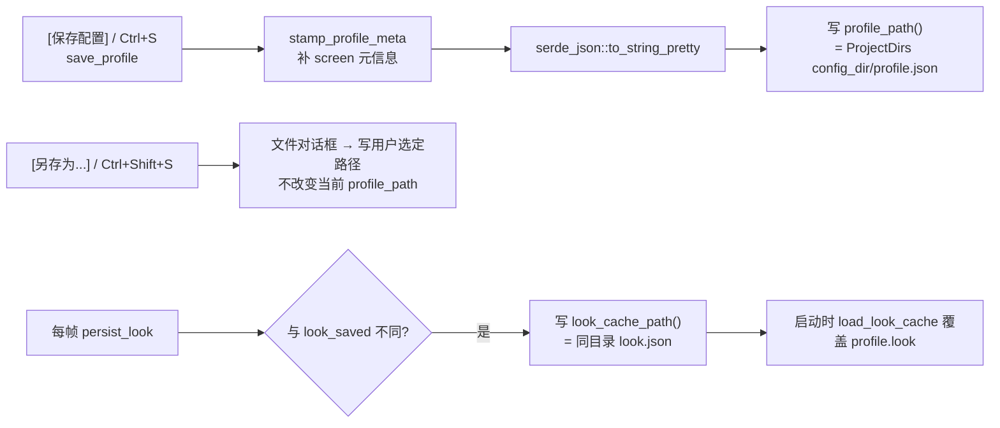
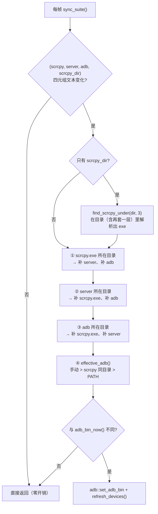

# scrcpy-pad 成分组分说明 · 第一线：功能线

> **本文件是《成分组分说明》三线文档中的第一线——功能线。**
>
> | 序 | 文件名 | 回答的问题 |
> |---|---|---|
> | 一 | `功能组分说明.md`（本文件） | 软件有哪些功能、归成哪些功能组、彼此如何联动 |
> | 二 | `文件与执行逻辑.md` | 每个文件做什么、运行时线程与数据如何流动 |
> | 三 | `设计思想与演进.md` | 为什么这样设计、历史包袱与演进方向 |
>
> **写作基准与校验口径**：本文内容以唯一权威源码目录 `src/` 为准（`scrcpy-pad/src/` 是过时旧副本，`release/` 是打包产物，均未参考）。所有关键结论都给出 `文件:行号` 或函数名，可直接对照代码查证。
>
> **上一轮遗留的例外已经关闭**：第 2.4 节曾声明的「影响范围 `Wheel::scope` 尚未落地」已不成立——`scope` 现已存在于 `src/keymap.rs`（`Wheel` 现为 `up/down/left/right/cx/cy/radius/scope/temp` 九个字段，见 `keymap.rs:522-539`），第 2.4.1 节即为其正式说明。
>
> **本轮（2026-09-21）同步的四件事**：① 引擎侧的**共享触点池**与**归属对账 / 结构指纹**（第 1.1、1.2、1.3、2.3、2.4、3.1、3.2、3.3、4.2、4.3 节）；② `settings.rs` 的 **scrcpy 目录记忆与 BOM 容错**（第 1.7、2.8、3.13、4.7 节）；③ 浮层的**键位显示亮度**与画布坐标空间（第 1.8、2.10、2.7、4.8 节）；④ 新建轮盘的固定半径与落点。凡不确定或未见实现之处，仍一律显式标注「（代码中未见明确实现）」。

---

## 一、概念名词体系（术语表）

### 1.1 配置与总控

| 中文名 | 代码标识符 | 一句话定义 | 它存在的原因 |
|---|---|---|---|
| 配置 | `Profile`（`keymap.rs:492-510`） | 一份完整的映射方案：总开关键、键位列表、轮盘列表、瞄准参数、外观 | 让"一套手感"可以被保存、分享、切换；也是撤销栈与 JSON 持久化的基本单位 |
| 键位列表 | `Profile::binds: Vec<KeyBind>` | 普通绑定的有序数组，**索引即身份** | 索引被用于触点 id（`1000+idx`）与并发跟踪表下标，因此删除条目会导致后续索引整体前移（见 4.2） |
| 轮盘列表 | `Profile::wheels: Vec<Wheel>` | 虚拟摇杆数组，索引同样被用于触点 id（`2000+idx`） | 同上 |
| 配置格式版本 | `Profile::format_version` / `PROFILE_VERSION = 2`（`keymap.rs:5`） | 1 = 坐标存屏幕像素（旧格式）；2 = 坐标存相对比例 0..1 | 让"改单位"这种破坏性变更可以对老配置文件安全降级处理 |
| 坐标单位 | `CoordUnit::{Pixel, Rel}`（`keymap.rs:49-55`） | 由 `format_version` 推导（`Profile::coord_unit`，`keymap.rs:619-625`） | 是 `Mapper` 唯一的输入开关，决定"配置里的数字怎么变成像素" |
| 总开关键 | `Profile::toggle_key`（`keymap.rs:501`，默认 `66` = KEY_F8） | 映射总开关的键盘按键 | 打游戏/打字之间需要一个"一键收手"的闸门，且必须能在任何状态下生效 |
| 映射开关 | `Shared::enabled`（`engine.rs:649`） | 运行时唯一的使能标志 | 所有注入路径的总闸；引擎靠它决定"继续处理事件"还是"整条丢掉" |
| 配置元信息 | `Profile::screen`（`keymap.rs:623`） | 记录这份布局是按哪个分辨率设计的 | 只作显示参考；相对坐标本身已自适应，但它能帮助排查"这份配置是给谁调的" |
| 共享状态 | `Shared` / `SharedState = Arc<Mutex<Shared>>`（`engine.rs:647-666`） | 界面线程与引擎线程唯一的交汇点，含 `profile / enabled / control / aim_live / live / toolbar_release` | 引擎与 egui 是两个线程，必须有一处受锁保护的共同真相 |
| 引擎运行状态 | `EngineLive`（`engine.rs:188-195`）：`pointers / refused / last_refused` | 当前占用的注入触点数、因触点池满被放弃的按下次数、最近一次被放弃的是哪个键 | "按了没反应"最常见的原因是设备端触点池满了；把这个数字与那个键显示出来，用户才知道该少按一个键，而不是以为程序坏了（`app.rs:2226-2235`） |
| 物理按键镜像 | `Held`（`engine.rs:168-184`）：`set(code, pressed)` / `has(code)` | "此刻物理上真的按着"的键码集合，只认按键事件，不受配置与轮盘启用状态影响 | 键盘事件是边沿触发的：属主切换（启用/停用临时轮盘、开关映射）那一瞬间，引擎必须知道某个键还按着没有，否则只能等用户"松开再按一次" |

### 1.2 动作语义（一个键按下后做什么）

| 中文名 | 代码标识符 | 一句话定义 | 它存在的原因 |
|---|---|---|---|
| 绑定 / 键位 | `KeyBind { key, action }`（`keymap.rs:452-456`） | "某个键码 → 某个动作"的一条规则 | 映射的最小可编辑单位；界面上的每一行、撤销栈里的每一个改动都围绕它 |
| 点按 | `Action::Tap { x, y, duration_ms, radius }`（`keymap.rs:334-342`） | 按下时触点落下，`duration_ms` 后自动抬起 | 绝大多数游戏按钮只需"点一下"；定时抬起把"按多久"从人手交给程序 |
| 长按 | `Action::Hold { x, y, radius }`（`keymap.rs:344-349`） | 按下键盘瞬间触点落下，抬起键盘瞬间触点抬起（全程实时跟随） | 需要"按住多久就按多久"的动作（开镜、蓄力、持续移动） |
| 按住切换 | `Action::Tap { duration_ms: 0 }`（`keymap.rs:335-336`；`engine.rs:1194-1205`） | 点按的特殊档：按下不松手，直到再次按同一键才抬起 | 用键盘实现"开关式"操作，省去一直按住的手部负担 |
| 共享触点池 | `DEVICE_MAX_POINTERS = 10`（`engine.rs:46`）+ `Fingers::try_down(idx, others)`（`engine.rs:123`） | 普通绑定、轮盘、瞄准三个子系统**抢同一个** 10 触点池；`others` 就是"别的子系统此刻已占用几个" | 设备端 `PointersState.MAX_POINTERS = 10`，超出的按下会被服务端**直接丢弃**（不是排队）。客户端必须自己先算这笔账，否则用户看到的是"按下没反应、原因不明" |
| 滑动 | `Action::Swipe(Swipe)`（`keymap.rs:351`、`405-412`） | 按下时沿一条轨迹滑动一次 | 对应 QtScrcpy 的 `KMT_DRAG`；用于技能划屏、镜头甩动等 |
| 滑动曲线 | `Easing`（`keymap.rs:143-160`）+ `easing_apply`（`keymap.rs:181-195`） | 把"时间 t"映射为"沿轨迹的进度"，即速度分布 | 起终点相同、速度分布不同的滑动，在手感与（在部分游戏中）识别结果上并不等价；曲线让这两件事可以分开调 |
| 滑动轨迹 | `SwipePath`（`keymap.rs:230-242`）+ `swipe_points`（`keymap.rs:261-276`） | 决定路径的空间形状：条形 / 方形 / 圆形 | 有些手势必须画出特定形状（画圈、画方），直线轨迹无法表达；采样点由起终点派生，所以配置里只需存两个端点 |
| 系统键 | `Action::AndroidKey { keycode }`（`keymap.rs:353`） | 直接向设备注入 Android keycode（返回=4、主页=3 等） | 触摸注入无法表达"返回键"，必须走 keycode 通道 |
| 键码空间 | `KeyBind::key: u16`（`keymap.rs:454`） | 全平台统一的 evdev 键码空间 | 让配置在两平台可互换；Windows 由 rdev 映射到同一空间（`capture.rs:372-478`） |
| 右键常量 | `BTN_RIGHT = 273`（`keymap.rs:33`） | 鼠标右键的 evdev 码 | 瞄准门控键最常用的一档，单独给出便于"用右键"一键设置 |

### 1.3 虚拟摇杆（轮盘）

| 中文名 | 代码标识符 | 一句话定义 | 它存在的原因 |
|---|---|---|---|
| 轮盘 / 虚拟摇杆 | `Wheel`（`keymap.rs:522-539`） | 四个方向键驱动一个以 `(cx, cy)` 为圆心、`radius` 为半径的虚拟摇杆 | 对应 QtScrcpy 的 `KMT_STEER_WHEEL`；键盘无法直接产生"模拟量方向 + 力度" |
| 圆心 | `Wheel::cx / cy` | 触点落下的中位坐标（相对值） | 摇杆的"回中点"，也是每次推杆的起点 |
| 响应范围 / 半径 | `Wheel::radius`（`keymap.rs:530`）；点按/长按另有同名字段 | 既决定截图浮层上圆环的大小，也决定手指被推出的距离 | 一个数字同时承担"看得见"和"推得动"，便于对着截图调参 |
| 影响范围 / 范围系数 | `Wheel::scope`（`keymap.rs:531-535`，`#[serde(default = "default_wheel_scope")]`，默认 `1.0`，代码内 `clamp_scope` 到 `0.2..=4.0`） | 手指实际推出距离 = `radius × scope`，唯一定义在 `Wheel::push_px`（`keymap.rs:546-548`） | 游戏的摇杆判定圈往往与"看得见的圆环"不一致：圆环要够大才好点选/好辨认，但手指推太远会被判成另一个方向。解耦这两个量，才能在不改变视觉与响应圈的前提下微调真实推动距离 |
| 新建轮盘半径 | `NEW_WHEEL_RADIUS_PX = 150.0`（`keymap.rs:485`）+ `Wheel::new_default`（`keymap.rs:560-572`） | 点[添加轮盘]新建的摇杆半径固定 150 **像素**，按当前坐标空间换算成相对值后入配置 | 旧版写死"屏宽的 1/9"（2772 宽横屏上就是 307px），比用户手调的大一圈；固定像素才能让"界面显示的半径"与"新建出来的半径"一致 |
| 新建轮盘落点 | `next_wheel_spot(wheels)`（`keymap.rs:599-614`）+ `WHEEL_SPOTS` / `WHEEL_MIN_GAP`（`keymap.rs:577-592`） | 在候选点里挑一个与所有已有轮盘圆心距离 ≥ `WHEEL_MIN_GAP` 的落点，候选点用尽则沿网格错开 | 两个摇杆圆心重合时，浮层上的圆环与方向标注会糊成一团，用户分不清哪个是刚建的那个 |
| 永久轮盘 | `Wheel::temp == None`（`keymap.rs:536-538`；`engine.rs:1159`） | 任何时刻都生效的摇杆 | WASD 走路这类"一直在用"的方向输入 |
| 临时轮盘 | `Wheel::temp: Option<TempWheel>`（`keymap.rs:536-538`） | 仅在启用期间生效的摇杆 | 让同一批方向键在不同时刻归属不同摇杆（走路 vs 开车 vs 开镜） |
| 启用键 | `TempWheel::key`（`keymap.rs:514-518`） | 激活/关闭该临时轮盘的按键；**无论该轮盘是否生效，这个键都归它自己**（`key_owned_by_wheel`，`engine.rs:293-303`） | 区分"这一批方向键现在归谁"的开关 |
| 启用模式 | `TempMode::{Hold, Toggle}`（`keymap.rs:459-465`） | `Hold` = 按住启用键期间生效，松开即失效；`Toggle` = 按一下开、再按一下关 | `Hold` 适合"临时切一下"，`Toggle` 适合"长时间换模式" |
| 归属对账 | `reconcile_binds`（`engine.rs:210-254`）/ `reconcile_wheels`（`engine.rs:264-287`） | 把"谁该有触点"完全重算成 `该轮盘此刻是否生效 × 对应物理键是否按着`，然后补按/补抬 | 归属切换是边沿事件，只靠事件流会让"仍按着的键"失去触点；对账让切换**即时生效**，不需要用户松手重按 |

### 1.4 FPS 鼠标瞄准

| 中文名 | 代码标识符 | 一句话定义 | 它存在的原因 |
|---|---|---|---|
| 鼠标瞄准 | `Aim`（`keymap.rs:547-565`） | 把鼠标的**相对位移**映射成手机上一根手指的持续拖动 | 对应 QtScrcpy 的 `mouseMoveMap`；FPS 转视角靠手指拖动，而鼠标天生只有相对位移 |
| 锚点 | `Aim::anchor_x / anchor_y` + `anchor_set()`（`keymap.rs:587-589`） | 手指落下的起点（相对坐标）；`(0,0)` 视为未设置 | 拖动必须有起点；锚点取在视角区中央空白处，才不会误触 UI |
| 灵敏度 | `Aim::sensitivity_x / sensitivity_y` | 每 1 个鼠标计数对应多少设备像素 | 不同游戏、不同 DPI 需要不同换算比 |
| 反转 Y | `Aim::invert_y` | 纵向位移取反 | 飞行/载具类游戏的常见需求 |
| 归中 | `RecenterMode::{Idle, Threshold, Never}`（`keymap.rs:516-524`）+ `aim_recenter`（`engine.rs:216-233`） | 手指拖动无法无限持续（会被屏幕边界挡住），偏移过大时"抬指 + 在锚点重按" | 这是把"无限鼠标位移"投影到"有限屏幕"的唯一办法；三种策略是手感取舍 |
| 静止归中 | `RecenterMode::Idle` + `Aim::recenter_idle_ms` | 鼠标停止移动一小段时间后归中 | 顿挫最不易察觉，默认档 |
| 阈值归中 | `RecenterMode::Threshold` + `Aim::recenter_threshold` | 偏移超过阈值立即归中 | 适合不停转圈的打法 |
| 门控键 / 按住才瞄准 | `Aim::hold_key`（`keymap.rs:562`，`0` = 始终瞄准） | 仅当该鼠标键按住时才瞄准 | 对应"开镜才转视角"；同时也避免平时误触 |
| 捕获鼠标 | `Aim::capture_mouse`（`keymap.rs:563`）+ `Capture::mouse_grab`（`capture.rs:39`） | 瞄准期间隐藏/冻结系统光标 | 否则鼠标会顶到屏幕边缘、位移丢失，且光标乱跑影响观感 |
| Ctrl+Alt 交还鼠标 | `AimState::released`（`engine.rs:151`）+ `ctrl_alt_chord`（`engine.rs:47-49`） | 按一次 Ctrl+Alt 把鼠标交还系统，再按一次收回 | 打游戏中途要切出去点别的窗口，不能把鼠标锁死 |
| 瞄准指针 | `AIM_PID = 3000`（`engine.rs:29`） | 瞄准触点固定使用的 pointer id | 与普通绑定（1000+）、轮盘（2000+）分开，互不误抬 |
| 瞄准运行状态 | `AimLive`（`engine.rs:120-137`） | 位移次数、最近位移、累积偏移、触点是否按下、已注入条数 | 界面需要回答"现在为什么没反应"，而不是让用户猜 |
| 瞄准生效条件 | `aim_active`（`engine.rs:162-167`） | `enabled && 锚点已设 && !released && (hold_key==0 \|\| gate_down)` | 把"能不能瞄准"收敛成一个纯函数，界面自检与引擎判定共用同一口径 |

### 1.5 坐标与布局

| 中文名 | 代码标识符 | 一句话定义 | 它存在的原因 |
|---|---|---|---|
| 换算器 | `Mapper`（`keymap.rs:64-138`） | 配置坐标 ↔ 当前屏幕像素的**唯一**换算入口 | 注入、绘制、取点、界面显示四条出口若各算各的，迟早会互相错位 |
| 相对坐标 | `CoordUnit::Rel` | 存 0..1 比例，乘屏幕尺寸得像素 | 换分辨率、换手机、横竖屏切换后键位自动对齐 |
| 像素坐标 | `CoordUnit::Pixel` | 存绝对像素，直通使用 | 旧配置（v1）的原始语义；升级前必须原样可用 |
| 直通模式 | `Mapper::legacy`（`keymap.rs:68`、`91-97`） | 像素单位时不乘比例，只做四舍五入 | 保证老配置在升级发生之前"行为逐像素一致" |
| 配置升级 | `upgrade_profile`（`keymap.rs:665-701`） | 得知屏幕尺寸后，把 v1 像素坐标换算成相对坐标，只改单位、不改含义 | 老用户不该因为格式变更而重调布局 |
| 可装下判据 | `pixels_fit_space`（`keymap.rs:640-659`） | 检查所有点是否落在给定坐标空间内 | 防止"竖屏截图的尺寸去换算横屏的像素布局"这种毁配置事故（`keymap.rs:737-771` 有回归测试） |
| 触摸坐标空间 | `ControlClient::screen_w / screen_h`（`control.rs:28-32`） | 注入触摸时随消息一起发给 server 的屏幕宽高，即设备当前方向下的坐标空间 | 它一旦与真实方向不符，落在屏幕外的触摸会被系统**整条丢弃**，表现为"怎么点都没反应" |
| 当前显示器尺寸 | `adb::display_size`（`adb.rs:89-105`） | 优先取 `dumpsys window displays` 的 `cur=WxH`，回退 `wm size` | `wm size` 永远是自然方向；横屏时两者不一致（`adb.rs:542-551` 有回归测试） |
| 坐标空间校正 | `sync_display_space`（`app.rs:3039-3064`） | 更新控制通道的坐标空间并顺带升级旧配置；**绝不改动已取好的坐标** | 手机随时可能转屏；坐标空间必须跟当前方向走，但用户调好的布局不能被程序擅自"纠正" |
| 手动查询尺寸 | `refresh_display_space`（`app.rs:3284-3298`） | 后台线程查一次 `display_size`，结果经 `space_rx` 回 UI | 映射由关到开的那一刻需要重新确认方向，但查询会阻塞，不能卡 UI 帧 |
| 坐标编辑范围 | `COORD_RANGE = -8192..=8192`（`app.rs:31`） | 界面坐标框允许负值与超屏 | 横屏布局在竖屏下显示、截图方向与布局方向不一致时，键位本来就可能落在画面外，程序不做越界纠正 |

### 1.6 界面编辑

| 中文名 | 代码标识符 | 一句话定义 | 它存在的原因 |
|---|---|---|---|
| 键位槽位 | `KeySlot`（`app.rs:203-213`） | "正在等待按键的那一处"：新绑定/某条绑定/轮盘方向键/启用键/总开关键/瞄准门控键 | 让"按任意键"这一个动作能服务六种不同的绑定目标 |
| 坐标槽位 | `CoordSlot`（`app.rs:214-232`） | "正在等待在截图上点击的那一处"：绑定坐标/轮盘圆心/滑动起终点/圆形出发点/瞄准锚点 | 取点是单一交互，需要一张"点哪儿写到哪儿"的路由表 |
| 草稿 | `DraftBind`（`app.rs:280-317`）+ `draft_active` | 尚未提交的新键位临时状态，**坐标始终是像素** | 新增过程中用户还没决定最终分辨率语境，用像素最直观；提交时才换算成相对值 |
| 草稿复位 | `reset_draft_to_screen`（`app.rs:3586-3594`） | 按当前屏幕尺寸把草稿预览放到画面中央 | 新键位不该出现在上一个分辨率留下的坐标上 |
| 取点 / 改范围互斥 | `begin_pick`（`app.rs:1150-1154`）与 `begin_resize`（`app.rs:1156-1162`） | 两种交互同一时刻只保留一个，以最后一次操作为准 | 避免"两头挂着"导致截图点击的语义不确定 |
| 取消草稿 | `cancel_draft`（`app.rs:1164-1172`） | 清除取点等待、等待按键与草稿圆圈/轨迹 | 用户中途放弃时，界面上不该留下幽灵圆圈 |
| 截图取点 | `take_screenshot`（`app.rs:887-912`）+ `ui_picker`（`app.rs:4171-4360`） | 截一帧设备画面并在其上点击取坐标 | 相对坐标手算不现实；对着真实画面取点是最可靠的方式 |
| 截图浮层 | `draw_overlay`（`app.rs:3050-3330`） | 把键位/轮盘/锚点按配置坐标叠加画在截图上 | 让"配置里的数字"变成"眼睛能看到的位置"，是全部坐标编辑的视觉基准 |
| 浮层过滤 | `OverlayFilter`（`app.rs:235-263`） | 全部 / 仅键位 / 仅摇杆 / 永久摇杆 / 临时摇杆 / 锚点(FPS) | 键位一多，浮层会互相遮挡，看不清要对齐的那一层 |
| 摇杆编号 | `draw_overlay` 内 `idx_label = wi + 1`（`app.rs:3240-3242`、`3275`、`3296`） | 浮层标签写作"摇杆1/临时摇杆2"，与列表里的"轮盘N"（`app.rs:2876-2879`）使用同一个编号 | 两个摇杆方向键相同时，只靠方向键根本分不清画面上哪一圈是哪一个 |
| 响应范围拖拽 | `ui_picker` 内的指针拖拽段（`app.rs:4300-4338`） | 直接看原始指针状态拖动圆圈改半径 | 截图位于双向滚动区内，`resp.dragged()` 的拖拽仲裁会被滚动区吃掉，表现为"拖不动" |
| 快捷键缩放 | `zoom_radius`（`keymap.rs:22-28`）+ `RADIUS_ZOOM_FACTOR = 1.12`（`keymap.rs:15`） | Ctrl+`+` / Ctrl+`-` 按乘性因子缩放响应范围 | 半径是**相对值**（0.03 上下），用绝对差判"是否接近默认值"会让复位条件恒成立——`keymap.rs:718-735` 有专门回归测试锁死这个 bug |
| 界面缩放让位 | `options.zoom_with_keyboard`（`app.rs:1329`） | 改范围期间关掉 egui 自带的 Ctrl+`+/-` 整界面缩放 | 否则快捷键先被 egui 吃掉，界面变大而圆圈纹丝不动 |
| 撤销点 | `push_undo`（`app.rs:955-958`）/ `push_undo_snapshot`（`app.rs:962-969`） | 把"修改之前"的 `Profile` 快照压栈并清空重做栈，上限 50 | 键位布局是长时间试错的结果，必须可回退 |
| 延迟撤销点 | `pending_undo` + `undo_frame_marked`（`app.rs:380-385`、`2039-2048`） | 持锁修改处无法即时压栈，先存快照、帧末统一入栈 | 同一帧的多个改动合并成一个撤销步；也解开了"持锁时不能再加锁"的死结 |
| 重做栈 | `redo_stack` | 被撤销掉的状态 | 撤销按多了要能回来 |
| 编辑目标 | `EasingEditTarget`（`app.rs:237-241`） | 曲线参数编辑指向"已有绑定"还是"新增草稿" | 同一个曲线编辑窗口服务两种来源 |

### 1.7 设备与通道（scrcpy 三件套）

| 中文名 | 代码标识符 | 一句话定义 | 它存在的原因 |
|---|---|---|---|
| scrcpy 三件套 | `scrcpy_path` / `server_path` / `adb_path`（`app.rs:736-739`）+ `scrcpy_dir`（`app.rs:737`） | 运行映射所需的三个外部文件，外加"它们所在的目录" | 官方 Windows 发行包三者同目录；只填**目录**一个就够（其余自动补齐），比填三个文件省事 |
| scrcpy 目录 | `PadApp::scrcpy_dir: String`（`app.rs:737`）+ `apply_scrcpy_dir`（`app.rs:1465-1496`） | 用户直接指定的发行包目录；[应用]后按 `adb::find_scrcpy_under` 解析出 exe，并补齐 server 与 adb | 用户嘴里的"scrcpy 目录"就是解压出来的那个文件夹，"填一个就够"是这一栏存在的全部理由 |
| 三件套联动 | `sync_suite`（`app.rs:1287-1391`）+ `suite_synced`（`app.rs:363`） | 四元组 `(scrcpy, server, adb, scrcpy_dir)` 任一变化时：任一为空就从另几个的同目录推导补齐；只给目录则先解析出 exe；生效 adb 变化时自动刷新设备 | 手动填三个路径是纯粹的负担，且极易填错 |
| 生效 adb | `effective_adb`（`app.rs:1256-1270`） | 手动指定的 adb > scrcpy 同目录 > PATH | 三级优先，兼顾"精确指定"与"零配置可用" |
| 记住的 scrcpy 位置 | `app::locate_remembered_scrcpy`（`app.rs:4458-4474`） | 记住的 exe（**目录也算**）→ 记住的目录里重找 → 交给自动寻找 | 用户换版本/搬目录之后仍然能找回：`scrcpy-win64-v3.1 → v3.3` 时死 exe 路径一定失效，目录线索却还在 |
| 目录线索 | `Settings::scrcpy_dir`（`settings.rs:28-34`）+ `Settings::search_dirs`（`settings.rs:108-124`）+ `nearest_existing_dir`（`settings.rs:209-223`） | 死路径被清掉时把"它原来在哪"记进 `scrcpy_dir`，必要时上溯 1~2 层 | 死路径比空路径更糟（空路径还能走自动逻辑），但把位置一并抹掉同样糟——所以"清路径、留线索" |
| 安全下探 | `adb::find_scrcpy_under`（`adb.rs:236-258`）/ `adb::find_scrcpy_in_dir`（`adb.rs:225-227`）/ `adb::find_scrcpy_explicit`（`adb.rs:208-221`） | 只在**名字以 scrcpy 开头**的子目录里下探，允许外面再套一层任意名字的文件夹 | 因此可以安全地拿桌面/下载/用户主目录当基准（每层只有一次 `read_dir`），不会全树递归拖慢启动 |
| 配置读取容错 | `app::read_config_text`（`app.rs:4425-4432`）+ `app::backup_broken_config`（`app.rs:4438-4442`） | 读文本时去掉 UTF-8 BOM；解析失败时把原文件另存为 `xxx.json.broken` | 记事本加的 BOM 会让整份配置"解析失败 → 退回默认值 → 下一次落盘把用户内容覆盖掉"，一个字节的差别不该毁掉整份配置 |
| 强制重同步 | `resync`（`app.rs:1163-1166`） | 置空 `suite_synced` 并立即同步一次 | 手动改过路径后必须立刻生效，而不是等下一次文本变化 |
| 控制通道服务端 | `ControlServer`（`adb.rs:467-481`） | control-only 的 scrcpy-server 子进程 + adb forward 端口 | 只需要控制，不需要视频；比开一整路 video 轻得多 |
| 控制通道客户端 | `ControlClient`（`control.rs:25-98`） | 直连本地转发端口的 scrcpy 控制协议客户端 | 触摸/keycode 注入口 |
| 会话 id | `SCID = 0x1a2b3c4d`（`app.rs:17`） / `socket_name = scrcpy_{scid:08x}`（`adb.rs:422`） | socket 名中的会话标识 | 多开实例/与真实 scrcpy 共存时避免撞名 |
| 本地转发端口 | `LOCAL_PORT = 28383`（`app.rs:18`） | `adb forward tcp:28383 → localabstract:scrcpy_xxx` | 把设备侧 abstract socket 拉到本地 TCP |
| dummy 字节 | `ControlClient::connect`（`control.rs:38-52`） | 连接后必须先读到 server 发来的 1 个字节才算成功 | `adb forward` 在本地**总会先完成 TCP 握手**，设备侧未就绪时随即 EOF——不读 dummy 就会拿到"假连接" |
| 低延迟注入 | 专用写线程 + 无锁命令队列（`control.rs:55-72`） | 控制消息由独立线程串行写 socket | UI 帧率与注入时序解耦，避免卡帧导致按键抖动 |
| 下行丢弃线程 | `control.rs:74-90` | 持续读并丢弃 server 下行消息（剪贴板等） | 不读会把接收缓冲填满，最终阻塞 |
| 输入捕获 | `Capture`（`capture.rs:35-59`） / `CaptureEvent`（`capture.rs:17-23`） | 平台无关的全局输入事件源 | 映射的前提是"能拿到其它窗口的按键" |
| 映射屏蔽原键 | `Capture::grab`（`capture.rs:37`） + `grab_enabled`（`app.rs:367`） | 映射开启时 grab 键盘设备，原始按键不再传给其它程序 | 否则在游戏里按 W 会同时触发游戏自身的键盘绑定 |
| 引擎→界面回传 | `gui_tx` / `PadApp::gui_rx`（`engine.rs:322`、`app.rs:333`） | 只转发"按下的按键"给界面，用于"按任意键"绑定 | 引擎已经拿着全局捕获，界面没必要再开一路捕获 |
| 界面键盘回退 | `egui_key_code`（`app.rs:444-539`）+ `waiting_key` 分支（`app.rs:1301-1323`） | 等待绑定时直接用 egui 收到的按键事件 | Windows 全局钩子受 scrcpy 抢焦点影响，必须把 scrcpy 窗口置前才能绑定；egui 这条路不受影响，与 `gui_rx` 双路竞争、`waiting_key` 只消费一次，天然去重 |
| 启动 scrcpy 窗口 | `adb::launch_scrcpy`（`adb.rs:483-497`） | 独立子进程启动常规 scrcpy 画面 | 关掉本程序时不强杀，用户自行关窗口 |
| 参数助手 | `ArgHelp`（`app.rs:63-191`） | 常用 scrcpy 参数的中文说明 + 示例 + 加入/撤去按钮 | 参数名不直观，猜错一个字母就白折腾 |
| 启动预设 | `StartPreset`（`app.rs:34-60`） | 分辨率类预设先重置为 `--stay-awake` 再叠加；音频类直接增删 | 两类预设的语义不同：分辨率是"整串替换"，音频是"开关某一项" |

### 1.8 外观与诊断

| 中文名 | 代码标识符 | 一句话定义 | 它存在的原因 |
|---|---|---|---|
| 外观 | `theme::Look`（`theme.rs:254-294`） | 配色预设 + 控件密度 + 背景图设置，随配置保存 | "选用配置"应连同观感一起切换 |
| 语义色 | `Theme`（`theme.rs:31-62`） | 按**含义**取色（ok/warn/danger/key_tap/wheel_temp/…），不写死具体颜色 | 换主题时一处生效；浅色主题下深色浮层色必然不可读 |
| 配色预设 | `Preset::{Dark, Light, Nord, Catppuccin}`（`theme.rs:155-204`） | 四套完整配色 | 覆盖"默认观感不变"与"想要浅色/第三方配色"两类需求 |
| 控件密度 | `Density::{Compact, Standard, Loose}`（`theme.rs:207-232`） | 只保留三档，统一缩放行高、间距、字号、圆角 | 档位多了维护成本失控 |
| 背景图填充 | `BgFit::{Cover, Contain, Tile}`（`theme.rs:235-251`） | 铺满裁切 / 完整显示 / 平铺 | 用户截图与窗口比例几乎不会正好一致 |
| 外观缓存 | `look_cache_path()` = 同目录 `look.json`（`app.rs:3756-3760`） + `load_look_cache`（`app.rs:3763-3766`） + `persist_look`（`app.rs:3259-3280`） | 与键位配置同目录的一份"程序自用"外观缓存，启动时覆盖 `profile.look` | 没点过[保存配置]也要在重启后保持外观；内容不变才写盘，避免每帧写文件 |
| 键位显示亮度 | `Look::overlay_tone`（`theme.rs:271-274`，`-1..=1`，默认 `0`）+ `theme::tone_color`（`theme.rs:426-438`）/ `tone_alpha`（`theme.rs:441-444`）/ `tone_text`（`theme.rs:448-454`）/ `tone_ring_fill`（`theme.rs:464-472`） | 把截图上键位/摇杆的响应圈与标注整体加深（负）或变浅（正）；只改明度不改色相，填充透明度反向微调 | 游戏画面很亮时圈看不见、画面昏暗时圈又太扎眼；只有一个滑块才能"对着当前画面"现场调 |
| 标注对比描边 | `theme::paint_label`（`theme.rs:480-499`） | 先按正文色亮度自动取反色画四个方向的描边，再画正文 | 有了亮度档位，文字可能变成近黑或纯白；描边保证任何档位、任何背景上都读得出来 |
| 运行日志 | `PadApp::logs: VecDeque<String>`（`app.rs:365`）、`log()`（`app.rs:805-810`） | 保留最近 200 条的界面日志 | 一个"配好了却没反应"的问题，90% 靠日志定位 |
| 日志导出 | `build_log_content`（`app.rs:917-941`） + `adb::device_info`（`adb.rs:388-409`） | 环境信息 + 设备信息 + 运行日志的完整文本 | 便于向他人求助 |
| 自检 | `selftest()`（`main.rs:58-176`） | `--selftest` 无界面模式，逐项检查权限/adb/scrcpy/通道/协议注入 | 把"环境问题"与"程序问题"一刀切开；最终只发无害 hover（`action=7`、`pointer_id=u64::MAX`），不触碰屏幕内容 |
| 文件对话框 | `filedialog.rs` | 非阻塞原生对话框封装，独立线程 + channel，UI 每帧轮询 | 阻塞式对话框会把 egui 帧卡死 |

---

## 二、功能组划分

### 2.1 功能组总览与联动



图 1 只表达"谁依赖谁"；每条边的具体语义（谁先谁后、谁被谁吃掉）见第三节。

### 2.2 输入捕获组

- **包含的功能**：evdev 设备枚举与键盘/鼠标识别（`capture.rs:81-105`、`135-155`）、按键事件转发（`capture.rs:185-194`）、鼠标相对位移合并（`capture.rs:195-207`）、键盘 grab 与鼠标 grab 的状态同步（`capture.rs:168-176`）、Windows 侧 rdev 钩子与光标回中（`capture.rs:229-340`）。
- **组内协作**：`platform_start` 为每个识别出的设备起一个 `device_loop` 线程，共用同一个 `Sender<CaptureEvent>`；grab 标志由界面/引擎写、由设备线程读并落到 `EVIOCGRAB`。鼠标的 `REL_X/REL_Y` 在同一次 `fetch_events` 内累加后合成**一条** `Motion`，减少下游消息数。
- **输入**：物理键盘/鼠标事件、`grab` / `mouse_grab` 两个 `AtomicBool`。
- **输出**：`CaptureEvent::Button{code, pressed}` 与 `CaptureEvent::Motion{dx, dy}` 两条流，其中 `Button` 同时进入引擎与界面（`gui_tx`），`Motion` 只进引擎。

### 2.3 动作语义组

- **包含的功能**：四种 `Action` 的语义实现（`engine.rs:1181-1292`）、并发跟踪 `Fingers`（`engine.rs:97-156`）、定时动作 `SchedAct`（`engine.rs:668-672`、`engine.rs:783-813`）、系统键去重（`engine.rs:1280-1290`）、触点抢占取消 `cancel_up_for`（`engine.rs:1303-1306`）、**共享触点池预算**（`Fingers::try_down` 的 `others` 参数，`engine.rs:123-138`）。
- **组内协作**：
  - `Fingers` 为每个绑定索引记录"是否已按下"，`try_down` 同时负责三件事：去抖、普通绑定并发上限 `MAX_CONCURRENT_KEYS = 8`（`engine.rs:40`）、以及"加上轮盘/瞄准已占用的触点后不得超过设备端 `DEVICE_MAX_POINTERS = 10`"（`engine.rs:46`）。`release` 只在确有按下记录时才允许注入 UP——队列两端严格成对。
  - **被拒绝的按下会说话**：挤不进触点池时不再"发出去让服务端悄悄丢掉"，而是由 `refuse`（`engine.rs:311-314`）记一次 `EngineLive.refused` 与 `last_refused`，界面左栏据此显示"因触点池满被放弃 N 次（最近是哪个键）"。
  - `Tap` 按下时把抬起动作排进 `scheduled`；`Swipe` 按下时一次性把整条轨迹的 `Move` 与终点的 `Up` 排进 `scheduled`；调度循环在每次事件等待前先处理到期动作，并把等待时间精确对齐到"最早到期时刻"（上限 4ms），使定时抬起误差从 ~4ms 降到 ~1ms（`engine.rs:894-913`）。
  - `Tap` 的 `duration_ms == 0` 走"按住切换"分支，完全不进 `scheduled`。
  - **结构变化先抬手**：`sync_structures`（`engine.rs:350-393`）用 `binds_signature`（`engine.rs:401-419`）识别"绑定表数量/键码/动作类型"的变化，一旦变化就 `release_all_binds`（`engine.rs:322-340`）把在按的触点全部抬起并补发 UP（连被删掉的槽位也遍历到），再按新长度重建按下表。
- **输入**：`CaptureEvent::Button`、`Profile::binds`、`Mapper`、`ControlClient`。
- **输出**：`touch_down / touch_move / touch_up / key` 四类控制消息；`Fingers` 与 `active_android_keys` 两个内部状态表、`EngineLive` 诊断快照。

### 2.4 虚拟摇杆组

- **包含的功能**：永久与临时轮盘的判定（`engine.rs:1154-1174`）、启用键与两种模式（`engine.rs:1096-1152`）、触点推杆与回中（`update_wheel`，`engine.rs:1414-1464`）、斜向归一化（`engine.rs:1441-1447`）、停用释放（`deactivate_wheel`，`engine.rs:1365-1375`）、冲突绑定强制释放（`release_conflicting_binds`，`engine.rs:1379-1407`）、影响范围 `scope`、**归属对账**（`reconcile_wheels`，`engine.rs:264-287`；`key_owned_by_wheel`，`engine.rs:293-303`）、**轮盘结构指纹与重建**（`wheel_signature`，`engine.rs:430-448`；`sync_structures`，`engine.rs:371-392`）、新建轮盘的固定半径与落点。
- **组内协作**：
  - `WheelState`（`engine.rs:674-681`）保存四方向按下位、触点是否落下、上次落点与临时轮盘是否激活。`update_wheel` 由 `pressed[4]` 计算出 `dx = right - left`、`dy = down - up`；两者同时非零时乘 `1/√2` 归一化，保证斜向不会比直向"推得更远"。
  - **方向状态不是"自己记的"，而是重算出来的**：`reconcile_wheels` 把每个方向位直接写成 `该轮盘此刻是否生效 × 对应物理键是否按着`，然后调 `update_wheel` 补推/回中。于是"按下启用键的瞬间，已经按着的方向键立刻推动摇杆"不需要任何特判。
  - 触点落下采用"**先按圆心、再移到目标**"两步（`engine.rs:1456-1457`）：游戏看到的是从中位推出去的过程，而不是手指凭空出现在边缘。
  - 四方向全部松开时，`update_wheel` 先 `touch_move` 回圆心再 `touch_up`（`engine.rs:1431-1439`）；`deactivate_wheel` 同理（`engine.rs:1368-1374`）。**这个"先回中再抬起"不是多余的**：抬起坐标与落下坐标不一致时，部分游戏会把它判成一次滑动。
  - **触点池预算**：轮盘申请新触点前要看 `reserved`（普通绑定 + 瞄准 + 其它轮盘已占用的触点数，`wheel_pointers`，`engine.rs:306-308`）；挤不进去就放弃这一次按下并计数（`engine.rs:1451-1455`）。
  - **结构变化先抬手**：`wheel_signature` 只认"数量 + 四个方向键 + 启用键与模式"，**只改圆心/半径/scope 不会触发重建**（避免一边打一边调参被反复抬手）；指纹一变就先按旧状态把落下的轮盘触点回中再抬起，然后 `vec![WheelState::default(); 新长度]`（`engine.rs:373-392`）。
- **输入**：`CaptureEvent::Button`、`Profile::wheels`、`Mapper`、`ControlClient`、`Held`（物理按键镜像）。
- **输出**：轮盘触点（pid = `2000 + 索引`）的 down/move/up；被强制释放的普通触点与系统键；`EngineLive` 诊断计数。

#### 2.4.1 影响范围 `scope`（本轮已落地，现状说明）

> 这一节原写作时 `scope` 尚未进代码，现在它已存在于 `src/keymap.rs`；下文按**真实实现**描述。

| 项 | 说明 |
|---|---|
| 字段 | `Wheel::scope: f32`（`keymap.rs:531-535`），`#[serde(default = "default_wheel_scope")]`，`default_wheel_scope()` 返回 `DEFAULT_WHEEL_SCOPE = 1.0`（`keymap.rs:499-501`） |
| 语义 | **摇杆触点实际推出的距离 = `radius × scope`**，唯一定义在 `Wheel::push_px`（`keymap.rs:546-548`） |
| `radius` 的职责 | 不变：仍然决定截图浮层上那个圆环的大小（视觉圈 / 响应圈） |
| `scope` 的职责 | "影响范围系数"，乘在半径上，决定手指真正被推多远 |
| 取值范围 | `clamp_scope` 收敛到 `SCOPE_MIN = 0.2 ..= SCOPE_MAX = 4.0`（`keymap.rs:472-473`、`504-510`） |
| 界面 | 用 DragValue 编辑，并显示换算出的实际像素值（`app.rs:2967-2990`） |
| 浮层可视化 | 当推出距离与半径相差 > 1px 时，浮层额外画一圈橙色虚线外环表示"触点实际能推到的最大距离"，并在标签里显示像素值与倍数（`app.rs:3301-3327`） |
| 兼容性 | 老配置没有这个字段 → 反序列化得 `1.0` → **行为与老配置完全一致**（单测 `wheel_scope_defaults_and_clamps`、`wheel_push_px_is_a_radius_scale`，`keymap.rs:1014`、`1049`） |
| 与升级的关系 | `scope` 是无量纲系数，`upgrade_profile` 不需要也不应该对它做任何换算；`pixels_fit_space` 只检查 `cx/cy`，同样不受影响 |
| 它解决的问题 | 游戏的摇杆判定圈往往与"看得见的圆环"不一致：圆环要够大才好辨认、好拖拽，但手指推太远会被判成别的方向。把"视觉/响应圈"与"实际推动距离"解耦后，可以在不动视觉布局的前提下微调真实推杆距离 |

对应到注入代码，`update_wheel` 中的
`let wr = w.push_px(m);`（`engine.rs:1427`）
即 `m.len(w.radius * clamp_scope(w.scope))`
——**其余逻辑（归一化、两步落下、回中抬起、`st.last` 去重）一律不变**，因此这是一处纯参数化改动，不引入新的状态机分支。唯一新增的分支是触点池预算：`reserved >= DEVICE_MAX_POINTERS` 时放弃这次落下并计数（`engine.rs:1451-1455`）。

#### 2.4.2 新建轮盘的几何（本轮新增约定）

| 项 | 说明 |
|---|---|
| 固定半径 | `NEW_WHEEL_RADIUS_PX = 150.0`（`keymap.rs:485`）；`Wheel::new_default(m, cx, cy)`（`keymap.rs:560-572`）把它按**当前坐标空间**换算成相对值入配置，方向键默认 WASD、`scope` 默认 1.0、`temp = None` |
| 默认配置的参照 | `Profile::default()` 拿不到屏幕尺寸，按参考屏宽 `REFERENCE_SCREEN_W = 1080.0` 换算：`DEFAULT_WHEEL_RADIUS = 150/1080`（`keymap.rs:487-493`） |
| 落点 | `next_wheel_spot`（`keymap.rs:599-614`）在 `WHEEL_SPOTS` 候选点里挑第一个与所有已有轮盘圆心距离 ≥ `WHEEL_MIN_GAP = 0.12` 的点；候选点用尽则沿网格错开 |
| 调用点 | `ui_wheels` 的[添加轮盘]按钮（`app.rs:3024-3046`），日志会打印"半径 NNNpx、圆心 x%,y%" |
| 为什么不用比例 | 写死比例会让"界面显示的像素半径"随屏幕宽度漂移（旧版 0.111 在 2772 宽横屏上是 307px、在 1080 竖屏上是 120px）；用户是拿这个像素值去对照游戏里真实摇杆判定圈的 |
| 界面呼应 | 浮层摇杆标签带编号（`app.rs:3242`），与列表里的"轮盘N"（`app.rs:2876-2879`）一一对应 |

### 2.5 瞄准组

- **包含的功能**：生效条件判定（`aim_active`）、锚点钳制（`aim_anchor`，`engine.rs:193-199`）、落点钳制与边界探测（`aim_target`，`engine.rs:202-212`）、位移累加与注入（`aim_on_motion`，`engine.rs:236-274`）、归中三策略（`aim_recenter` + `aim_tick`）、鼠标捕获状态维护（`engine.rs:366-402`）、Ctrl+Alt 交还（`engine.rs:470-479`）、诊断（`AimLive`）。
- **组内协作**：
  - `aim_on_motion` 先检查 `aim_active`，再比对 `st.anchor_used`：锚点被改动或屏幕方向变了就结束旧拖动、从新锚点重开（`engine.rs:241-245`）。
  - 累加偏移后由 `aim_target` 把落点钳进屏幕并报告是否触边；触边时若策略不是 `Never` 就立即归中——否则"同方向继续转"将无法实现（`engine.rs:266-273`）。
  - `aim_tick` 每 4ms 轮询一次，负责两件事：映射关闭/门控松开时收手（`aim_lift`），以及静止归中（`engine.rs:277-293`）。
  - 鼠标捕获在引擎侧统一维护（`engine.rs:379-388`），条件为 `enabled && connected && aim.enabled && capture_mouse && anchor_set && (hold_key==0 || gate_down) && !released`——把"光标被冻结但什么都做不了"这种状态从设计上排除。
- **输入**：`CaptureEvent::Motion`、`CaptureEvent::Button`（门控键与 Ctrl/Alt）、`Aim` 配置、`Mapper`。
- **输出**：瞄准触点（pid = 3000）的 down/move/up；`AimLive` 诊断快照；`mouse_grab` 原子标志。

### 2.6 坐标与布局组

- **包含的功能**：`CoordUnit` 推导、`Mapper` 构造与六种换算（`x/y/point/len/rel_x/rel_y/rel_len`）、`pixels_fit_space` 判据、`upgrade_profile` 升级、`display_size` 查询、`sync_display_space` 校正、界面显示的像素化。
- **组内协作**：`Profile::coord_unit()` 决定 `Mapper` 的 `legacy` 开关；`Mapper` 对内提供"配置值 → 像素"与"像素 → 配置值"两个方向；`upgrade_profile` 在得知屏幕尺寸时把 v1 数据搬进 v2 语义，并用 `pixels_fit_space` 拒绝"方向不匹配"的危险换算。
- **输入**：`Profile`、`ControlClient` 的屏幕尺寸（或截图尺寸）。
- **输出**：一切像素坐标（给注入与绘制）、一切相对坐标（给配置与取点）。

### 2.7 界面编辑组

- **包含的功能**：`ui()` 主帧、`ui_binds`、`ui_wheels`、`ui_aim` / `ui_aim_body`、`ui_picker`、`ui_look`、`draw_overlay`、`ui_easing_editor`、`ui_args_helper`、撤销/重做、全局快捷键、对话框回收。
- **组内协作**：`KeySlot` / `CoordSlot` 是两张路由表；`waiting_key` 与 `picking` 是两个"当前正在等待什么"的状态；`begin_pick` / `begin_resize` / 各类按钮在切换交互时互相清理，落实"以最后一次操作为准"。每帧末尾统一入栈 `pending_undo`，把同帧多个改动合并成一步撤销。
- **输入**：用户操作、`gui_rx` 的按键事件、异步任务结果（`connect_rx` / `shot_rx` / `space_rx` / `loginfo_rx` / 文件对话框）。
- **输出**：对 `Shared.profile` 的修改、注入所需的 `ControlClient` 挂载与 `enabled` 翻转、日志。

### 2.8 配置与持久化组

- **包含的功能**：默认与加载（`load_profile`，`app.rs:4405-4416`）、严格校验读取（`read_profile_at`，`app.rs:4445-4448`）、保存（`save_profile`，`app.rs:1100`）、另存为、新建（`write_default_profile`）、选用切换（`apply_profile_switch`）、重新加载、检测合法性（`check_current_profile`）、元信息补全（`stamp_profile_meta`）、外观缓存读写。
- **组内协作**：所有配置文本读取都走同一个 `read_config_text`（`app.rs:4425-4432`）：去 UTF-8 BOM + 解析失败时 `backup_broken_config` 留一份 `xxx.json.broken`。`settings::load`、`load_profile`、`load_look_cache`、`read_profile_at` 四条入口共用它，因此"一个 BOM 让整份配置退回默认值、下一次落盘又把它覆盖掉"这条路径被整体堵死。`stamp_profile_meta` 只在 `format_version >= PROFILE_VERSION` 时写 `screen`（像素配置的该字段无意义）；`apply_profile_switch` 会清空撤销/重做栈，因为旧文件的撤销点与当前上下文无关（`app.rs:1138-1148`）；`reload_profile_from_current` 则保留撤销能力，并把重载本身记为一个撤销点（`app.rs:1121-1136`）。
- **输入**：`Shared.profile`、文件对话框返回的路径、截图/控制通道给出的屏幕尺寸。
- **输出**：`profile.json`（或用户指定路径）、`look.json`。

### 2.9 设备与通道组

- **包含的功能**：scrcpy/adb/server 定位与推导、设备列表、分辨率查询、截图、控制通道启停、scrcpy 窗口启动、日志用设备信息。
- **组内协作**：见 3.8 的 `sync_suite` 推导方向。
- **输入**：三个路径文本、选中的 serial、`scrcpy_args`。
- **输出**：`Vec<String>` 设备列表、`ControlServer` + `ControlClient`、PNG 截图字节、`DeviceInfo`。

### 2.10 外观组

- **包含的功能**：四套配色、三档密度、背景图填充/压暗/面板不透明度、**键位显示亮度**（`Look::overlay_tone` + `theme::tone_*`）、语义色到 egui 样式的应用（`theme::apply_style`，`theme.rs:319-379`）、浮层文字与对比描边（`paint_label`，`theme.rs:480-499`）。
- **组内协作**：`Look` 同时住进 `Profile`（随配置保存/切换）与 `look.json`（程序自用缓存）；界面每帧 `self.look()` 取一次，`apply_style` 统一落到 egui `Style` 与 `Visuals`，所以改配色不需要重启也不需要重建控件。**浮层的颜色不走 `apply_style`**，而是每处绘制各自过 `tone_color` / `tone_ring_fill` / `tone_text`：`draw_overlay`（`app.rs:3065`）读一次档位，键位圈、摇杆圈、滑动轨迹、锚点与全部标注都用同一个档位换算，保证整层浮层明暗一致；标注文字由 `paint_label` 自动配对比描边，所以加深到近黑、变浅到纯白都读得清。早期那两个"恒为白色"的 `outline_text` / `outline_stroke` 已删除（`theme.rs:386-389` 留了说明），免得某一处漏掉档位。
- **输入**：`Profile.look`、是否启用背景图。
- **输出**：egui 样式与窗口背景层绘制；`look.json`；截图浮层的实际配色。

### 2.11 诊断与自检组

- **包含的功能**：界面日志（上限 200 条，`app.rs:805-809`）、日志导出、`--selftest`、瞄准生效条件自检面板、运行状态显示（位移次数/最近位移/累积偏移/触点状态/已注入条数）、**引擎状态显示（触点 n/10 · 因触点池满被放弃 N 次（最近是哪个键），`app.rs:2214-2235`，读 `Shared.live: EngineLive`）**、控制通道意外断开检测、鼠标捕获状态变化日志。
- **组内协作**：自检面板把 2.5 节的 `aim_active` 条件逐条摊开，并在全部满足但 `hold_key != 0` 时给出"需按住 X 才转视角"的针对性提示；**引擎状态那一行则把 3.0 节的"共享触点池"变成可见的数字**——它是本轮"按了没反应"类问题的主要诊断入口（计数不为 0 就说明那一刻同时按住的键比设备能接的还多）；`--selftest` 则在无界面模式下走一遍 2.9 组的完整链路。
- **输入**：各组的状态与错误。
- **输出**：可读的中文诊断文本；`selftest` 以 `[PASS]/[FAIL]` 逐项打印并以退出码汇总。

---

## 三、联动关系（耦合与优先级）

### 3.0 共享触点池与"归属对账"（本轮新增的两条总则）

这两条是本节所有联动的前提，先单独说清楚。

**① 触点池是共享的，只有 10 个名额。**

设备端 scrcpy-server 的 `PointersState.MAX_POINTERS = 10`（`engine.rs:42-46` 的注释写明来源），超出这个数的按下会被服务端**直接丢弃**（不是排队）。因此普通绑定、轮盘、瞄准三个子系统抢的是同一个池子：



- `Fingers::try_down(idx, others)` 里的 `others` 就是"轮盘 + 瞄准此刻占用的触点数"（`engine.rs:120-129`）；调用点用 `wheel_pointers(&wheels) + usize::from(aim.down)` 算出来（`engine.rs:1180`）。
- 轮盘与瞄准同理：`update_wheel(..., reserved)` 返回"是否因池满放弃"（`engine.rs:1451-1455`），`aim_on_motion(..., reserved)` 在"触点还没落下且池已满"时直接返回 true 让调用方计数（`engine.rs:588-590`）。
- 8 这个普通绑定并发上限现在是**软上限**：真正的硬边界是 10，`MAX_CONCURRENT_KEYS` 只是"给 FPS 场景留出轮盘与瞄准的余量"（`engine.rs:36-40`）。
- 界面把这件事显式化：左栏的"引擎: 触点 n/10 · 因触点池满被放弃 N 次（最近是哪个键）"（`app.rs:2214-2235`，数据来自 `Shared::live: EngineLive`，`engine.rs:653-656`）。`last_refused == 0` 时显示"瞄准"（键码 0 不是合法 evdev 键）。

**② 归属一变，就按物理按键状态对账。**

键盘事件是边沿触发的，"某个键现在归谁"却可能在两帧之间改变。引擎因此维护一份**物理按键镜像** `Held`（`engine.rs:158-184`），所有按键事件在进入任何分支之前先写它（`engine.rs:987-989`，在总开关键判定之前）：



- `reconcile_binds`（`engine.rs:210-254`）只对**状态型**动作对账：`Hold` 与 `AndroidKey`（按着就该有触点、松开就该抬起）；`Tap`（含时长 0 的开关档）与 `Swipe` 是一次性动作，由事件自己收尾——在这里对账会把它们反复翻转/重放。
- `reconcile_wheels`（`engine.rs:264-287`）把方向状态重算为"是否生效 × 是否按着"，因此**启用瞬间已按着的方向键立刻推杆**。
- 归属判定收敛成一个函数 `key_owned_by_wheel`（`engine.rs:293-303`）：生效中轮盘的方向键归它；**临时轮盘的启用键无论是否生效都归它**（事件路径上它总被消费掉）。对账与事件路径收敛到同一口径，两者不会打架。

由此带来的两种"用户能直接感受到"的行为：

1. **松开启用键的瞬间**，仍被按住的 `Hold` / 系统键立刻补上触点——不需要松手重按一次；
2. **按下启用键的瞬间**，已经按着的方向键立刻推动摇杆——同样不需要重按。

### 3.1 总开关键 → 所有功能的使能门

`engine.rs:991-1064`。判定位于事件循环中**非常靠前**的位置，且不受 `enabled` 影响（因为它在 `if !enabled { continue; }` 之前），所以"关"和"开"都能被它捕获。



要点：

1. **共四处释放**，缺一不可：瞄准触点（否则松手后仍按在屏幕上）、绑定触点、系统键（否则设备上"返回键"一直处于按下）、轮盘触点。轮盘触点释放时先 `touch_move` 回圆心再 `touch_up`（`engine.rs:726-736`），与 `deactivate_wheel` 保持同一手法。释放完还会把 `live.pointers` 之类状态一并复位。
2. **无控制通道时也做本地清理**（`engine.rs:738-741`）：`active_android_keys.clear()` + `aim_release_local()`，再加 `fingers.free_all()` 与轮盘状态复位（含临时轮盘的 `active = false`）——本地状态绝不能残留，否则重新连上后会立刻注入一批错误的 UP。
3. **重新开启不只是复位 `aim.released`**（`engine.rs:1016-1056`）：还会先 `sync_structures` 再 `reconcile_binds` + `reconcile_wheels`，**按物理按键状态补回触点**——所以你按住 W 再按 F8 开打，摇杆会立刻生效，不需要松手重按。
4. **总开关键本身不会落到绑定流程**：末尾的 `continue` 保证它不可能同时被当成普通绑定（即使配置里存在 `key == toggle_key` 的绑定，也不会生效）。
5. **总开关键与其它门控的相对顺序**：瞄准门控键（3.4）和 Ctrl+Alt（3.5）的处理都在它之前，而 `held.set` 又在它们之前。因此若把 `hold_key` 与 `toggle_key` 设成同一个键，一次按下会**先**置 `gate_down = true`、**再**翻转 `enabled`。
6. **顶栏按钮走同一条收尾路径**（`app.rs:1956-1976`、`engine.rs:815-845`）：按钮只置 `Shared.toolbar_release = true`（引擎按上升沿取一次），由引擎在下一轮执行**同一份** `release_all`。早期版本按钮直接改 `enabled`，长按触点会永久留在屏幕上——这条已在 2026-09-19 那轮修复，本轮未变。

### 3.2 临时轮盘的启用键 → 方向键归属切换 → 冲突绑定强制释放

流程见 `engine.rs:1096-1152`：

| 模式 | 按下启用键 | 松开启用键 |
|---|---|---|
| `TempMode::Hold` | `wheels[j].active = true` + `release_conflicting_binds(...)` | `deactivate_wheel(...)`（释放触点 + 清四方向位 + `active = false`） |
| `TempMode::Toggle` | 若已激活 → `deactivate_wheel`；否则 `active = true` + `release_conflicting_binds` | 无动作 |

无论哪种模式，命中启用键后都会 `consumed = true` → `continue`，**启用键自身绝不会继续走到方向键或普通绑定流程**。

**关键的一步：切换之后立刻对账。** 两种模式在改变 `active` 之后都无条件执行一次 `reconcile_binds` + `reconcile_wheels`（`engine.rs:1131-1146`）。这一句同时修掉两个方向上的问题：

- **停用**：启用期间按着的 `Hold`/系统键在事件路径上收不到任何东西（那个键一直被启用键分支或轮盘方向键分支消费），对账会按 `Held` 把它们**补按回来**——所以"松开启用键的瞬间，原来按着不放的键立刻恢复功能"，不必松手重按（这是用户明确反馈过的痛点："松开启用键后，那个键必须松开手一次才能触发。战场是瞬息万变的"）；
- **启用**：对账会把已经按着的方向键立刻写成"按下"，摇杆当场开始推。

`release_conflicting_binds` 的必要性（`engine.rs:1379-1407`）——它遍历所有 `key ∈ {up, down, left, right}` 的普通绑定，把 `AndroidKey` 从 `active_android_keys` 移除并补发 `key(false)`，其余类型则 `fingers.release(i)` 后补发 `touch_up`。原因有两条，缺一都会出问题：

1. **防止触点永久卡死。** 绑定列表与轮盘列表彼此独立、没有任何唯一性约束，同一个键完全可能既是一条普通绑定的 `key`，又是某个临时轮盘的方向键。启用轮盘后，该键的事件在"方向键"分支就被 `handled = true; continue` 吃掉（`engine.rs:598-624`），普通绑定**永远收不到自己的 UP**——若它此前已经按下，触点就会一直落在屏幕上。
2. **防止普通绑定抢占方向输入。** 即使触点是在启用之前落下的，它依然是一个真实存在的设备触点：游戏看到的是"多了一根手指按在别处"，方向输入可能被判给错误的触点。

需要明确的是：**强制释放只在"启用瞬间"发生一次**。启用期间继续按方向键，事件只会走轮盘分支，普通绑定既不会 DOWN 也不会 UP——这正是"启用期间方向键归摇杆"的实现方式。而"停用瞬间把仍按着的键补回来"由紧随其后的 `reconcile_binds` 负责（见 3.0）。

### 3.3 焦点 / 优先级顺序

事件在同一次迭代中按固定次序尝试匹配，先命中者 `continue`，形成严格的优先级链：

```
held.set(物理按键镜像)  →  瞄准门控键 / Ctrl+Alt（旁路）  →  总开关键  >  临时轮盘启用键  >  生效中的轮盘方向键  >  普通绑定
```

| 序 | 判定 | 代码位置 | 命中后的行为 |
|---|---|---|---|
| — | `Held::set(code, pressed)` | `engine.rs:987-989` | 记录物理状态，**不终止流程**；这是后面所有对账的依据 |
| 0 | `aim.hold_key` 匹配 | `engine.rs:971-974` | 仅置 `gate_down`，**不 return**（旁路监听） |
| 0 | Ctrl/Alt + 双键同按 | `engine.rs:976-985` | 仅翻转 `aim.released`，**不 return**（且要求 `aim_captured` 为真） |
| 1 | `toggle_key` | `engine.rs:991-1064` | 翻转 `enabled` + 释放/对账流程 → `continue` |
| 2 | 临时轮盘启用键 | `engine.rs:1096-1152` | 切换激活态 + 冲突释放 + 对账 → `continue` |
| 3 | 生效中轮盘的方向键 | `engine.rs:1154-1174` | `reconcile_wheels` 重算方向状态 → `continue` |
| 4 | 普通绑定 | `engine.rs:1181-1292` | 按 `Action` 分派；申请触点时带上 `reserved` |

三处细节值得单独记住：

- **方向键分支只考虑"生效中"的轮盘**：`let engaged = w.temp.is_none() || wheels[j].active;`（`engine.rs:1159`）。未激活的临时轮盘方向键会**穿透到普通绑定**——这正是"临时轮盘没启用时，WASD 还能当普通键用"的原因。
- **方向键分支不会 `break`**：`handled` 用 `any()` 遍历所有生效轮盘，只表示"本次事件已消费"。因此**多个生效轮盘共用同一个方向键时会被同时驱动**，会同时落下多个轮盘触点（并一起争那 10 个名额）。这是配置层面需要避免的（代码中未见任何重复键校验）。
- **瞄准门控键的"特殊处理"就是"不特殊处理"**：它只在 `engine.rs:971-974` 记一次状态，之后**照常**参与总开关键、轮盘与普通绑定的匹配。用右键当开镜门控的同时，右键仍然可以被绑定成一个普通动作——这是刻意的旁路设计，不是遗漏。

### 3.4 瞄准门控键的状态机

`gate_down` 只有两个写入点：`engine.rs:466-468`（跟随门控键的按下/抬起）与 `AimState::default()`。它向外影响三处：

1. `aim_active`（`engine.rs:162-167`）——不满足则 `aim_on_motion` 直接返回，位移被丢弃；
2. 鼠标捕获条件（`engine.rs:384-386`）——`hold_key != 0` 时只在按住期间捕获，松手立刻把光标还给系统；
3. 界面自检文案（`app.rs:3387-3394`）——"已就绪，但需按住 X 时才会转动视角"。

`Aim::anchor_set()` 以 `abs > 1e-6` 为判据（`keymap.rs:587-589`），所以 `(0,0)` 是"未设置"的哨兵值；这也是 `upgrade_profile` 里把锚点坐标一并换算的原因——否则升级后锚点会被误判为未设置。

### 3.5 鼠标捕获与 Ctrl+Alt 交还

| 状态 | `aim.released` | `mouse_grab` | 效果 |
|---|---|---|---|
| 正常瞄准 | `false` | `true` | 光标隐藏、位移持续累积 |
| 按下 Ctrl+Alt | `true` | `false` | 光标立刻归还系统，瞄准停止（`aim_active` 为假） |
| 再按 Ctrl+Alt | `false` | `true` | 收回 |
| 映射关闭 / 通道断开 / 锚点未设 / 门控未按 | 任意 | `false` | 绝不出现"光标被冻结但什么都做不了" |

`ctrl_alt_chord`（`engine.rs:78-80`）要求"按下的那一方是 Ctrl 或 Alt，且两者都在按住状态"，因此**一次组合只切换一次**，按住不放不会连发（`ctrl_alt_chord_fires_once_per_press`，`engine.rs:1559`）。且该分支被 `aim_captured = aim.enabled && aim.capture_mouse && aim.anchor_set()` 守卫（`engine.rs:960-969`、`983`）——不打算捕获鼠标时，Ctrl+Alt 不会被本程序改状态。

### 3.6 轮盘半径 / 影响范围 → 触点位移距离



- **改造前**：`radius` 一个量同时决定浮层圆环与手指推出距离，二者被绑死。
- **改造后**：`radius` 仍然单独决定圆环（`app.rs:3223`），`scope` 只乘在注入距离上（`Wheel::push_px`，`keymap.rs:546-548`；消费点 `engine.rs:1427`）。于是"响应范围圈"与"触点实际可达范围"解耦。
- **为什么必须画那个橙色虚线外环**：解耦之后，光看圆环已经无法判断手指到底能推多远，调试时极易误判（"我把圈画得跟游戏摇杆一样大，为什么判定成反方向？"）。外环把不可见的注入距离重新变成可见的，并在标签里显示像素值与倍数，方便与游戏里真实摇杆的判定圈直接对照。
- **与响应范围的耦合关系**：`scope` 不改变"哪个区域算命中"——它只改变推杆幅度。取点、改范围（Ctrl+`+/-`、拖动圆圈）操作的都是 `radius`；`scope` 走独立的 DragValue。两者在同一个轮盘行里并排显示，像素值 `= m.len(radius) × scope` 由界面即时算出，供对照。
- **与浮层过滤的耦合**：外环属于轮盘的一部分，随 `OverlayFilter` 一起显示/隐藏——选 `永久摇杆` 时只对 `temp == None` 的轮盘画外环，选 `临时摇杆` 时反之（筛选逻辑见 `app.rs:3212-3221`）。
- **与旧配置的耦合**：无该字段的 JSON 反序列化得 `1.0`，注入距离与改动前逐像素一致；`upgrade_profile` 不做任何涉及 `scope` 的换算。
- **与触点池的耦合**：推出距离变大不会多占触点（每个轮盘始终只占 1 个），但"要不要落下这个触点"要先过 10 个名额的预算（见 3.0）。

### 3.7 坐标单位 Rel/Pixel → Mapper → 四条出口的一致性

`Mapper` 是**唯一**做坐标换算的地方（`keymap.rs:57-59` 的文档注释明确写了这一点），四条出口全部经由它：

| 出口 | 位置 | 用到的方向 |
|---|---|---|
| ① 注入 | `engine.rs` 各处（`bind_point`、`Tap`/`Hold`、`Swipe` 起终点、`update_wheel` 圆心与半径、`aim_anchor` / `aim_target`） | 配置值 → 像素（`point` / `x` / `y` / `len`） |
| ② 绘制 | `draw_overlay`（`app.rs:3060`、`3078-3079`、`3101-3102`、`3222-3223`） | 配置值 → 像素，再乘浮层缩放 `scale` |
| ③ 取点 | `assign_coord`（`app.rs:953-1023`） | 像素 → 配置值（`rel_x` / `rel_y`） |
| ④ 界面显示与编辑 | `ui_binds`、`ui_wheels`（`app.rs:2861-3047`）、`ui_aim_body` | 双向：显示时 `x/y/len`，写回时 `rel_x/rel_y/rel_len` |

一致性由三点保证：`legacy` 开关只在 `Mapper` 构造时决定；`CoordUnit` 只由 `format_version` 推导；任何新增的坐标字段都必须同时接进这四条出口。**`DraftBind` 是唯一的例外**——草稿坐标刻意保持像素（`app.rs:280-317` 的注释），只在提交时换算，因为草稿还没有"正式单位"的语境，用像素最直观。

**本轮新增的一条纪律（画布坐标空间）**：②这条出口用的屏幕尺寸来自 `PadApp::screen_size()`（`app.rs:3541-3554`），它**优先取截图尺寸**，取不到才退回控制通道尺寸。原因是控制通道尺寸会在"连接控制 / 手机转屏 / 后台刷新"时变化，而浮层是画在截图上的——用会变的尺寸去画一张不变的图，观感就是"同一个摇杆毫无征兆地突然变大/移位"。注入仍按控制通道尺寸单独计算（`inject_space()`，`app.rs:3558-3564`），两者不一致时画布上方给出明确提示（`app.rs:4256-4268`）。画布缩放系数也只依赖窗口高度与截图尺寸（`app.rs:4277-4279`），不再用"当前剩余高度"，否则右侧多出一行设置就会让整张浮层跟着缩放。

### 3.8 屏幕方向变化 → display_size → sync_display_space → upgrade_profile



关键约束：

- **只校正坐标空间，绝不改动已取好的坐标**（`app.rs:3032-3038` 的设计说明）。手机临时切到别的方向再切回来，配置必须原样可用。
- **升级必须发生在任何注入之前**：连接成功后立刻 `sync_display_space`（`app.rs:1373-1374`），避免出现"按错误单位注入"的中间态（`keymap.rs:661-664` 的注释说明了这个时序要求）。
- **升级失败是安全结果而非错误**：`pixels_fit_space` 返回 false 时不升级、不改任何数值，像素坐标继续直通使用。宁可暂时不升级，也不能把用户辛苦调好的布局算坏。
- **锚点超界由注入前钳制兜底**：方向变化后锚点可能落在当前空间之外，`aim_anchor` 会把它钳进屏幕（`engine.rs:190-199`，回归测试 `engine.rs:928-944`），界面同时给出提示（`app.rs:3363-3369`）。

### 3.9 截图 → 取点 → 草稿 → 绑定



- **草稿是像素、配置是相对值**：这一条贯穿 `DraftBind` 的全部字段（`x/y/radius/swipe_start/swipe_end` 与 `swipe_path` 的圆心/半径计算），也是 `reset_draft_to_screen` 存在的理由。
- **添加后立刻收尾**：`app.rs:2413-2417` 一次清掉 `draft_active`、`picking`、`resizing`，避免"刚添加完又停在取点状态"。
- **取消路径**：`is_draft_slot`（`app.rs:3875-3883`）识别出"这个取点槽位属于新增草稿"，取消时走 `cancel_draft` 把圆圈/轨迹一并清除；已有条目的取点取消只需清 `picking`。
- **浮层过滤与可视化**：`OverlayFilter::All` 与 `Keys` 显示键位与草稿；`All` 与 `Aim` 显示锚点；除 `Keys` / `Aim` 外都显示轮盘，`PermWheels` / `TempWheels` 再按 `temp.is_none()` 二次筛选（`app.rs:2579`、`2664`、`2713-2722`）。因此 `Keys` 会同时屏蔽锚点与轮盘，`Aim` 会屏蔽键位与轮盘——过滤是"白名单"语义。
- **圆形轨迹的取点是特例**：`CoordSlot::CircleAngle` 只用角度，与单位无关；实现时先把起终点换算成像素、算出圆心，再 `atan2` 得到 `start_angle`（`set_circle_angle`，`app.rs:3827-3845`）。

### 3.10 三方共享：Profile ↔ 引擎(Shared) ↔ 界面(PadApp)



**锁的约束（三条硬规则）**：

1. **`PadApp::mapper()` 会自锁**（`app.rs:2993-3000` 的注释原文点名了这一点）。它内部先 `self.shared.lock()` 读 `coord_unit`、再调 `self.screen_size()`（同样要锁），最后构造 `Mapper`。因此**任何已经持有配置锁的地方，都必须改用 `Profile::mapper(space)`**（`keymap.rs:629-631`，纯构造、不加锁）。代码里的正确示范：`assign_coord` 在加锁前先 `let m = self.mapper();`（`app.rs:847`）；`ui_wheels` 同样在 `self.shared.lock()` 之前取好 `m`（`app.rs:2500` vs `2502`）；`ui_picker` 中两处都在 `let g = self.shared.lock()` 之后改用 `g.profile.mapper((w, h))`（`app.rs:3703`、`3714`）；`draw_overlay` 的注释直接把"先构造 Mapper 再加锁"写成了硬要求（`app.rs:2572-2574`）。
2. **`format!` 里不要出现两次 `lock()`**。`app.rs:1449-1453` 的注释记录了这个坑："先取数、释放锁，再 log：避免 format! 参数里两次 lock 死锁"。同类风险存在于任何"在持锁表达式里调用另一个也会加锁的方法"的写法。
3. **持锁期间不能压撤销栈**。`push_undo()` 自己会加锁（`app.rs:955-958`），所以持锁的 UI 代码只能用 `push_undo_snapshot(before)`，并把 `before` 快照留到帧末统一入栈（`pending_undo` + `undo_frame_marked`，`app.rs:2039-2048`）。

**可见性方向**：界面是 `profile` 的唯一写入者（除了引擎不再写入配置），引擎是 `aim_live`、`control` 与 `enabled`（由总开关键触发的那一路）的写入者；`control` 由 UI 挂载（连接成功后写、断开时置 None），引擎只读。这个"单一写入者"格局是避免竞态的根本原因。

### 3.11 撤销栈 → 所有编辑入口

`undo_stack`（上限 50）与 `redo_stack` 覆盖的入口（均给出代码位置）：

| 类别 | 入口 | 位置 |
|---|---|---|
| 按键绑定 | `assign_key`（新绑定/改键/轮盘方向键/启用键/总开关键/瞄准门控键，六种槽位共用） | `app.rs:806-842` |
| 坐标取点 | `assign_coord`（绑定坐标/轮盘圆心/滑动起终点/圆形出发点/瞄准锚点） | `app.rs:845-914` |
| 绑定增删改 | 删除绑定、转长按/转点按、添加绑定 | `app.rs:2263-2276`、`2219-2243`、`2371-2422` |
| 轮盘增删改 | 删除轮盘、添加轮盘、切换 Hold/Toggle、设为永久 | `app.rs:2542-2560`、`2457-2481` |
| 数值连续编辑 | 绑定 x/y/时长/范围、轮盘圆心/半径/影响范围、滑动时长、瞄准灵敏度/归中/门控键 | `app.rs:2116-2190`、`2502-2530`、`3405-3548` |
| 曲线参数 | `ui_easing_editor`（弹窗内的幂次/贝塞尔控制点） | `app.rs:2861-2886` |
| 范围修改 | `begin_resize`（整段修改算一步撤销） | `app.rs:1046-1051` |
| 外观 | `ui_look` 的任意改动、选择背景图（含自动调整不透明度） | `app.rs:3156-3158`、`1497` |
| 配置级 | 重新加载（可撤销）、选用/新建配置（清空两栈） | `app.rs:1014`、`1028-1036` |

两条统一规则：

- **连续控件只在"开始编辑"那一帧记点**：`r.drag_started() || r.gained_focus()`，避免拖动过程中每帧塞一个撤销步（注释见 `app.rs:3134`、`3886-3888`）。
- **帧末合并**：同一帧的多个改动只产生一个撤销步（`app.rs:2039-2048`）。

### 3.12 保存 / 另存为 / 外观缓存



- **两个持久化目标的优先级**：`look.json` 在启动时**覆盖**配置里的 `look`（`app.rs:551-553`）。因此外观的实际真相源是 `look.json`，"选用配置"切换到的外观会在下次启动时被 `look.json` 盖掉。这是刻意的取舍——外观是"程序自用"的设置，键位才是"配置"的内容。
- **写盘节流**：`persist_look` 只在内容真的变化时才写，失败只提示一次（`look_cache_warned`）；背景图解码也只在路径变化时进行，同一路径失败后不再重试（`app.rs:3170-3178`），避免每帧刷屏。
- **`stamp_profile_meta` 有前置条件**：只在 `format_version >= PROFILE_VERSION` 时写 `screen`（`app.rs:3024-3030`），像素配置不该被盖上误导性的分辨率标签。
- **`screen_size()` 的估算兜底**：未连接、也未截图时回退 `(1080, 2400)`（`app.rs:2999`）。这只影响界面显示与草稿初始化，不影响注入——真正的注入尺寸来自 `ControlClient`。

### 3.13 三件套联动 sync_suite



- **推导方向是"三向互补 + 目录优先"**：任一非空就足够，只填空缺项，绝不覆盖用户已填的值；`scrcpy_dir` 是"最自然的那一个"——只填它，程序会先在目录里找出 exe，再自动补齐另外两个。
- **触发时机**：每帧调用但用 `suite_synced` 缓存短路；`resync()` 强制置空并立即同步一次，被手动改路径的按钮、[启动 scrcpy] 之前、F5 刷新调用。
- **自动刷新设备**：只在"生效 adb"真的变化时刷新，避免每帧跑 `adb devices`。
- **路径记忆与落盘**：`save_settings_now`（`app.rs:1431-1453`）在"选完路径/目录、点[应用]、[自动寻找全部]、勾选[记住路径]"这几处立刻写盘并打日志确认（调用点见 `app.rs:1680/1693/1699/2276/2319`）；其余改动由帧末的 `remember_now()` + `persist_settings()`（`app.rs:2471-2472`）统一收尾。**即使关掉了[记住路径]也照样登记**——开关状态本身也是设置的一部分，早退会导致"我明明关掉了，下次启动它又自己打开了"。
- **连接链路的完整推导**：`[连接控制]` → `resync()` → `serial()` → 后台线程里 `adb::display_size` → `adb::start_control_server`（push server → forward → `app_process` 启动 server）→ `ControlClient::connect` 重试 20 次（每次间隔 150ms）→ 成功后 UI 侧 `sync_display_space`。断开时 `ControlServer::drop` 会 `kill` 子进程并 `adb forward --remove`（`adb.rs:545-554`）。
- **假连接防护**：`ControlClient::connect` 必须读到 1 个 dummy 字节，否则报"设备侧 socket 未就绪(EOF)"。没有这一步，`adb forward` 造成的"本地 TCP 握手成功"会被误判为连接可用。

---

## 四、边界条件与限制

### 4.1 输入捕获组

| 限制 | 说明与代码位置 |
|---|---|
| evdev 需要 input 组权限 | 无权限时 `platform_start` 显式探测 `/dev/input/event*` 并给出中文指引"`sudo usermod -aG input $USER` 并重新登录"（`capture.rs:107-129`）；`--selftest` 第一项即检查此项（`main.rs:68-82`） |
| Windows `grab` 未实现 | rdev 的 grab 在 Windows 无实现，`platform_start` 里 `let _ = (grab, stop);`（`capture.rs:237-239`）。因此"映射时屏蔽原键"在 Windows 只有标志位、没有效果（界面复选框仍可勾选） |
| Windows 鼠标捕获是"等效实现" | 用 `SetCursorPos` 把光标拉回屏幕中心，阈值 `CURSOR_RECENTER_PX = 64.0`（`capture.rs:342-347`）。注释说明按阈值而非每次回中，是为了不让钩子回调量翻倍 |
| `ShowCursor` 是引用计数 | 必须成对调用，代码用 `hiding` 布尔量保证只在状态翻转时调一次（`capture.rs:252-263`） |
| 无鼠标设备时 FPS 瞄准不可用 | `mouse_found` 只作诊断；Linux 下按 `REL_X/REL_Y` 识别鼠标（`capture.rs:146-155`），`--selftest` 会报数量（`main.rs:87-104`） |
| 鼠标按键只映射了左/右/中 | `map_win_button` 中 `Unknown(n) => 275 + n`（`capture.rs:380`），其余按键的映射范围有限；`map_win_key` 未列出的键返回 `None`，即静默丢弃 |
| 自动重复被忽略 | evdev 侧 `value == 2` 直接跳过（`capture.rs:186-189`）；系统键另有 `HashSet` 去重（`engine.rs:717-721`） |

### 4.2 动作语义组

| 限制 | 说明与代码位置 |
|---|---|
| 普通绑定并发上限 8 | `MAX_CONCURRENT_KEYS = 8`（`engine.rs:40`）。这是**软上限**：超限时 `try_down` 返回 false，不注入 DOWN，但会记一次 `refuse` 并在左栏显示 |
| 设备端触点池上限 10（共享） | `DEVICE_MAX_POINTERS = 10`（`engine.rs:42-46`）。普通绑定、轮盘、瞄准**共用**这一个池子，超出的按下会被服务端**直接丢弃**；现由 `Fingers::try_down(idx, others)`（`engine.rs:123-138`）在本地挡住并计数，`update_wheel` / `aim_on_motion` 也会因池满放弃本次落下。剩余风险：**拒绝后的重试时机**——轮盘要等"方向位变化"、瞄准要等"下一次位移"才会再试，触点被占满的那段时间里这些动作是静默失败的（界面只反映次数） |
| 触点 id 与数组索引强绑定 | `bind_pid = 1000 + idx`（`engine.rs:1297-1299`）、`wheel_pid = 2000 + idx`（`engine.rs:1308-1310`）。增删条目会让后续索引整体前移，因此引擎用**结构指纹**识别：`binds_signature` / `wheel_signature`（`engine.rs:401-448`）一变，`sync_structures`（`engine.rs:350-393`）先把在按的触点全部抬起（绑定走 `release_all_binds`，连被删掉的槽位也遍历；轮盘先回中再抬）再按新配置重建。只改坐标/半径/scope 不触发重建 |
| 点按最短持续 5ms | `Duration::from_millis((*duration_ms as u64).max(5))`（`engine.rs:1217-1221`） |
| 滑动中途松手不打断 | `engine.rs:1243-1244` 的注释明确"按下触发滑动；中途松手不打断，滑到终点由定时抬起清理按下状态" |
| 点按连发会抢占旧点击 | 上一击未自动抬起又再次按下时，`cancel_up_for`（`engine.rs:1303-1306`）取消旧排程并立即结束旧触点（`engine.rs:1206-1224`） |
| 键码空间是 evdev 码 | Windows 侧未列出的键无法绑定；两平台配置互通的前提是走同一码空间（`capture.rs:372-478`） |
| 触点池满时的"最近被放弃的键" | `EngineLive::last_refused` 只记**最近一个**（`engine.rs:311-314`）。而且键码 0 被用作"瞄准"的哨兵（`app.rs:2216-2220`），因此"哪个键被放弃"这条信息是粗粒度的：它不区分"这一次是哪几个键一起挤"，也不保留历史 |

### 4.3 虚拟摇杆组

| 限制 | 说明与代码位置 |
|---|---|
| 无重复键校验 | 绑定列表与轮盘列表之间、轮盘与轮盘之间都没有唯一性约束。多个生效轮盘共用同一方向键会被**同时驱动**（`engine.rs:1158-1162` 用 `any()` 不 `break`），并一起争那 10 个触点名额；同一键既绑普通动作又当方向键则依赖 `release_conflicting_binds` 兜底（只在启用瞬间执行一次，见 3.2） |
| 方向取值为离散三档 | `dx/dy ∈ {-1, 0, 1}`，只有 8 个方向 + 中位，没有模拟量力度（代码中未见任何力度/压感字段） |
| 回中即抬起 | 四方向全松开时先 `touch_move` 回圆心再 `touch_up`（`engine.rs:1431-1439`）——不是"停在圆心按住" |
| 启用键与方向键同键 | 启用键的判定在前且 `continue`，同键的方向输入在启用那一刻会被吃掉一次（`engine.rs:1096-1152` vs `1154-1174`） |
| `radius` 界面范围受限 | 轮盘半径的 DragValue 范围是 `10..=1000` 像素（`app.rs:2962`），点按/长按的范围框是 `0.01..=100000.0`（`app.rs:2584`、`2608`）——两处口径不一致 |
| `scope` 的潜在误判 | 见 3.6：`scope` 不改变响应圈，只看圆环无法判断实际推动距离，这正是橙色虚线外环存在的理由。`scope` 经 `clamp_scope` 收敛到 `0.2..=4.0`（`keymap.rs:504-510`），注入端没有对轮盘触点做越界钳制——越界触摸会被系统整条丢弃 |
| 结构指纹只认结构 | 指纹只包含"数量 / 键码 / 启用键 / 模式 / `Tap` 是否 duration 0"（`engine.rs:401-448`）。因此修改**滑动起终点**这类会改变触点落点的字段不会触发重建——正在滑动的触点在配置被改的瞬间仍按旧轨迹走完，`st.last` 与圆心回中也以配置的最新值为准 |

### 4.4 瞄准组

| 限制 | 说明与代码位置 |
|---|---|
| 锚点 `(0,0)` 视为未设置 | `anchor_set()` 判据为 `abs > 1e-6`（`keymap.rs:587-589`）。左上角理论上无法作为锚点 |
| 锚点会被钳进屏幕 | `aim_anchor`（`engine.rs:531-537`）。方向变化后锚点超界不会报错，而是静默钳制——界面另有提示但仅在 `ui_aim_body` 打开时可见 |
| 落点钳制导致转向能力有界 | 顶到边界时若非 `Never` 策略会立即归中（`engine.rs:617-624`）；选 `Never` 则同方向持续转向会失效 |
| `Idle` 归中依赖 `last_motion` | 首次位移前 `last_motion` 为 `None`，暂停判定不成立（`engine.rs:638-641`） |
| 归中会注入两次消息 | `touch_up` + `touch_down`（`engine.rs:554-571`），`AimLive::sent` 会跳增；`Idle` 的最短等待被钳到 16ms（`engine.rs:637`） |
| Ctrl+Alt 需要全局钩子 | 注释说明"开打时焦点通常在 scrcpy 窗口，主程序收不到按键"（`engine.rs:770-771`），因此这一功能依赖捕获层正常工作 |
| 鼠标捕获的开关不在用户手里 | 由引擎每轮统一刷新（`engine.rs:866-875`），界面只读显示。这是为了排除"冻结但无效"状态，代价是无法手动强制捕获 |
| 瞄准触点也要抢触点池 | `aim_on_motion(..., reserved)` 在"触点还没落下且池已满"时直接放弃并让调用方计数（`engine.rs:588-590`、`936-938`）。表现是"鼠标在动、视角不动"，左栏的"被放弃"计数会涨，但瞄准本身不会给出"为什么这次没转"的逐条解释 |

### 4.5 坐标与布局组

| 限制 | 说明与代码位置 |
|---|---|
| 升级需要正确的屏幕方向 | `pixels_fit_space` 在方向不匹配时**拒绝升级**（`keymap.rs:640-673`）。此时配置会长期停留在 Pixel 模式，跨分辨率自适应失效——但这是刻意的安全取舍 |
| `screen_size()` 有估算兜底 | 未连接未截图时用 `(1080, 2400)`（`app.rs:3570-3573` 的 `mapper()`）。此时界面上显示的像素值只是估算，不是真实注入值 |
| 负坐标与超屏坐标合法 | `COORD_RANGE = -8192..=8192`（`app.rs:31`），程序不做越界纠正。注入端把负值钳到 0（`control.rs:108-133` 的 `x.max(0)`），**但上界不钳**——超出屏幕宽高的触摸会被系统丢弃 |
| 仅在四条出口都改对时才一致 | 见 3.7。新增任何坐标字段都必须同时接进注入、绘制、取点、界面显示四处，代码中没有集中的强制机制 |
| 半径按屏幕**宽度**换算 | `Mapper::len` 只乘 `w`（`keymap.rs:104-111`）。竖屏长边方向上的圆圈视觉比例会与横屏不同 |
| 画布空间与注入空间可以不一致 | `screen_size()` 优先截图、`inject_space()` 取控制通道（`app.rs:3541-3564`）。手机转过屏那一刻两者必然不一致：浮层画得对（按截图），注入却按新空间走。程序只在画布上方给提示，不做任何自动校正——**这是刻意的**，自动纠正等于擅自改动用户取好的坐标（见 3.8 的关键约束） |

### 4.6 界面编辑组

| 限制 | 说明与代码位置 |
|---|---|
| 顶栏按钮关闭映射只置请求位 | 按钮本身不改触点状态，只置 `Shared.toolbar_release = true`（`app.rs:1963-1970`），由引擎按上升沿执行 `release_all`（`engine.rs:815-845`）。因此收尾有 ≤16ms（慢档）的延迟——这段时间里触点仍按着，属于刻意取舍：触点状态由引擎线程独占，界面线程拿不到也改不了 |
| 取点/改范围/等待按键三者互斥 | `begin_pick`（`app.rs:1150-1154`）/ `begin_resize`（`app.rs:1156-1162`）/ 各按钮入口互相清理，"以最后一次操作为准"是设计而非缺陷，但同时只能做一件事 |
| 撤销栈上限 50 | `if self.undo_stack.len() > 50 { remove(0) }`（`app.rs:1063-1068`），超出后最老的记录被丢弃 |
| 切换配置文件会清空两栈 | `apply_profile_switch`（`app.rs:1030-1031`）：旧文件的撤销点与当前上下文无关，清空是防止误操作 |
| 恢复默认没有入口 | 界面提供"新建配置..."（写全新默认配置），但没有"把当前配置恢复为默认"的按钮（代码中未见实现） |
| 快捷键在特定状态下失效 | `waiting_key` / `picking` / `egui_wants_keyboard_input()` 三者任一为真时不拦截快捷键（`app.rs:1269`），以保证 Ctrl+Z 等可以作为待绑定键被捕获 |
| 背景图仅支持 png / jpg | 解码走 `image::load_from_memory`（`app.rs:3183`），错误文案里显式写明"仅支持 png / jpg" |
| 截图缩放上限 | `scale = (avail / w).min(1.0).min(max_h / h)`（`app.rs:3667`）——不放大，只缩小；纵向长截图按可视高度的 2 倍兜底并交给滚动区 |
| 改范围时的拖拽命中区被横向摊开 | `hit = rect.expand2(...)`（`app.rs:3698`），这是为纵向窄图做的可用性补偿，副作用是拖拽起点可以离图片本身较远 |

### 4.7 设备与通道组

| 限制 | 说明与代码位置 |
|---|---|
| `adb forward` 假连接需 dummy 字节 | `ControlClient::connect`（`control.rs:38-52`）+ server 侧 `send_dummy_byte=true`（`adb.rs:451`）。缺少任一侧都会让"连接成功"变成假象 |
| 端口与会话 id 写死 | `LOCAL_PORT = 28383`、`SCID = 0x1a2b3c4d`（`app.rs:17-18`）。多开两个本程序会撞端口（代码中未见端口占用检测或自动选择） |
| server 推送到固定设备路径 | `/data/local/tmp/scrcpy-server-pad.jar`（`adb.rs:423`），多设备/多版本共存时是同一份文件 |
| server 版本号靠解析 | `scrcpy_version_at` 取 `scrcpy --version` 第一行第二个字段（`adb.rs:362-374`）；取不到时 `connect_control` 回退成硬编码 `"4.1"`（`app.rs:742-746`） |
| `cleanup=false` | 启动 server 时显式关闭清理（`adb.rs:451`），设备上的临时 jar 不会被自动清除 |
| `ControlServer::Drop` 才收尾 | 进程被强杀（如任务管理器结束）时 `Drop` 不执行，会留下设备侧 server 进程与 forward 规则 |
| 下行消息全部丢弃 | `control.rs:74-90`：剪贴板等下行能力未实现（代码中未见处理逻辑） |
| scrcpy 窗口生命周期独立 | `launch_scrcpy` 用 `Stdio::null()` 且不持有 `Child`（`adb.rs:484-497`），关掉本程序不会关掉画面窗口 |
| `--max-size` 只缩不放 | 界面在选择分辨率预设时会主动提示"设备当前最长边只有 Npx……scrcpy 不会放大"（`app.rs:1085-1093`） |
| adb 版本检测非强制 | `adb_version_at` 失败只记一条日志，连接流程不会因此中止 |
| 目录线索是一次"猜测" | `sanitize()` 把死路径的位置线索记进 `scrcpy_dir`（必要时上溯 1~2 层，`settings.rs:209-223`）。它可能落在桌面/下载这类大目录上；缓解手段是 `find_scrcpy_under` 只往名字以 `scrcpy` 开头的子目录里下探、每层仅一次 `read_dir`（`adb.rs:236-258`），但**如果用户把新版本解压到一个不叫 scrcpy 的目录里，线索就找不回来**，仍会回落到全盘自动寻找 |
| 目录里没有 scrcpy 时只记日志 | [应用] 一个不含 `scrcpy.exe` 的目录时，`apply_scrcpy_dir` 只写一条日志（`app.rs:1488-1491`），**不会**把已有路径清掉——但也因此不会告诉用户"你填错目录了、要不要撤销记住" |
| 配置读取的容错范围 | `read_config_text` 只处理 **UTF-8 BOM**；其它编码（UTF-16/GBK 等）会经 `String::from_utf8_lossy` 变成乱码 → json 解析失败 → 退回默认值，但 `backup_broken_config` 是**按字节复制**的，所以 `.broken` 副本里的原文件仍可捞回（`app.rs:4425-4442`） |

### 4.8 外观组与诊断组

| 限制 | 说明与代码位置 |
|---|---|
| `look.json` 优先于配置里的外观 | 见 3.12。切换配置后重启，外观会回到 `look.json` 的记录 |
| 外观缓存的写入节流 | 内容不变不写盘（`app.rs:3260-3263`）；真失败只提示一次 |
| 键位显示亮度只改明暗 | 档位拉到端点时向白/黑混合最多 `TONE_MIX = 60%`（`theme.rs:410-414`），所以语义色在任意档位仍分得清，但**极端档位下的对比度是有限的**（不会变成纯黑/纯白圈）。标注文字用对比描边兜底（`theme.rs:480-499`），圈与填充的可见度仍受截图内容影响 |
| 亮度档位不参与"随配置保存"以外的同步 | `overlay_tone` 住在 `Look` 里，因此随配置保存、也随 `look.json` 缓存；与其它外观项一样，启动时 `look.json` 会覆盖配置里的值（见 3.12） |
| 语义色覆盖不全 | `Theme` 只定义了若干语义色；`draw_easing_preview` 用固定的深底 `from_gray(30)`，不随配色变化（**本项沿用原描述，未逐行复核**） |
| 日志上限 200 条 | `app.rs:805-809`，超出从头部淘汰 |
| `--selftest` 会真启 server | 它会在设备上 push server、起进程、连通道并发两条 hover（`main.rs:145-170`），不是纯只读检查 |
| `--selftest` 只测第一台设备 | `devices[0]`（`main.rs:137`），多设备时不会逐个验证 |
| 自检面板只在展开时可见 | 瞄准的生效条件提示位于折叠面板内（`default_open(false)`，`app.rs:3301-3307`） |

---

## 附录 A：`scope` 影响的速查表

| 受影响处 | 改动前 | 改动后 |
|---|---|---|
| `Wheel` 结构（`keymap.rs:522-539`） | `up/down/left/right/cx/cy/radius/temp` | 追加 `scope: f32` + `#[serde(default = "default_wheel_scope")]` |
| 注入距离（`Wheel::push_px`，`keymap.rs:546-548`；消费点 `update_wheel`，`engine.rs:1427`） | `m.len(w.radius)` | `m.len(w.radius * clamp_scope(w.scope))` |
| 截图浮层圆环（`draw_overlay`，`app.rs:3223`） | `m.len(w.radius) * scale` | **不变**（仍由 `radius` 决定） |
| 截图浮层新增 | 无 | 推出距离与半径相差 > 1px 时画橙色虚线外环，半径 `= push_px * scale`，标签附像素值与倍数（`app.rs:3301-3327`） |
| 轮盘编辑行（`ui_wheels`，`app.rs:2935-3002`） | 圆心 x/y + 半径 | 追加 DragValue，`suffix("×半径")`，范围 `SCOPE_MIN..=SCOPE_MAX`；另有"影响范围复位"按钮 |
| 旧配置兼容 | — | 无字段 → `1.0` → 行为逐像素一致（单测 `wheel_scope_defaults_and_clamps`） |
| `upgrade_profile` | 换算 `cx/cy/radius` | **不换算 `scope`**（无量纲） |
| `pixels_fit_space` | 只检查 `cx/cy` | **不变** |
| 浮层过滤 | 圆环随轮盘过滤 | 外环同样随 `OverlayFilter` 过滤 |
| 撤销 | 圆心/半径的编辑有撤销点 | 影响范围的编辑同样记撤销点（与半径同处一段轮盘编辑逻辑） |

---

## 附录 B：本轮（2026-09-21）小结

> 本节是"三位一体"三份文档共用的同一轮改动记录；实现线的细节见 `文件与执行逻辑.md` 的 §8，设计线的复盘见 `设计思想与演进.md` 的 §5.12。

| # | 改了什么 | 功能线上的落点 | 主要代码位置 |
|---|---|---|---|
| 1 | **共享触点池**：普通绑定 + 轮盘 + 瞄准共用一个 10 触点池，挤不进去的按下由本地明确拒绝并计数，界面显示"引擎: 触点 n/10 · 因触点池满被放弃 N 次（最近是哪个键）" | 1.1、1.2、2.3、2.4、3.0、4.2、4.4 | `engine.rs:42-46`、`123-138`、`188-195`、`311-314`、`1451-1455`；`app.rs:2214-2235` |
| 2 | **物理按键镜像 + 归属对账**：所有按键事件先落进 `Held`；启用/停用临时轮盘、开关映射、结构变化之后按物理状态重算触点。停用瞬间把仍按着的 `Hold`/系统键补按回来，启用瞬间已按着的方向键立刻推杆 | 1.1、1.3、3.0、3.2、3.3、4.2 | `engine.rs:158-184`、`210-287`、`987-989`、`1016-1056`、`1131-1146` |
| 3 | **结构指纹与释放路径**：绑定表/轮盘表各一份指纹（只认数量/键码/启用键/模式，不认坐标）；指纹一变先把在按的触点全部抬起（轮盘先回中）再重建状态 | 1.3、2.3、2.4、4.2 | `engine.rs:322-340`、`350-393`、`401-448` |
| 4 | **scrcpy 目录记忆与找回**：`Settings.scrcpy_dir` + `search_dirs` + `nearest_existing_dir`；`adb::find_scrcpy_explicit / in_dir / under`；启动三级定位 | 1.7、2.8、3.13、4.7 | `settings.rs:28-34`、`108-124`、`209-223`；`adb.rs:208-258`；`app.rs:4458-4474` |
| 5 | **配置不被悄悄覆盖**：`saved_at` 退出内容比较（不再每 120ms 写盘、开关状态能落盘、关掉不清空文件）；读取统一去 UTF-8 BOM，解析失败另存 `xxx.json.broken` | 1.7、2.8、3.13 | `settings.rs:90-102`、`265-300`、`313-324`；`app.rs:4425-4442` |
| 6 | **键位显示亮度与标注描边**：`Look.overlay_tone`（-1..1）+ `tone_color/tone_alpha/tone_text/tone_ring_fill/paint_label`；旧的恒白 `outline_text/outline_stroke` 删除 | 1.8、2.10、3.6、4.8 | `theme.rs:271-274`、`386-499`；`app.rs:3065`、`3723-3741` |
| 7 | **画布坐标空间与缩放稳定**：浮层坐标空间优先取截图尺寸，缩放系数只依赖窗口高度与截图尺寸；与注入空间不一致时给提示 | 1.6、2.6、3.7、4.5 | `app.rs:3541-3564`、`4256-4268`、`4277-4279` |
| 8 | **新建轮盘几何**：半径固定 150px、落点避开已有轮盘、浮层标注编号 | 1.3、2.4.2、3.6 | `keymap.rs:485-493`、`560-614`；`app.rs:3024-3046`、`3240-3242` |
| 9 | **单测数量**：按 `#[test]` 实数从上一轮的 12 增至 **39**（见 `文件与执行逻辑.md` §8 的测试分布表）。分布：`engine.rs` 12 / `keymap.rs` 8 / `settings.rs` 6 / `adb.rs` 5 / `theme.rs` 4 / `control.rs` 3 / `app.rs` 1 |
