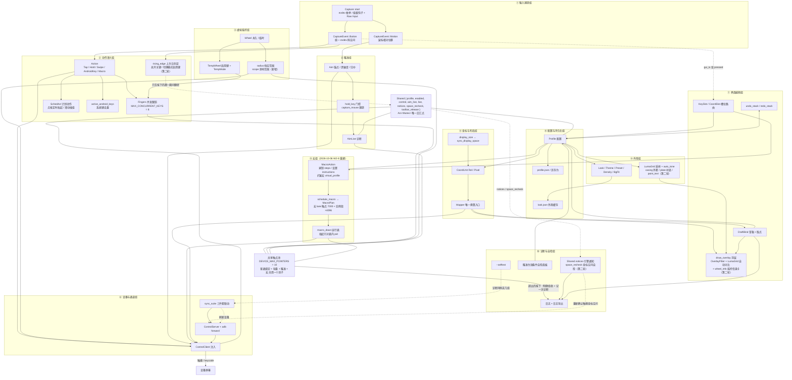
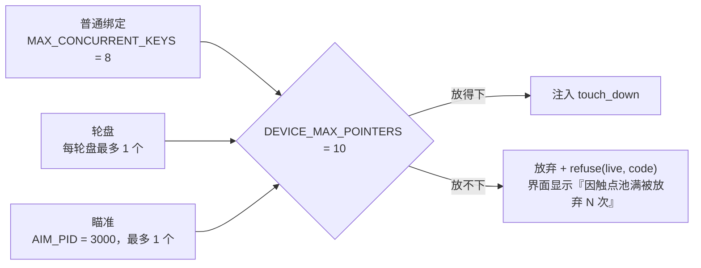
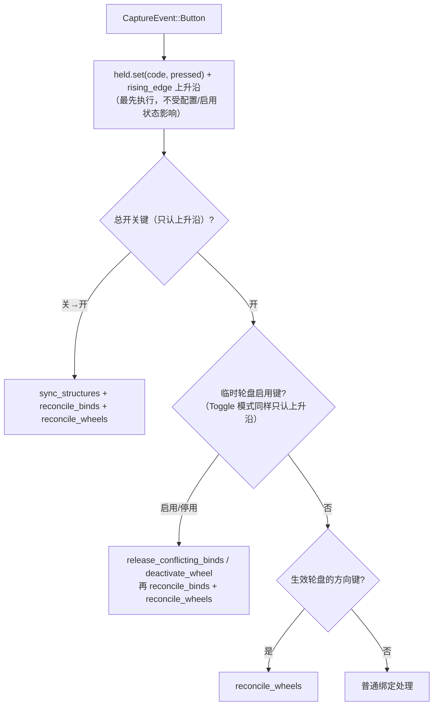
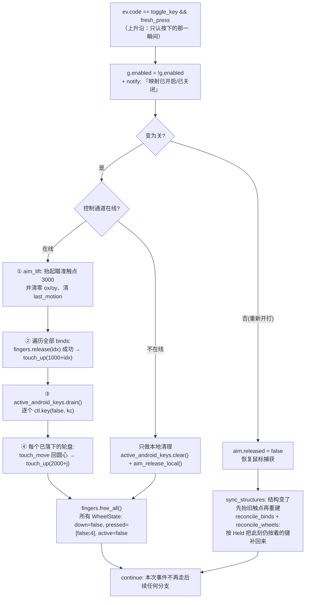
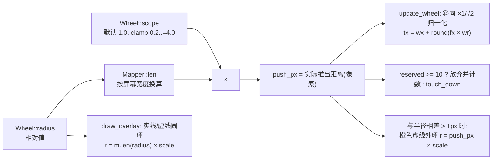
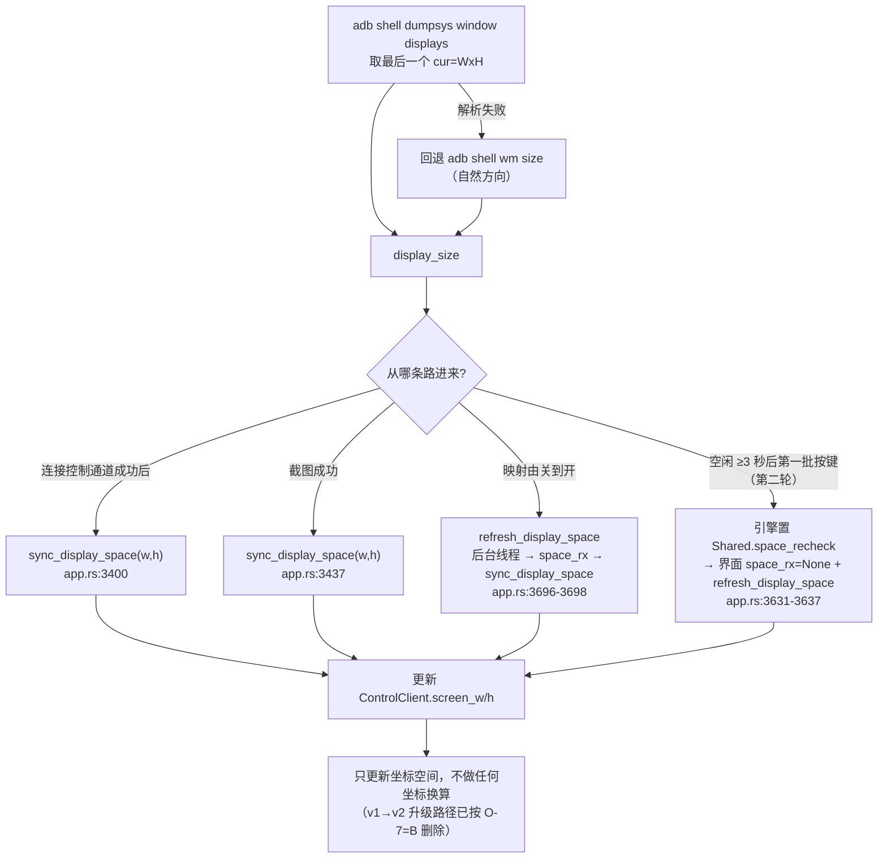
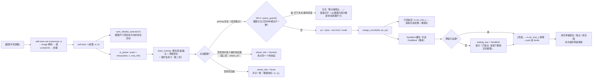
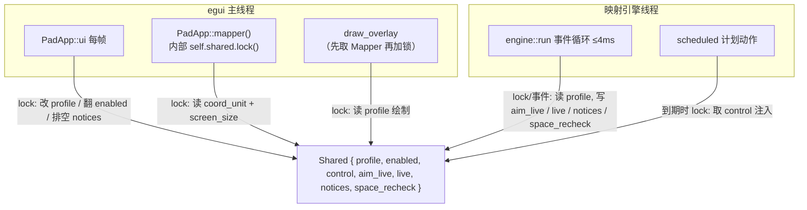
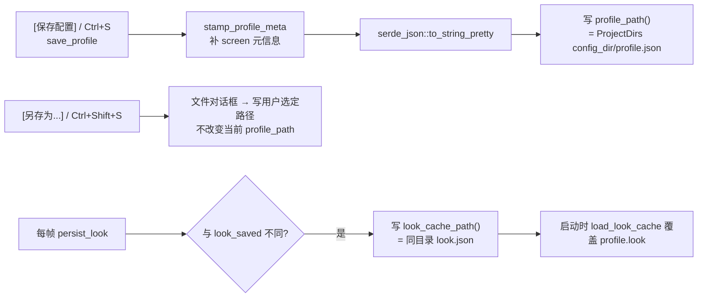
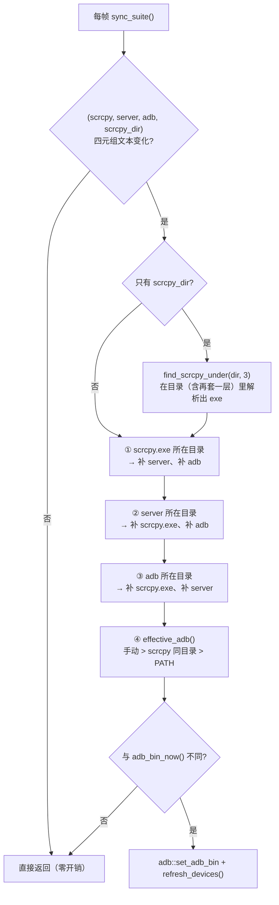

# scrcpy-pad 成分组分说明 · 第一线：功能线

> **本文件是《成分组分说明》三线文档中的第一线——功能线。**
>
> | 序 | 文件名 | 回答的问题 |
> |---|---|---|
> | 一 | `功能组分说明.md`（本文件） | 软件有哪些功能、归成哪些功能组、彼此如何联动 |
> | 二 | `文件与执行逻辑.md` | 每个文件做什么、运行时线程与数据如何流动 |
> | 三 | `设计思想与演进.md` | 为什么这样设计、历史包袱与演进方向 |
>
> **写作基准与校验口径**：本文内容以唯一权威源码目录 `src/` 为准（`scrcpy-pad/src/` 是过时旧副本，`release/` 是打包产物，均未参考）。所有关键结论都给出 `文件:行号` 或函数名，可直接对照代码查证。
>
> **上一轮遗留的例外已经关闭**：第 2.4 节曾声明的「影响范围 `Wheel::scope` 尚未落地」已不成立——`scope` 现已存在于 `src/keymap.rs`（`Wheel` 现为 `up/down/left/right/cx/cy/radius/scope/temp` 九个字段，见 `keymap.rs:823-854`），第 2.4.1 节即为其正式说明。
>
> **第一轮（2026-09-21）同步的四件事**：① 引擎侧的**共享触点池**与**归属对账 / 结构指纹**（第 1.1、1.2、1.3、2.3、2.4、3.1、3.2、3.3、4.2、4.3 节）；② `settings.rs` 的 **scrcpy 目录记忆与 BOM 容错**（第 1.7、2.8、3.13、4.7 节）；③ 浮层的**键位显示亮度**与画布坐标空间（第 1.8、2.10、2.7、4.8 节）；④ 新建轮盘的固定半径与落点。凡不确定或未见实现之处，仍一律显式标注「（代码中未见明确实现）」。
>
> **第二轮（2026-09-21 续）同步的三件事**：① **浮层可读性重做**——旧版"只有手动亮度档位"被判定为解决不了问题（同一档位在亮块上太浅、在暗块上太深），改为**描边外套 + 衬底 + 按截图逐块自动对比**三招齐上（`theme::casing` / `plate` / `paint_text` / `auto_tone` / `luma` + `app::LumaGrid`，第 1.6、1.8、2.10、3.6、3.7、4.8 节）；② 画布上的摇杆标注**瘦身成「摇杆N / 临时摇杆N」**，方向键与启用键改成**点一下摇杆弹出信息卡**（第 1.6、2.4.3、4.8 节）；③ 引擎**只认上升沿**（总开关键、切换模式的临时轮盘启用键）+ `Shared.notices` 引擎通知 + **空闲后重新确认坐标空间**（第 1.1、1.5、2.11、3.0、3.1、3.2、3.3、3.8 节）。**本文写作「本轮」处均指第一轮；第二轮的内容一律写明「第二轮」**，附录 B 是第一轮小结、附录 C 是第二轮小结。

---

## 一、概念名词体系（术语表）

### 1.1 配置与总控

| 中文名 | 代码标识符 | 一句话定义 | 它存在的原因 |
|---|---|---|---|
| 配置 | `Profile`（`keymap.rs:1209`） | 一份完整的映射方案：总开关键、键位列表、轮盘列表、瞄准参数、外观 | 让"一套手感"可以被保存、分享、切换；也是撤销栈与 JSON 持久化的基本单位 |
| 键位列表 | `Profile::binds: Vec<KeyBind>` | 普通绑定的有序数组，**索引即身份** | 索引被用于触点 id（`1000+idx`）与并发跟踪表下标，因此删除条目会导致后续索引整体前移（见 4.2） |
| 轮盘列表 | `Profile::wheels: Vec<Wheel>` | 虚拟摇杆数组，索引同样被用于触点 id（`2000+idx`） | 同上 |
| 配置格式版本 | `Profile::format_version` / `PROFILE_VERSION = 2`（`keymap.rs:5`） | 1 = 坐标存屏幕像素（旧格式）；2 = 坐标存相对比例 0..1 | 让"改单位"这种破坏性变更可以对老配置文件安全降级处理 |
| 坐标单位 | `CoordUnit::{Pixel, Rel}`（`keymap.rs:1407-1413`） | 由 `format_version` 推导（`Profile::coord_unit`，`keymap.rs:1407-1413`） | 是 `Mapper` 唯一的输入开关，决定"配置里的数字怎么变成像素" |
| 总开关键 | `Profile::toggle_key`（`keymap.rs:1219`，默认 `66` = KEY_F8） | 映射总开关的键盘按键 | 打游戏/打字之间需要一个"一键收手"的闸门，且必须能在任何状态下生效 |
| 映射开关 | `Shared::enabled`（`engine.rs:1790`） | 运行时唯一的使能标志 | 所有注入路径的总闸；引擎靠它决定"继续处理事件"还是"整条丢掉" |
| 配置元信息 | `Profile::screen`（`keymap.rs:1209`） | 记录这份布局是按哪个分辨率设计的 | 只作显示参考；相对坐标本身已自适应，但它能帮助排查"这份配置是给谁调的" |
| 共享状态 | `Shared` / `SharedState = Arc<Mutex<Shared>>`（`engine.rs:1834-1865`） | 界面线程与引擎线程唯一的交汇点，含 `profile / enabled / control / aim_live / live / notices / space_recheck / toolbar_release` | 引擎与 egui 是两个线程，必须有一处受锁保护的共同真相 |
| 按键上升沿 | `rising_edge(pressed, was_down)`（`engine.rs:836-838`） | "这一次事件是不是这个键**刚被按下**"，而不是自动重复送来的第 N 个 KeyPress | "按一下翻一次"的判定（总开关键、切换模式的临时轮盘启用键）若每个事件都翻一次，长按半秒就能翻十几次——用户看到的是"按了 F8 却没反应 / 状态跟自己以为的不一样，必须再关一次开一次才恢复"（第二轮） |
| 引擎运行状态 | `EngineLive`（`engine.rs:570`）：`pointers / refused / last_refused` | 当前占用的注入触点数、因触点池满被放弃的按下次数、最近一次被放弃的是哪个键 | "按了没反应"最常见的原因是设备端触点池满了；把这个数字与那个键显示出来，用户才知道该少按一个键，而不是以为程序坏了（`app.rs:8445-8477`） |
| 物理按键镜像 | `Held`（`engine.rs:550`）：`set(code, pressed)` / `has(code)` | "此刻物理上真的按着"的键码集合，只认按键事件，不受配置与轮盘启用状态影响 | 键盘事件是边沿触发的：属主切换（启用/停用临时轮盘、开关映射）那一瞬间，引擎必须知道某个键还按着没有，否则只能等用户"松开再按一次" |

### 1.2 动作语义（一个键按下后做什么）

| 中文名 | 代码标识符 | 一句话定义 | 它存在的原因 |
|---|---|---|---|
| 绑定 / 键位 | `KeyBind { key, action }`（`keymap.rs:1752-1756`） | "某个键码 → 某个动作"的一条规则 | 映射的最小可编辑单位；界面上的每一行、撤销栈里的每一个改动都围绕它 |
| 点按 | `Action::Tap { x, y, duration_ms, radius }`（`keymap.rs:528`） | 按下时触点落下，`duration_ms` 后自动抬起 | 绝大多数游戏按钮只需"点一下"；定时抬起把"按多久"从人手交给程序 |
| 长按 | `Action::Hold { x, y, radius }`（`keymap.rs:538`） | 按下键盘瞬间触点落下，抬起键盘瞬间触点抬起（全程实时跟随） | 需要"按住多久就按多久"的动作（开镜、蓄力、持续移动） |
| 按住切换 | `Action::Tap { duration_ms: 0 }`（`keymap.rs:528`；`engine.rs:4149-4161`） | 点按的特殊档：按下不松手，直到再次按同一键才抬起 | 用键盘实现"开关式"操作，省去一直按住的手部负担 |
| 共享触点池 | `DEVICE_MAX_POINTERS = 10`（`engine.rs:62`）+ `Fingers::try_down(idx, others)`（`engine.rs:505`） | 普通绑定、轮盘、瞄准、**宏**四个子系统**抢同一个** 10 触点池；`others` 就是"别的子系统此刻已占用几个"（宏触点在 2026-10-06 W2-8 起计入同一预算，见 2.12 / 3.14） | 设备端 `PointersState.MAX_POINTERS = 10`，超出的按下会被服务端**直接丢弃**（不是排队）。客户端必须自己先算这笔账，否则用户看到的是"按下没反应、原因不明" |
| 滑动 | `Action::Swipe(Swipe)`（`keymap.rs:545`、`keymap.rs:614-620`） | 按下时沿一条轨迹滑动一次 | 对应 QtScrcpy 的 `KMT_DRAG`；用于技能划屏、镜头甩动等 |
| 滑动曲线 | `Easing`（`keymap.rs:219`）+ `easing_apply`（`keymap.rs:251-265`） | 把"时间 t"映射为"沿轨迹的进度"，即速度分布 | 起终点相同、速度分布不同的滑动，在手感与（在部分游戏中）识别结果上并不等价；曲线让这两件事可以分开调 |
| 滑动轨迹 | `SwipePath`（`keymap.rs:301`）+ `swipe_points`（`keymap.rs:332-347`） | 决定路径的空间形状：条形 / 方形 / 圆形 | 有些手势必须画出特定形状（画圈、画方），直线轨迹无法表达；采样点由起终点派生，所以配置里只需存两个端点 |
| 系统键 | `Action::AndroidKey { keycode }`（`keymap.rs:547`） | 直接向设备注入 Android keycode（返回=4、主页=3 等） | 触摸注入无法表达"返回键"，必须走 keycode 通道 |
| 宏 | `Action::Macro(MacroAction)`（`keymap.rs:549`、`keymap.rs:503-514`） | 触发键点一下，按顺序执行一串预编排的动作（录制时间线或设置步骤） | 连招/连点无法用单个点按表达；宏把"一串动作 + 时间轴"打包成一条绑定，与其它动作同列一行 |
| 录制宏 | `MacroAction::steps: Vec<MacroStep>`（`keymap.rs:466`、`keymap.rs:504-506`） | **字面时间线**：每次按下/抬起的键码 + 距上一步的间隔毫秒；回放时照原时间轴（没有长按语义） | 用户要的是"录制什么就释放什么"——存原始时序，长按/连点都由按下-抬起间隔自然表达，回放时不需要猜意图 |
| 设置宏 | `MacroAction::instructions: Vec<MacroInstruction>`（`keymap.rs:1705`、`keymap.rs:507-509`） | **自包含动作**列表（八种：`delay` / `key` / `combo` / `wheel` / `fps` / `click` / `swipe` / `macro` 嵌套）；每条自带"持续"时长，执行时按下 → 持续 → 抬起 | 有些连招不方便录（键位本机没有、或要精确控制时长）；自包含语义让每一步能单独看、单独调，也便于坐标取点 |
| 扩展宏 / 虚拟键位层 | `MacroAction::virtual_profile: Option<Box<Profile>>`（`keymap.rs:512-515`） | 宏自带的一份微型配置：录制步骤与按键/组合键/轮盘设置步骤先按它解析，再注入设备 | "想按的键位上没有绑定"或不想占用真实键位时，给宏一套临时虚拟键盘/轮盘即可；随宏保存、取消即零残留 |
| 键码空间 | `KeyBind::key: u16`（`keymap.rs:660`） | 全平台统一的 evdev 键码空间 | 让配置在两平台可互换；Windows 由 `vktable` 模块（虚拟键码 ↔ evdev：`map_vk` / `evdev_name`，`capture.rs:1104` 起）映射到同一空间 |
| 右键常量 | `BTN_RIGHT = 273`（`keymap.rs:33`） | 鼠标右键的 evdev 码 | 瞄准门控键最常用的一档，单独给出便于"用右键"一键设置 |

### 1.3 虚拟摇杆（轮盘）

| 中文名 | 代码标识符 | 一句话定义 | 它存在的原因 |
|---|---|---|---|
| 轮盘 / 虚拟摇杆 | `Wheel`（`keymap.rs:823-854`） | 四个方向键驱动一个以 `(cx, cy)` 为圆心、`radius` 为半径的虚拟摇杆 | 对应 QtScrcpy 的 `KMT_STEER_WHEEL`；键盘无法直接产生"模拟量方向 + 力度" |
| 圆心 | `Wheel::cx / cy` | 触点落下的中位坐标（相对值） | 摇杆的"回中点"，也是每次推杆的起点 |
| 响应范围 / 半径 | `Wheel::radius`（`keymap.rs:830`）；点按/长按另有同名字段 | 既决定截图浮层上圆环的大小，也决定手指被推出的距离 | 一个数字同时承担"看得见"和"推得动"，便于对着截图调参 |
| 影响范围 / 范围系数 | `Wheel::scope`（`keymap.rs:1048-1050`，`#[serde(default = "default_wheel_scope")]`，默认 `1.0`，代码内 `clamp_scope` 到 `0.2..=4.0`） | 手指实际推出距离 = `radius × scope`，唯一定义在 `Wheel::push_px`（`keymap.rs:1043-1045`） | 游戏的摇杆判定圈往往与"看得见的圆环"不一致：圆环要够大才好点选/好辨认，但手指推太远会被判成另一个方向。解耦这两个量，才能在不改变视觉与响应圈的前提下微调真实推动距离 |
| 新建轮盘半径 | `NEW_WHEEL_RADIUS_PX = 150.0`（`keymap.rs:755`）+ `Wheel::new_default`（`keymap.rs:1130-1147`） | 点[添加轮盘]新建的摇杆半径固定 150 **像素**，按当前坐标空间换算成相对值后入配置 | 旧版写死"屏宽的 1/9"（2772 宽横屏上就是 307px），比用户手调的大一圈；固定像素才能让"界面显示的半径"与"新建出来的半径"一致 |
| 新建轮盘落点 | `next_wheel_spot(wheels)`（`keymap.rs:1230`）+ `WHEEL_SPOTS` / `WHEEL_MIN_GAP`（`keymap.rs:1152`） | 在候选点里挑一个与所有已有轮盘圆心距离 ≥ `WHEEL_MIN_GAP` 的落点，候选点用尽则沿网格错开 | 两个摇杆圆心重合时，浮层上的两个圆环与两个编号会糊成一团，用户分不清哪个是刚建的那个（第二轮起画布上只留编号，细节在信息卡里） |
| 永久轮盘 | `Wheel::temp == None`（`keymap.rs:851-853`；`engine.rs:3476`） | 任何时刻都生效的摇杆 | WASD 走路这类"一直在用"的方向输入 |
| 临时轮盘 | `Wheel::temp: Option<TempWheel>`（`keymap.rs:851-853`） | 仅在启用期间生效的摇杆 | 让同一批方向键在不同时刻归属不同摇杆（走路 vs 开车 vs 开镜） |
| 启用键 | `TempWheel::key`（`keymap.rs:814`） | 激活/关闭该临时轮盘的按键；**无论该轮盘是否生效，这个键都归它自己**（`key_owned_by_wheel`，`engine.rs:717-727`） | 区分"这一批方向键现在归谁"的开关 |
| 启用模式 | `TempMode::{Hold, Toggle}`（`keymap.rs:730`） | `Hold` = 按住启用键期间生效，松开即失效；`Toggle` = 按一下开、再按一下关 | `Hold` 适合"临时切一下"，`Toggle` 适合"长时间换模式" |
| 归属对账 | `reconcile_binds`（`engine.rs:592-642`）/ `reconcile_wheels`（`engine.rs:652-691`） | 把"谁该有触点"完全重算成 `该轮盘此刻是否生效 × 对应物理键是否按着`，然后补按/补抬 | 归属切换是边沿事件，只靠事件流会让"仍按着的键"失去触点；对账让切换**即时生效**，不需要用户松手重按 |

### 1.4 FPS 鼠标瞄准

| 中文名 | 代码标识符 | 一句话定义 | 它存在的原因 |
|---|---|---|---|
| 鼠标瞄准 | `Aim`（`keymap.rs:1277`） | 把鼠标的**相对位移**映射成手机上一根手指的持续拖动 | 对应 QtScrcpy 的 `mouseMoveMap`；FPS 转视角靠手指拖动，而鼠标天生只有相对位移 |
| 锚点 | `Aim::anchor_x / anchor_y` + `anchor_set()`（`keymap.rs:1365-1367`） | 手指落下的起点（相对坐标）；`(0,0)` 视为未设置 | 拖动必须有起点；锚点取在视角区中央空白处，才不会误触 UI |
| 灵敏度 | `Aim::sensitivity_x / sensitivity_y` | 每 1 个鼠标计数对应多少设备像素 | 不同游戏、不同 DPI 需要不同换算比 |
| 反转 Y | `Aim::invert_y` | 纵向位移取反 | 飞行/载具类游戏的常见需求 |
| 归中 | `RecenterMode::{Idle, Threshold, Never}`（`keymap.rs:1244`）+ `aim_recenter`（`engine.rs:1561-1578`） | 手指拖动无法无限持续（会被屏幕边界挡住），偏移过大时"抬指 + 在锚点重按" | 这是把"无限鼠标位移"投影到"有限屏幕"的唯一办法；三种策略是手感取舍 |
| 静止归中 | `RecenterMode::Idle` + `Aim::recenter_idle_ms` | 鼠标停止移动一小段时间后归中（"停止"按位移事件的**捕获时刻**算，W1-1） | 顿挫最不易察觉，默认档 |
| 阈值归中 | `RecenterMode::Threshold` + `Aim::recenter_threshold` | 偏移超过阈值立即归中 | 适合不停转圈的打法 |
| 门控键 / 按住才瞄准 | `Aim::hold_key`（`keymap.rs:1294`，`0` = 始终瞄准） | 仅当该鼠标键按住时才瞄准 | 对应"开镜才转视角"；同时也避免平时误触 |
| 捕获鼠标 | `Aim::capture_mouse`（`keymap.rs:1297`）+ `Capture::mouse_grab`（`capture.rs:659`） | 瞄准期间隐藏/冻结系统光标 | 否则鼠标会顶到屏幕边缘、位移丢失，且光标乱跑影响观感 |
| Ctrl+Alt 交还鼠标 | `AimState::released`（`engine.rs:1155`）+ `ctrl_alt_chord`（`engine.rs:203-205`） | 按一次 Ctrl+Alt 把鼠标交还系统，再按一次收回 | 打游戏中途要切出去点别的窗口，不能把鼠标锁死 |
| 瞄准指针 | `AIM_PID = 3000`（`engine.rs:75`） | 瞄准触点固定使用的 pointer id | 与普通绑定（1000+）、轮盘（2000+）分开，互不误抬 |
| 瞄准运行状态 | `AimLive`（`engine.rs:1113`） | 位移次数、最近位移、累积偏移、触点是否按下、已注入条数 | 界面需要回答"现在为什么没反应"，而不是让用户猜 |
| 瞄准生效条件 | `aim_active`（`engine.rs:1191-1196`） | `enabled && 锚点已设 && !released && (hold_key==0 \|\| gate_down)` | 把"能不能瞄准"收敛成一个纯函数，界面自检与引擎判定共用同一口径 |

### 1.5 坐标与布局

| 中文名 | 代码标识符 | 一句话定义 | 它存在的原因 |
|---|---|---|---|
| 换算器 | `Mapper`（`keymap.rs:148`） | 配置坐标 ↔ 当前屏幕像素的**唯一**换算入口 | 注入、绘制、取点、界面显示四条出口若各算各的，迟早会互相错位 |
| 相对坐标 | `CoordUnit::Rel` | 存 0..1 比例，乘屏幕尺寸得像素 | 换分辨率、换手机、横竖屏切换后键位自动对齐 |
| 像素坐标 | `CoordUnit::Pixel` | 存绝对像素，直通使用 | 旧配置（v1）的原始语义；`legacy` 直通下按原值使用（升级路径已删，不做换算） |
| 直通模式 | `Mapper::legacy`（`keymap.rs:148`、`keymap.rs:174-180`） | 像素单位时不乘比例，只做四舍五入 | 保证老配置"行为逐像素一致"（升级路径已删：像素配置永远直通） |
| 配置升级（已删除） | ~~`upgrade_profile`~~ —— 2026-10-07 O-7=B 删除 | 曾经把 v1 像素坐标换算成相对坐标、只改单位不改含义；现行约定是格式版本不匹配一律直通、不换算 | 删因：升级路径是死代码与事故源（方向不匹配时曾毁配置）；防事故职责由"直通不换算"承担 |
| 可装下判据（已删除） | ~~`pixels_fit_space`~~（随升级路径一并删除） | 曾检查所有点是否落在给定坐标空间内，防止"竖屏截图的尺寸去换算横屏的像素布局" | 升级路径删除后失去用武之地；同类事故由"格式不匹配一律直通"这条约定本身防住 |
| 触摸坐标空间 | `ControlClient::screen_w / screen_h`（`control.rs:220`） | 注入触摸时随消息一起发给 server 的屏幕宽高，即设备当前方向下的坐标空间 | 它一旦与真实方向不符，落在屏幕外的触摸会被系统**整条丢弃**，表现为"怎么点都没反应" |
| 当前显示器尺寸 | `adb::display_size`（`adb.rs:97-108`） | 优先取 `dumpsys window displays` 的 `cur=WxH`，回退 `wm size` | `wm size` 永远是自然方向；横屏时两者不一致（`adb.rs:97-108` 有回归测试） |
| 坐标空间校正 | `sync_display_space`（`app.rs:8178-8202`） | 更新控制通道的坐标空间并顺带升级旧配置；**绝不改动已取好的坐标** | 手机随时可能转屏；坐标空间必须跟当前方向走，但用户调好的布局不能被程序擅自"纠正" |
| 手动查询尺寸 | `refresh_display_space`（`app.rs:8961-8975`） | 后台线程查一次 `display_size`，结果经 `space_rx` 回 UI | 映射由关到开的那一刻（以及第二轮起的"空闲 ≥3 秒后的第一批按键"）需要重新确认方向，但查询会阻塞，不能卡 UI 帧 |
| 空闲后重查坐标空间 | `Shared.space_recheck`（`engine.rs:1811`）+ 引擎侧 `last_key_at`（`engine.rs:2152`、`engine.rs:3058-3066`）+ 界面侧取走处（`app.rs:3631-3637`） | 空闲 **≥3 秒**后的第一批按键，引擎置位请求界面重新确认一次坐标空间；界面取走后 `space_rx = None` 再 `refresh_display_space()` | 用户反馈"切到别的窗口待一会儿再回来按键不反应，关一次开一次映射才好"：**关开映射恰好会触发一次坐标空间重新确认**，而这段时间手机可能已经转过屏（第二轮） |
| 坐标编辑范围 | `COORD_RANGE = -8192..=8192`（`app.rs:40`） | 界面坐标框允许负值与超屏 | 横屏布局在竖屏下显示、截图方向与布局方向不一致时，键位本来就可能落在画面外，程序不做越界纠正 |

### 1.6 界面编辑

| 中文名 | 代码标识符 | 一句话定义 | 它存在的原因 |
|---|---|---|---|
| 键位槽位 | `KeySlot`（`app.rs:236`） | "正在等待按键的那一处"：新绑定/某条绑定/轮盘方向键/启用键/总开关键/瞄准门控键 | 让"按任意键"这一个动作能服务六种不同的绑定目标 |
| 坐标槽位 | `CoordSlot`（`app.rs:274`） | "正在等待在截图上点击的那一处"：绑定坐标/轮盘圆心/滑动起终点/圆形出发点/瞄准锚点/组合键落点/宏点击与滑动落点 | 取点是单一交互，需要一张"点哪儿写到哪儿"的路由表；宏指令的取点只在宏页开放（虚拟键盘绑定编辑器与宏展开编辑器里编辑的是克隆，取点写不回去） |
| 草稿 | `DraftBind`（`app.rs:674`）+ `draft_active` | 尚未提交的新键位临时状态，**坐标始终是像素** | 新增过程中用户还没决定最终分辨率语境，用像素最直观；提交时才换算成相对值 |
| 草稿复位 | `reset_draft_to_screen`（`app.rs:8157-8165`） | 按当前屏幕尺寸把草稿预览放到画面中央 | 新键位不该出现在上一个分辨率留下的坐标上 |
| 取点 / 改范围互斥 | `begin_pick`（`app.rs:2535`）与 `begin_resize`（`app.rs:2549`） | 两种交互同一时刻只保留一个，以最后一次操作为准 | 避免"两头挂着"导致截图点击的语义不确定 |
| 取消草稿 | `cancel_draft`（`app.rs:2566`） | 清除取点等待、等待按键与草稿圆圈/轨迹 | 用户中途放弃时，界面上不该留下幽灵圆圈 |
| 截图取点 | `take_screenshot`（`app.rs:1875-1900`）+ `ui_picker`（`app.rs:10386-10389`） | 截一帧设备画面并在其上点击取坐标 | 相对坐标手算不现实；对着真实画面取点是最可靠的方式 |
| 截图浮层 | `draw_overlay`（`app.rs:7351-7817`） | 把键位/轮盘/锚点按配置坐标叠加画在截图上 | 让"配置里的数字"变成"眼睛能看到的位置"，是全部坐标编辑的视觉基准 |
| 浮层过滤 | `OverlayFilter`（`app.rs:475`） | 全部 / 仅键位 / 仅摇杆 / 永久摇杆 / 临时摇杆 / 锚点(FPS) | 键位一多，浮层会互相遮挡，看不清要对齐的那一层 |
| 摇杆编号 | `draw_overlay` 内 `quick_label = "摇杆"/"临时摇杆" + (wi + 1)`（`app.rs:7690-7698`），与列表里的"轮盘N"（`app.rs:6990-6993`）使用同一个编号 | 浮层标签**只写编号**，不再把方向键/启用键/影响范围一并堆上去 | 两个摇杆方向键相同时，只靠方向键根本分不清画面上哪一圈是哪一个；而那一长串字压在游戏画面上既挡视野又看不清（第二轮把细节移进信息卡） |
| 摇杆信息卡 | `PadApp.wheel_info: Option<usize>`（字段 `app.rs:975-976`）+ `PadApp::wheel_at`（`app.rs:10680-10703`）+ `draw_wheel_card`（`app.rs:11507-11611`），命中半径常量 `WHEEL_CLICK_MIN_RADIUS = 24.0`（`app.rs:10707`） | 在画布上点某个摇杆的响应圈 → 在圈旁弹出信息卡（标题 + 上/下/左/右四个键名，临时摇杆再加"启用 X · 按住启用/再按切换"）；再点同一个摇杆或点空白处收起；换截图时清空 | 画布要干净，但"这一圈到底是哪四个键"又必须随手可查——把**常显**降级成**按需**（第二轮） |
| 响应范围拖拽 | `ui_picker` 内的指针拖拽段（`app.rs:10576-10637`） | 直接看原始指针状态拖动圆圈改半径 | 截图位于双向滚动区内，`resp.dragged()` 的拖拽仲裁会被滚动区吃掉，表现为"拖不动" |
| 快捷键缩放 | `zoom_radius`（`keymap.rs:22-28`）+ `RADIUS_ZOOM_FACTOR = 1.12`（`keymap.rs:15`） | Ctrl+`+` / Ctrl+`-` 按乘性因子缩放响应范围 | 半径是**相对值**（0.03 上下），用绝对差判"是否接近默认值"会让复位条件恒成立——`keymap.rs:1764` 有专门回归测试锁死这个 bug |
| 界面缩放让位 | `options.zoom_with_keyboard`（`app.rs:3337`） | 改范围期间关掉 egui 自带的 Ctrl+`+/-` 整界面缩放 | 否则快捷键先被 egui 吃掉，界面变大而圆圈纹丝不动 |
| 撤销点 | `push_undo`（`app.rs:2263-2266`）/ `push_undo_snapshot`（`app.rs:2270-2279`） | 把"修改之前"的 `Profile` 快照压栈并清空重做栈，上限 50 | 键位布局是长时间试错的结果，必须可回退 |
| 延迟撤销点 | `pending_undo` + `undo_frame_marked`（`app.rs:1020-1023`、`app.rs:4108-4119`） | 持锁修改处无法即时压栈，先存快照、帧末统一入栈 | 同一帧的多个改动合并成一个撤销步；也解开了"持锁时不能再加锁"的死结 |
| 重做栈 | `redo_stack`（`app.rs:1019`） | 被撤销掉的状态 | 撤销按多了要能回来 |
| 编辑目标 | `EasingEditTarget`（`app.rs:515`） | 曲线参数编辑指向"已有绑定"还是"新增草稿" | 同一个曲线编辑窗口服务两种来源 |

### 1.7 设备与通道（scrcpy 三件套）

| 中文名 | 代码标识符 | 一句话定义 | 它存在的原因 |
|---|---|---|---|
| scrcpy 三件套 | `scrcpy_path` / `server_path` / `adb_path`（`app.rs:868`）+ `scrcpy_dir`（`app.rs:865`） | 运行映射所需的三个外部文件，外加"它们所在的目录" | 官方 Windows 发行包三者同目录；只填**目录**一个就够（其余自动补齐），比填三个文件省事 |
| scrcpy 目录 | `PadApp::scrcpy_dir: String`（`app.rs:2891`）+ `apply_scrcpy_dir`（`app.rs:2891-2922`） | 用户直接指定的发行包目录；[应用]后按 `adb::find_scrcpy_under` 解析出 exe，并补齐 server 与 adb | 用户嘴里的"scrcpy 目录"就是解压出来的那个文件夹，"填一个就够"是这一栏存在的全部理由 |
| 三件套联动 | `sync_suite`（`app.rs:2702-2807`）+ `suite_synced`（`app.rs:2702`） | 四元组 `(scrcpy, server, adb, scrcpy_dir)` 任一变化时：任一为空就从另几个的同目录推导补齐；只给目录则先解析出 exe；生效 adb 变化时自动刷新设备 | 手动填三个路径是纯粹的负担，且极易填错 |
| 生效 adb | `effective_adb`（`app.rs:2676-2690`） | 手动指定的 adb > scrcpy 同目录 > PATH | 三级优先，兼顾"精确指定"与"零配置可用" |
| 记住的 scrcpy 位置 | `app::locate_remembered_scrcpy`（`app.rs:11032-11048`） | 记住的 exe（**目录也算**）→ 记住的目录里重找 → 交给自动寻找 | 用户换版本/搬目录之后仍然能找回：`scrcpy-win64-v3.1 → v3.3` 时死 exe 路径一定失效，目录线索却还在 |
| 目录线索 | `Settings::scrcpy_dir`（`settings.rs:208`）+ `Settings::search_dirs`（`settings.rs:135-151`）+ `nearest_existing_dir`（`settings.rs:236-250`） | 死路径被清掉时把"它原来在哪"记进 `scrcpy_dir`，必要时上溯 1~2 层 | 死路径比空路径更糟（空路径还能走自动逻辑），但把位置一并抹掉同样糟——所以"清路径、留线索" |
| 安全下探 | `adb::find_scrcpy_under`（`adb.rs:311-333`）/ `adb::find_scrcpy_in_dir`（`adb.rs:300-302`）/ `adb::find_scrcpy_explicit`（`adb.rs:283-296`） | 只在**名字以 scrcpy 开头**的子目录里下探，允许外面再套一层任意名字的文件夹 | 因此可以安全地拿桌面/下载/用户主目录当基准（每层只有一次 `read_dir`），不会全树递归拖慢启动 |
| 配置读取容错 | `app::read_config_text_graded`（`app.rs:10901-10912`）+ `app::backup_broken_config`（`app.rs:10924-10943`） | 读文本时去掉 UTF-8 BOM；解析失败时把原文件另存为 `xxx.json.broken` | 记事本加的 BOM 会让整份配置"解析失败 → 退回默认值 → 下一次落盘把用户内容覆盖掉"，一个字节的差别不该毁掉整份配置 |
| 强制重同步 | `resync`（`app.rs:2693-2696`） | 置空 `suite_synced` 并立即同步一次 | 手动改过路径后必须立刻生效，而不是等下一次文本变化 |
| 控制通道服务端 | `ControlServer`（`adb.rs:633`） | control-only 的 scrcpy-server 子进程 + adb forward 端口 | 只需要控制，不需要视频；比开一整路 video 轻得多 |
| 控制通道客户端 | `ControlClient`（`control.rs:220`） | 直连本地转发端口的 scrcpy 控制协议客户端 | 触摸/keycode 注入口 |
| 会话 id | `SCID = 0x1a2b3c4d`（`app.rs:23`） / `socket_name = scrcpy_{scid:08x}`（`adb.rs:580`） | socket 名中的会话标识 | 多开实例/与真实 scrcpy 共存时避免撞名 |
| 本地转发端口 | `LOCAL_PORT = 28383`（`app.rs:24`） | `adb forward tcp:28383 → localabstract:scrcpy_xxx` | 把设备侧 abstract socket 拉到本地 TCP |
| dummy 字节 | `ControlClient::connect`（`control.rs:244-370`） | 连接后必须先读到 server 发来的 1 个字节才算成功 | `adb forward` 在本地**总会先完成 TCP 握手**，设备侧未就绪时随即 EOF——不读 dummy 就会拿到"假连接" |
| 低延迟注入 | 专用写线程 + 自建命令队列 `CmdQueue`（`Mutex<VecDeque>`+`Condvar`，`control.rs:91`，W1-3） | 控制消息由独立线程串行写 socket；`push` 不阻塞 | UI 帧率与注入时序解耦，避免卡帧导致按键抖动。积压 ≥256 时对**同一触点最旧一条** `MOVE` 丢旧保新（绝对坐标语义，丢中间采样无害），边沿命令永不丢；深度/峰值/丢弃计数显示在诊断面板 |
| 下行丢弃线程 | `control.rs:230-246` | 持续读并丢弃 server 下行消息（剪贴板等） | 不读会把接收缓冲填满，最终阻塞 |
| 输入捕获 | `Capture`（`capture.rs:659`） / `CaptureEvent`（`capture.rs:56`） | 平台无关的全局输入事件源；每个事件带 `at` = 捕获时刻（W1-1） | 映射的前提是"能拿到其它窗口的按键"；计时不能用"引擎收到的时刻"——排队与卡帧的抖全会串进手感 |
| 映射屏蔽原键 | `Capture::grab`（`capture.rs:661`） + `grab_enabled`（`app.rs:981`） | 映射开启时 grab 键盘设备，原始按键不再传给其它程序 | 否则在游戏里按 W 会同时触发游戏自身的键盘绑定 |
| 引擎→界面回传 | `gui_tx` / `PadApp::gui_rx`（`engine.rs:2096`、`app.rs:1196`） | 只转发"按下的按键"给界面，用于"按任意键"绑定 | 引擎已经拿着全局捕获，界面没必要再开一路捕获 |
| 界面键盘回退 | `egui_key_code`（`app.rs:1095-1190`）+ `waiting_key` 分支（`app.rs:3321` 起） | 等待绑定时直接用 egui 收到的按键事件 | Windows 全局钩子受 scrcpy 抢焦点影响，必须把 scrcpy 窗口置前才能绑定；egui 这条路不受影响，与 `gui_rx` 双路竞争、`waiting_key` 只消费一次，天然去重 |
| 启动 scrcpy 窗口 | `adb::launch_scrcpy`（`adb.rs:741-813`） | 独立子进程启动常规 scrcpy 画面 | 关掉本程序时不强杀，用户自行关窗口 |
| 参数助手 | `ArgHelp`（`app.rs:105`） | 常用 scrcpy 参数的中文说明 + 示例 + 加入/撤去按钮 | 参数名不直观，猜错一个字母就白折腾 |
| 启动预设 | `StartPreset`（`app.rs:77`） | 分辨率类预设先重置为 `--stay-awake` 再叠加；音频类直接增删 | 两类预设的语义不同：分辨率是"整串替换"，音频是"开关某一项" |

### 1.8 外观与诊断

| 中文名 | 代码标识符 | 一句话定义 | 它存在的原因 |
|---|---|---|---|
| 外观 | `theme::Look`（`theme.rs:240`） | 配色预设 + 控件密度 + 背景图设置 + 浮层可读性设置（亮度档位与自动对比）+ **界面风格（主题）**，随配置保存 | "选用配置"应连同观感一起切换 |
| 界面风格（主题） | `theme::UiStyle::{Default, Visual}` + `Look.style`（`theme.rs`） | 两套**整体布局**：默认（原界面）/ 可视化（虚拟键盘取键）；与配色正交 | 用户要求"主题风格可换、换完记住"；风格牵动布局，无法热应用 → 切换即**关窗重开**（第四轮；原"鸿蒙"风格维护代价高，经用户决策 2026-10-06 删除，旧配置经 `#[serde(alias)]` 静默降级为默认） |
| 虚拟键盘/鼠标 | `keyboard.rs`（`VkKey` / `MAIN_ROWS` / `NAV_ROWS` / `NUM_ROWS` / `TOTAL_UNITS` / `show_keyboard` / `show_mouse`） | 标准美式全键盘（主区 17u + 导航 3u + 小键盘 4u，含跨行键）+ 虚拟鼠标（272~278 码）的绘制与命中 | 可视化风格"点键取键"的界面载体；键码与全局捕获同一 evdev 码空间（第四轮） |
| 点键取键 | `app::ui_vk_area` / `vk_lights` / `vk_on_key_clicked` / `VkSel` / `ui_vk_panel` | 点空闲键 → 新建草稿 + 立即 `begin_pick(NewBind)`；点已用键 → 操作栏（复用 `ui_bind_row`）；键亮表按语义色区分 | 用户要求"之前那种取点-按键的方式被点击虚拟键位取缔"，且**旧方式共存**（第四轮） |
| 语义色 | `Theme`（`theme.rs:70`） | 按**含义**取色（ok/warn/danger/key_tap/wheel_temp/…），不写死具体颜色 | 换主题时一处生效；浅色主题下深色浮层色必然不可读 |
| 配色预设 | `Preset::{Dark, Light, Nord, Catppuccin}`（`theme.rs:222`） | 四套完整配色 | 覆盖"默认观感不变"与"想要浅色/第三方配色"两类需求 |
| 控件密度 | `Density::{Compact, Standard, Loose}`（`theme.rs:274`） | 只保留三档，统一缩放行高、间距、字号、圆角 | 档位多了维护成本失控 |
| 背景图填充 | `BgFit::{Cover, Contain, Tile}`（`theme.rs:302`） | 铺满裁切 / 完整显示 / 平铺 | 用户截图与窗口比例几乎不会正好一致 |
| 外观缓存 | `look_cache_path()` = 同目录 `look.json`（`app.rs:8152-8154`） + `load_look_cache`（`app.rs:10762-10786`） + `persist_look`（`app.rs:8939-8957`） | 与键位配置同目录的一份"程序自用"外观缓存，启动时覆盖 `profile.look` | 没点过[保存配置]也要在重启后保持外观；内容不变才写盘，避免每帧写文件 |
| 键位显示亮度（微调） | `Look::overlay_tone`（`theme.rs:843`，`-1..=1`，默认 `0`）+ `theme::tone_color`（`theme.rs:579-595`）/ `tone_alpha`（`theme.rs:598-601`）/ `tone_text`（`theme.rs:605-611`）/ `tone_ring_fill`（`theme.rs:621-629`） | 把截图上键位/摇杆的响应圈与标注整体加深（负）或变浅（正）；只改明度不改色相，填充透明度反向微调 | 游戏画面很亮时圈看不见、画面昏暗时圈又太扎眼。**第二轮把它从"唯一手段"降级为微调**：它只负责"顺眼"，"看得清"交给自动对比；老配置读入后仍为 `0`，`tone == 0` 时逐字节不变 |
| 键位自动对比 | `Look::overlay_auto`（`theme.rs:562-570`，`#[serde(default = "default_true")]`，缺省 `true`）+ `theme::auto_tone(bg_luma, manual)`（`theme.rs:562-570`）+ `theme::luma(color)`（`theme.rs:573-576`） | 按每个标注**自己底下的画面明暗**决定这一处用深色还是浅色：`(0.5 - luma) × 2.2` 收敛后叠加手动微调；左栏 [外观] 新增 [键位自动对比] 复选框 | 用户附截图反馈"背景一亮就看不清键位"。一个全局滑块解决不了**同一张画面上既有亮块又有暗块**——同一个档位在亮块上太浅、在暗块上太深；本程序恰好有手机截图，可以直接逐块采样（第二轮） |
| 亮度网格 | `app::LumaGrid`（`app.rs:722-733`）+ `PadApp.shot_lum`（字段 `app.rs:903`，赋值 `app.rs:3429-3430`）+ `draw_overlay` 内的 `tone_at` 闭包（`app.rs:7366-7372`） | 截图到达时缩成至多 **64×64** 的亮度均值网格（`LumaGrid::new`），查询走 `LumaGrid::around(x, y)` 取 **3×3 格**平均；每个键位/摇杆/锚点/草稿各自按自己底下的像素取档位 | 取 3×3 而不是单格，是为了不让一条亮边或一小块高光决定整块标注的深浅；没有截图或关掉自动对比时，退回手动档位（第二轮） |
| 标注描边外套 | `theme::casing(ink)`（`theme.rs:634-640`） | 返回与本体**反相**的颜色：画圈时先用它画一圈更粗的线（`circle_stroke` 两遍，外套宽 `KEY_STROKE + 2.5`），再画本色圈；虚线环（临时摇杆、影响范围外环）同样先垫一层粗虚线 | 依据是制图学给等高线/地名加 halo（ICC 2013《Guidelines for Consistently Readable Topographic Vectors and Labels with Toggling Backgrounds》）与字幕描边：人眼对**局部对比度**敏感，标注与背景亮度接近时加一圈反相描边就能把可读性拉回来（第二轮） |
| 标注衬底 | `theme::plate(ink)`（`theme.rs:643-649`）+ `theme::paint_label`（`theme.rs:674-694`） | 先按 `layout_no_wrap` 量出文字尺寸，垫一块**圆角半透明衬底**（expand 3.0 / 圆角 3.0）再画字；浅字配深底、深字配浅底 | 依据是 Netflix Timed Text Style Guide 对字幕的要求（描边/阴影或半透明底色块）；衬底只比文字大一点点，尽量少遮挡截图内容（第二轮） |
| 仅描边文字 | `theme::paint_text`（`theme.rs:653-666`） | 只画四方向反相描边 + 正文，**不垫衬底** | 用在"已经有整块衬底"的场合（摇杆信息卡）：那里已经有一块 `plate` 铺底，再给每行文字各垫一块只会糊成一片（第二轮） |
| 运行日志 | `PadApp::logs: VecDeque<String>`（`app.rs:979`）、`log()`（`app.rs:1618-1623`） | 保留最近 200 条的界面日志 | 一个"配好了却没反应"的问题，90% 靠日志定位 |
| 引擎通知 | `Shared.notices: Vec<String>`（`engine.rs:1804`）+ `engine::notify(notices, msg)`（`engine.rs:823-828`） | 引擎在"映射被打开/关闭"、"触点池满导致某次按下被放弃（每秒最多一条）"、"配置结构变化而当时有触点被抬起"时各留一句话；界面每帧 `std::mem::take` 后排进日志（`app.rs:3620-3637`） | 总开关键是在引擎线程里处理的，**以前不留任何痕迹**——"映射到底开没开、刚才是谁把它关了"完全看不出来，用户只能反复按 F8 试（第二轮） |
| 日志导出 | `build_log_content`（`app.rs:2198-2229`） + `adb::device_info`（`adb.rs:546-567`） | 环境信息 + 设备信息 + 运行日志的完整文本 | 便于向他人求助 |
| 自检 | `selftest()`（`main.rs:106-266`） | `--selftest` 无界面模式，逐项检查权限/adb/scrcpy/通道/协议注入 | 把"环境问题"与"程序问题"一刀切开；最终只发无害 hover（`action=7`、`pointer_id=u64::MAX`），不触碰屏幕内容 |
| 文件对话框 | `filedialog.rs` | 非阻塞原生对话框封装，独立线程 + channel，UI 每帧轮询 | 阻塞式对话框会把 egui 帧卡死 |

---

## 二、功能组划分

### 2.1 功能组总览与联动


```mermaid
flowchart TD
    subgraph G1["① 输入捕获组"]
        I1["Capture::start<br/>evdev 枚举 / 低级钩子 + Raw Input"]
        I2["CaptureEvent::Button<br/>统一 evdev 码空间"]
        I3["CaptureEvent::Motion<br/>鼠标相对位移"]
    end

    subgraph G2["② 动作语义组"]
        S1["Action<br/>Tap / Hold / Swipe / AndroidKey / Macro"]
        S2["Fingers 并发跟踪<br/>MAX_CONCURRENT_KEYS = 8"]
        S3["SchedAct 计划动作<br/>点按定时抬起 / 滑动插值"]
        S4["active_android_keys<br/>系统键去重"]
        S5["rising_edge 上升沿判定<br/>总开关键 / 切换模式启用键（第二轮）"]
    end

    subgraph G3["③ 虚拟摇杆组"]
        W1["Wheel 永久 / 临时"]
        W2["TempWheel 启用键 + TempMode"]
        W3["radius 响应范围<br/>scope 影响范围（新增）"]
    end

    subgraph G4["④ 瞄准组"]
        A1["Aim 锚点 / 灵敏度 / 归中"]
        A2["hold_key 门控<br/>capture_mouse 捕获"]
        A3["AimLive 诊断"]
    end

    subgraph G5["⑤ 坐标与布局组"]
        C1["CoordUnit Rel / Pixel"]
        C2["Mapper 唯一换算入口"]
        C3["display_size → sync_display_space"]
    end

    subgraph G6["⑥ 设备与通道组"]
        D1["sync_suite 三件套联动"]
        D2["ControlServer + adb forward"]
        D3["ControlClient 注入"]
    end

    subgraph G7["⑦ 界面编辑组"]
        E1["KeySlot / CoordSlot 槽位路由"]
        E2["DraftBind 草稿 + 取点"]
        E3["draw_overlay 浮层<br/>OverlayFilter + LumaGrid 自动对比<br/>+ wheel_info 摇杆信息卡（第二轮）"]
        E4["undo_stack / redo_stack"]
    end

    subgraph G8["⑧ 配置与持久化组"]
        P1["Profile 配置"]
        P2["profile.json / 另存为"]
        P3["look.json 外观缓存"]
    end

    subgraph G9["⑨ 外观组"]
        L1["Look / Theme / Preset / Density / BgFit"]
        L2["LumaGrid 采样 + auto_tone<br/>casing 外套 / plate 衬底 / paint_text（第二轮）"]
    end

    subgraph G10["⑩ 诊断与自检组"]
        X1["日志 + 日志导出"]
        X2["--selftest"]
        X3["瞄准生效条件自检面板"]
        X4["Shared.notices 引擎通知<br/>space_recheck 坐标空间自检（第二轮）"]
    end

    subgraph G11["⑪ 宏组（2026-10-06 W2-8 重建）"]
        M1["MacroAction<br/>录制 steps / 设置 instructions<br/>扩展宏 virtual_profile"]
        M2["schedule_macro → MacroPlan<br/>宏 lane 触点 7000 + 实例段×4096"]
        M3["macro_down 运行表<br/>抬起只对表内 pid"]
    end

    SH["Shared { profile, enabled, control, aim_live, live, notices, space_recheck, toolbar_release }<br/>Arc&lt;Mutex&gt; 唯一交汇点"]
    POOL["共享触点池 DEVICE_MAX_POINTERS = 10<br/>普通绑定 + 轮盘 + 瞄准 + 宏 共用一个池子"]

    I1 --> I2 --> S1
    I1 --> I3 --> A1
    I2 -.->|"gui_tx 仅 pressed"| E1
    I2 --> S5
    S1 --> S2
    S1 --> S3
    S1 --> S4
    S1 --> D3
    W1 --> W2
    W1 --> W3
    W2 --> S2
    W3 --> D3
    A1 --> A2 --> A3
    A1 --> D3
    S2 --- POOL
    W3 --- POOL
    A3 --- POOL
    P1 --- M1
    E1 --> M1
    M1 --> M2 --> M3
    M3 --- POOL
    M3 --> D3
    POOL -->|"超出的按下：明确拒绝 + 记一次诊断"| X1
    C1 --> C2
    C2 --> D3
    C2 --> E3
    C2 --> E2
    C3 --> C1
    P1 --> C1
    P1 --> L1
    P1 --> P2
    L1 --> P3
    P1 --> L2
    L2 --> E3
    S5 -.->|"只在按下的那一瞬间翻转"| SH
    SH -.->|"notices / space_recheck"| X4
    X4 --> X1
    X4 -.->|"重新确认触摸坐标空间"| D2
    E2 --> P1
    E1 --> P1
    E4 <--> P1
    E2 --> E3
    D1 --> D2 --> D3 -->|"触摸 / keycode"| PHONE["设备屏幕"]
    D1 -.->|"刷新设备"| D2
    SH --- P1
    SH --- D3
    SH --- A3
    P1 --- X3
    E2 --> X1
    X2 -.->|"诊断同样这几组"| D1
```

图 1 只表达"谁依赖谁"；每条边的具体语义（谁先谁后、谁被谁吃掉）见第三节。

### 2.2 输入捕获组

- **包含的功能**：Linux 侧 `capture.rs` 的 `linux` 模块——evdev 设备枚举与键盘/鼠标识别、按键事件转发、鼠标相对位移合并、键盘 grab 与鼠标 grab 的状态同步；Windows 侧 `capture.rs` 的 `windows` 模块——低级钩子（键盘/鼠标按键/滚轮，键盘用 `map_vk_ex` 带 `LLKHF_EXTENDED` 判别小键盘与导航区、滚轮按齿累加，W1-5）、Raw Input 位移通道（W1-2，`raw_wnd_proc` / `handle_raw_input` / `setup_raw_input`）、1ms 位移合并器（W1-3，`MotionCoalescer`）、钩子心跳自愈（W1-4，1s 往返心跳 + VK 0xFF 探针，连续 3 次无回音或消息泵卡顿就就地重装并上报 UI；键盘钩子没装上时不发探针，连续 2 轮重装仍无回音则停用探针自愈只留泵检测）、光标回中与透明系统光标。两条路产同一种 `CaptureEvent`。
- **组内协作**：Linux 侧 `linux::start` 为每个识别出的设备起一个 `device_loop` 线程，共用同一个 `Sender<CaptureEvent>`；grab 标志由界面/引擎写、由设备线程读并落到 `EVIOCGRAB`。Windows 侧 `windows::start` 起两个线程：钩子线程（装钩子 + 消息循环，回调里只塞队列）与中转线程（差分 / 回中 / 对账）。鼠标的 `REL_X/REL_Y` 在同一次 `fetch_events` 内累加后合成**一条** `Motion`，减少下游消息数；W1-2 起 Windows 默认用 Raw Input 的设备计数（不经光标）。W1-3 起 Windows 侧又加了一层 `MotionCoalescer`：1ms 窗口（从第一条位移的捕获时刻起算）内的多条位移合成一条 `Motion`（`dx/dy` 求和、时刻取最后一条，净位移为 0 不发），窗口等待折进 `recv_timeout`，按键/另一路位移/退出等顺序点无条件 flush——8000Hz 鼠标的消息数降到 ≤1000/s，1ms 上限的延迟不叠加在排队的旧延迟上。W1-4 起两个线程之间还有一条心跳：中转线程每秒 `PostThreadMessage(WM_APP_HB)`（并把自测的循环间隔写进 `consumer_gap_ms`，睡眠/被抢 CPU 时不冤枉钩子线程），钩子线程装钩成功后先种一拍、处理到心跳就回写 `pump_ms` 并 `SendInput` 一枚被自己回调吞掉的 VK 0xFF 探针；上一拍间隔 >3s 或探针连续 3 次无回音 ⇒ `reinstall_hooks` 卸装重来（`hook_ok` 同步更新、探针期望跟着新结果走、`dead_ms` 事件由中转线程取走上报 UI；连续 2 轮重装仍无回音则停用探针自愈）——系统静默摘钩不再等于"按键突然全部失灵、只能重启"。W1-5 起这条链路上还有两处保真：小键盘/导航区按 `LLKHF_EXTENDED` 判别（同一物理键 NumLock 开/关报不同 VK；小键盘 Enter 与主 Enter 由此分开），滚轮按 120 一齿累加（不足一齿的余量跨事件保留），每 400ms 的对账改为"同一物理键的**全部别名 VK 任一按着就算按着"（NumLock 状态变化不再把按住的键误判成已释放）。
- **输入**：物理键盘/鼠标事件、`grab` / `mouse_grab` 两个 `AtomicBool`。
- **输出**：`CaptureEvent::Button{code, pressed, at}` 与 `CaptureEvent::Motion{dx, dy, at}`（W1-1 起每个事件都带捕获时刻）两条流，其中 `Button` 同时进入引擎与界面（`gui_tx`），`Motion` 只进引擎。

### 2.3 动作语义组

- **包含的功能**：五种 `Action`（Tap / Hold / Swipe / AndroidKey / Macro）的语义实现（派发在 `engine.rs:3379-3588`；宏的展开与发射另成一组，见 2.12）、并发跟踪 `Fingers`（`engine.rs:479`）、定时动作 `SchedAct`（`engine.rs:1886`、`engine.rs:2166-2224`）、系统键去重（`engine.rs:4231-4239`）、触点抢占取消 `cancel_up_for`（`engine.rs:3725-3728`）、**共享触点池预算**（`Fingers::try_down` 的 `others` 参数，`engine.rs:4154/4168/4190/4203`）。
- **组内协作**：
  - `Fingers` 为每个绑定索引记录"是否已按下"，`try_down` 同时负责三件事：去抖、普通绑定并发上限 `MAX_CONCURRENT_KEYS = 8`（`engine.rs:56`）、以及"加上轮盘/瞄准已占用的触点后不得超过设备端 `DEVICE_MAX_POINTERS = 10`"（`engine.rs:62`）。`release` 只在确有按下记录时才允许注入 UP——队列两端严格成对。
  - **被拒绝的按下会说话**：挤不进触点池时不再"发出去让服务端悄悄丢掉"，而是由 `refuse`（`engine.rs:786-804`）记一次 `EngineLive.refused` 与 `last_refused`，界面左栏据此显示"因触点池满被放弃 N 次（最近是哪个键）"。
  - `Tap` 按下时把抬起动作排进 `scheduled`；`Swipe` 按下时一次性把整条轨迹的 `Move` 与终点的 `Up` 排进 `scheduled`；调度循环在每次事件等待前先处理到期动作，并把等待时间精确对齐到"最早到期时刻"（上限 4ms），使定时抬起误差从 ~4ms 降到 ~1ms（`engine.rs:2608-2626`）。
  - `Tap` 的 `duration_ms == 0` 走"按住切换"分支，完全不进 `scheduled`。
  - **结构变化先抬手**：`sync_structures`（`engine.rs:909-989`）用 `binds_signature`（`engine.rs:997-1021`）识别"绑定表数量/键码/动作类型"的变化，一旦变化就 `release_all_binds`（`engine.rs:877-895`）把在按的触点全部抬起并补发 UP（连被删掉的槽位也遍历到），再按新长度重建按下表。若重建前确有触点按着，还会留一条引擎通知（第二轮，`engine.rs:3268-3272`）。
- **输入**：`CaptureEvent::Button`、`Profile::binds`、`Mapper`、`ControlClient`。
- **输出**：`touch_down / touch_move / touch_up / key` 四类控制消息；`Fingers` 与 `active_android_keys` 两个内部状态表、`EngineLive` 诊断快照。

### 2.4 虚拟摇杆组

- **包含的功能**：永久与临时轮盘的判定（`engine.rs:3421`）、启用键与两种模式（`engine.rs:3396-3467`，**第二轮起切换模式只认上升沿**）、触点推杆与回中（`update_wheel`，`engine.rs:5315-5382`）、斜向归一化（`engine.rs:3421`）、停用释放（`deactivate_wheel`，`engine.rs:3914-3925`）、冲突绑定强制释放（`release_conflicting_binds`，`engine.rs:3929-3957`）、影响范围 `scope`、**归属对账**（`reconcile_wheels`，`engine.rs:652-691`；`key_owned_by_wheel`，`engine.rs:717-727`）、**轮盘结构指纹与重建**（`wheel_signature`，`engine.rs:1069-1103`；`sync_structures`，`engine.rs:909-989`）、新建轮盘的固定半径与落点、**画布标注瘦身 + 摇杆信息卡**（第二轮，见 2.4.3）。
- **组内协作**：
  - `WheelState`（`engine.rs:1937`）保存四方向按下位、触点是否落下、上次落点与临时轮盘是否激活。`update_wheel` 由 `pressed[4]` 计算出 `dx = right - left`、`dy = down - up`；两者同时非零时乘 `1/√2` 归一化，保证斜向不会比直向"推得更远"。
  - **方向状态不是"自己记的"，而是重算出来的**：`reconcile_wheels` 把每个方向位直接写成 `该轮盘此刻是否生效 × 对应物理键是否按着`，然后调 `update_wheel` 补推/回中。于是"按下启用键的瞬间，已经按着的方向键立刻推动摇杆"不需要任何特判。
  - 触点落下采用"**先按圆心、再移到目标**"两步（`engine.rs:5372-5373`）：游戏看到的是从中位推出去的过程，而不是手指凭空出现在边缘。
  - 四方向全部松开时，`update_wheel` 先 `touch_move` 回圆心再 `touch_up`（`engine.rs:5346-5354`）；`deactivate_wheel` 同理（`engine.rs:3914-3925`）。**这个"先回中再抬起"不是多余的**：抬起坐标与落下坐标不一致时，部分游戏会把它判成一次滑动。
  - **触点池预算**：轮盘申请新触点前要看 `reserved`（普通绑定 + 瞄准 + 其它轮盘已占用的触点数，`wheel_pointers`，`engine.rs:736-738`）；挤不进去就由 `update_wheel` 返回 `true`（`engine.rs:5366-5371`）放弃这一次按下，调用方据此 `refuse` 计数并留一条引擎通知（`engine.rs:685-689`）。
  - **结构变化先抬手**：`wheel_signature` 只认"数量 + 四个方向键 + 启用键与模式"，**只改圆心/半径/scope 不会触发重建**（避免一边打一边调参被反复抬手）；指纹一变就先按旧状态把落下的轮盘触点回中再抬起，然后 `vec![WheelState::default(); 新长度]`（`engine.rs:958-987`）。
- **输入**：`CaptureEvent::Button`、`Profile::wheels`、`Mapper`、`ControlClient`、`Held`（物理按键镜像）。
- **输出**：轮盘触点（pid = `2000 + 索引`）的 down/move/up；被强制释放的普通触点与系统键；`EngineLive` 诊断计数。

#### 2.4.1 影响范围 `scope`（本轮已落地，现状说明）

> 这一节原写作时 `scope` 尚未进代码，现在它已存在于 `src/keymap.rs`；下文按**真实实现**描述。

| 项 | 说明 |
|---|---|
| 字段 | `Wheel::scope: f32`（`keymap.rs:1048-1050`），`#[serde(default = "default_wheel_scope")]`，`default_wheel_scope()` 返回 `DEFAULT_WHEEL_SCOPE = 1.0`（`keymap.rs:746`） |
| 语义 | **摇杆触点实际推出的距离 = `radius × scope`**，唯一定义在 `Wheel::push_px`（`keymap.rs:1043-1045`） |
| `radius` 的职责 | 不变：仍然决定截图浮层上那个圆环的大小（视觉圈 / 响应圈） |
| `scope` 的职责 | "影响范围系数"，乘在半径上，决定手指真正被推多远 |
| 取值范围 | `clamp_scope` 收敛到 `SCOPE_MIN = 0.2 ..= SCOPE_MAX = 4.0`（`keymap.rs:743`、`keymap.rs:781-787`） |
| 界面 | 用 DragValue 编辑，并显示换算出的实际像素值（`app.rs:7212-7232`） |
| 浮层可视化 | 当推出距离与半径相差 > 1px 时，浮层额外画一圈橙色虚线外环表示"触点实际能推到的最大距离"，并在标签里显示像素值与倍数（`app.rs:7778-7810`） |
| 兼容性 | 老配置没有这个字段 → 反序列化得 `1.0` → **行为与老配置完全一致**（单测 `wheel_scope_defaults_and_clamps`、`wheel_push_px_is_a_radius_scale`，`keymap.rs:1865`、`keymap.rs:1865`） |
| 与坐标单位的关系 | `scope` 是无量纲系数，与坐标单位（Rel/Pixel）无关：任何换算路径都不该碰它；升级路径已删，像素配置直通时更是原值保留 |
| 它解决的问题 | 游戏的摇杆判定圈往往与"看得见的圆环"不一致：圆环要够大才好辨认、好拖拽，但手指推太远会被判成别的方向。把"视觉/响应圈"与"实际推动距离"解耦后，可以在不动视觉布局的前提下微调真实推杆距离 |

对应到注入代码，`update_wheel` 中的
`let wr = w.push_px(m);`（`engine.rs:5146`）
即 `m.len(w.radius * clamp_scope(w.scope))`
——**其余逻辑（归一化、两步落下、回中抬起、`st.last` 去重）一律不变**，因此这是一处纯参数化改动，不引入新的状态机分支。唯一新增的分支是触点池预算：`reserved >= DEVICE_MAX_POINTERS` 时放弃这次落下并计数（`engine.rs:5366-5371`）。

#### 2.4.2 新建轮盘的几何（本轮新增约定）

| 项 | 说明 |
|---|---|
| 固定半径 | `NEW_WHEEL_RADIUS_PX = 150.0`（`keymap.rs:755`）；`Wheel::new_default(m, cx, cy)`（`keymap.rs:1130-1147`）把它按**当前坐标空间**换算成相对值入配置，方向键默认 WASD、`scope` 默认 1.0、`temp = None` |
| 默认配置的参照 | `Profile::default()` 拿不到屏幕尺寸，按参考屏宽 `REFERENCE_SCREEN_W = 1080.0` 换算：`DEFAULT_WHEEL_RADIUS = 150/1080`（`keymap.rs:763`） |
| 落点 | `next_wheel_spot`（`keymap.rs:1177-1206`）在 `WHEEL_SPOTS` 候选点里挑第一个与所有已有轮盘圆心距离 ≥ `WHEEL_MIN_GAP = 0.12` 的点；候选点用尽则沿网格错开 |
| 调用点 | `ui_wheels` 的[添加轮盘]按钮（`app.rs:7300-7323`），日志会打印"半径 NNNpx、圆心 x%,y%" |
| 为什么不用比例 | 写死比例会让"界面显示的像素半径"随屏幕宽度漂移（旧版 0.111 在 2772 宽横屏上是 307px、在 1080 竖屏上是 120px）；用户是拿这个像素值去对照游戏里真实摇杆判定圈的 |
| 界面呼应 | 浮层摇杆标签带编号（`app.rs:7687-7698`），与列表里的"轮盘N"（`app.rs:6989-6994`）一一对应 |

#### 2.4.3 画布标注瘦身与"点摇杆看方向键"（第二轮）

| 项 | 说明 |
|---|---|
| 画布上只留编号 | 摇杆的标注只写「摇杆N / 临时摇杆N」（`quick_label`，`app.rs:7690-7698`），与列表里的"轮盘N"（`app.rs:6990-6993`）使用同一个编号。旧版把"方向键 / 启用键·模式 / 影响范围倍数"一并堆在标签里，用户附截图要求「后面全删了，只留摇杆xxx」——那一长串字压在游戏画面上既挡视野又看不清 |
| 细节去哪了 | 移进**摇杆信息卡**：点摇杆的响应圈 → 卡片显示"标题 + 上/下/左/右四个键名"，临时摇杆再加一行"启用 <键> · 按住启用/再按切换"（`draw_wheel_card`，`app.rs:11507-11611`；模式文案取自 `TempMode::{Hold, Toggle}`，`app.rs:11507-11611`） |
| 怎么点开 / 收起 | `PadApp.wheel_info: Option<usize>`（`app.rs:975-976`）记住"哪一个摇杆被点开"。再点同一个摇杆 → 收起；点空白处 → 收起并照旧报一次截图坐标；**换截图时清空**（`app.rs:3435`）。**取点优先**：`picking` 存在时点击一律走取点（`app.rs:10643-10656`），不受信息卡影响 |
| 命中判定 | `PadApp::wheel_at(px, py)`（`app.rs:10680-10703`）：命中半径 = `max(该摇杆半径, WHEEL_CLICK_MIN_RADIUS = 24)` **截图像素**（`app.rs:10707`）——摇杆调得很小时也点得中；多个摇杆重叠时取**最后绘制**的那一个，与眼睛看到的上下层一致 |
| 选中反馈 | 被点开的摇杆会多描一圈细环（半径 `r + 6.0`，颜色取 `tone_text(tone)`，`app.rs:7726-7728`、`app.rs:7758-7760`），所以"现在看的是哪一个"在画布上一眼可见 |
| 卡片画法 | 先量出最长一行的宽度与行高定出卡片尺寸，默认放圈的右边；右边放不下自动**翻到左边**，再不够就夹在画布内（`app.rs:11551-11582`）。卡片垫 `theme::plate(ink)` 衬底、描一圈**摇杆语义色**（永久青 / 临时品红）的边（`app.rs:11585-11605`），文字用 `theme::paint_text`（已有整块衬底，不再逐行垫底） |
| 为什么不做成"常显" | 常显的信息会一直占着游戏画面；"点一下才出现"既解决了信息密度，也不必让用户记住颜色与编号的对应关系。代价是多一次点击，且**卡片只在有截图的画布上可点**（没有截图就没有命中判定，代码中未见其它入口） |

### 2.5 瞄准组

- **包含的功能**：生效条件判定（`aim_active`）、锚点钳制（`aim_anchor`，`engine.rs:1455-1461`）、落点钳制与边界探测（`aim_target`，`engine.rs:1477-1495`）、位移累加与注入（`aim_on_motion`，`engine.rs:1618-1687`）、归中三策略（`aim_recenter` + `aim_tick`）、鼠标捕获状态维护（`engine.rs:1618-1687`）、Ctrl+Alt 交还（`engine.rs:1618-1687`）、诊断（`AimLive`）。
- **组内协作**：
  - `aim_on_motion` 先检查 `aim_active`，再比对 `st.anchor_used`：锚点被改动或屏幕方向变了就结束旧拖动、从新锚点重开（`engine.rs:1618-1687`）。
  - 累加偏移后由 `aim_target` 把落点钳进屏幕并报告是否触边；触边时若策略不是 `Never` 就立即归中——否则"同方向继续转"将无法实现（`engine.rs:1662-1685`）。
  - `aim_tick` 每 4ms 轮询一次，负责两件事：映射关闭/门控松开时收手（`aim_lift`），以及静止归中（`engine.rs:1770-1786`）。
  - 鼠标捕获在引擎侧统一维护（`engine.rs:1201`），条件为 `enabled && connected && aim.enabled && capture_mouse && anchor_set && (hold_key==0 || gate_down) && !released`——把"光标被冻结但什么都做不了"这种状态从设计上排除。
- **输入**：`CaptureEvent::Motion`、`CaptureEvent::Button`（门控键与 Ctrl/Alt）、`Aim` 配置、`Mapper`。
- **输出**：瞄准触点（pid = 3000）的 down/move/up；`AimLive` 诊断快照；`mouse_grab` 原子标志。

### 2.6 坐标与布局组

- **包含的功能**：`CoordUnit` 推导、`Mapper` 构造与六种换算（`x/y/point/len/rel_x/rel_y/rel_len`）、`display_size` 查询、`sync_display_space` 校正、界面显示的像素化。
- **组内协作**：`Profile::coord_unit()` 决定 `Mapper` 的 `legacy` 开关；`Mapper` 对内提供"配置值 → 像素"与"像素 → 配置值"两个方向；v1 像素配置在 `legacy` 直通下按原值使用（v1→v2 自动升级路径已按 O-7=B 删除：格式版本不匹配一律直通、不换算）。
- **输入**：`Profile`、`ControlClient` 的屏幕尺寸（或截图尺寸）。
- **输出**：一切像素坐标（给注入与绘制）、一切相对坐标（给配置与取点）。

### 2.7 界面编辑组

- **包含的功能**：`ui()` 主帧、`ui_binds`、`ui_wheels`、`ui_aim` / `ui_aim_body`、`ui_picker`、`ui_look`、`draw_overlay`、`ui_easing_editor`、`ui_args_helper`、撤销/重做、全局快捷键、对话框回收。
- **组内协作**：`KeySlot` / `CoordSlot` 是两张路由表；`waiting_key` 与 `picking` 是两个"当前正在等待什么"的状态；`begin_pick` / `begin_resize` / 各类按钮在切换交互时互相清理，落实"以最后一次操作为准"。每帧末尾统一入栈 `pending_undo`，把同帧多个改动合并成一步撤销。
- **输入**：用户操作、`gui_rx` 的按键事件、异步任务结果（`connect_rx` / `shot_rx` / `space_rx` / `loginfo_rx` / 文件对话框）。
- **输出**：对 `Shared.profile` 的修改、注入所需的 `ControlClient` 挂载与 `enabled` 翻转、日志。

### 2.8 配置与持久化组

- **包含的功能**：默认与加载（`load_profile`，`app.rs:10795-10822`）、严格校验读取（`read_profile_at`，`app.rs:10946-10955`）、保存（`save_profile`，`app.rs:2316`）、另存为、新建（`write_default_profile`）、选用切换（`apply_profile_switch`）、重新加载、检测合法性（`check_current_profile`）、元信息补全（`stamp_profile_meta`）、外观缓存读写。
- **组内协作**：所有配置文本读取都走同一个 `read_config_text_graded`（`app.rs:10901-10912`）：去 UTF-8 BOM + 解析失败时 `backup_broken_config` 留一份 `xxx.json.broken`。`settings::load`、`load_profile`、`load_look_cache`、`read_profile_at` 四条入口共用它，因此"一个 BOM 让整份配置退回默认值、下一次落盘又把它覆盖掉"这条路径被整体堵死。`stamp_profile_meta` 只在 `format_version >= PROFILE_VERSION` 时写 `screen`（像素配置的该字段无意义）；`apply_profile_switch` 会清空撤销/重做栈，因为旧文件的撤销点与当前上下文无关（`app.rs:2517-2522`）；`reload_profile_from_current` 则保留撤销能力，并把重载本身记为一个撤销点（`app.rs:2455-2472`）。
- **输入**：`Shared.profile`、文件对话框返回的路径、截图/控制通道给出的屏幕尺寸。
- **输出**：`profile.json`（或用户指定路径）、`look.json`。

### 2.9 设备与通道组

- **包含的功能**：scrcpy/adb/server 定位与推导、设备列表、分辨率查询、截图、控制通道启停、scrcpy 窗口启动、日志用设备信息。
- **组内协作**：见 3.8 的 `sync_suite` 推导方向。
- **输入**：三个路径文本、选中的 serial、`scrcpy_args`。
- **输出**：`Vec<String>` 设备列表、`ControlServer` + `ControlClient`、PNG 截图字节、`DeviceInfo`。

### 2.10 外观组

- **包含的功能**：四套配色、三档密度、背景图填充/压暗/面板不透明度、**浮层可读性三招**（第二轮：`theme::casing` 描边外套 + `theme::plate` / `paint_label` 衬底 + `theme::auto_tone` 按截图自动对比，外加降级为"微调"的**键位显示亮度** `Look::overlay_tone`）、**界面风格（第四轮：默认 / 可视化，与配色正交，见下）**、语义色到 egui 样式的应用（`theme::apply_style`，`theme.rs:403-477`）。
- **界面风格（主题，第四轮；2026-10-06 删除"鸿蒙"后为两种）**：`Look.style: UiStyle`（默认 / 可视化）与配色**正交** —— 四套配色在两种风格下都保留。风格牵动布局分支（左栏 `LeftTab` 三张标签、右栏 `RightTab` 两张变三张、`ui_vk_*` 虚拟键盘）；面板底/弹窗底/圆角/控件底不再按风格分叉，统一由配色预设与密度给出（原鸿蒙分支的独立浅色卡片配色已随风格一并删除；旧 `look.json` / 配置里的 `style: 鸿蒙/Harmony` 经 `#[serde(alias)]` 静默降级为默认）。**它不能像配色那样每帧热应用**（布局会变），所以走"写盘 → 置 `STYLE_RESTART` → 关窗口 → `main.rs` 重启循环重开"（`app::request_style_restart` / `take_style_restart`）；因为风格存在 `look.json`，重启后自然记住上次的选择。可视化风格引入独立组件 `keyboard.rs`（虚拟键盘/虚拟鼠标）：点**空闲键** → 新建草稿 + 立即进入截图取点（可取消），点**已用键** → 操作栏显示与该键**同一套**编辑器（`ui_bind_row`），取点中的键在键盘上呼吸闪烁。
- **组内协作**：`Look` 同时住进 `Profile`（随配置保存/切换）与 `look.json`（程序自用缓存）；界面每帧 `self.look()` 取一次，`apply_style` 统一落到 egui `Style` 与 `Visuals`，所以改配色不需要重启也不需要重建控件。**浮层的颜色不走 `apply_style`**，而是每处绘制各自过 `tone_color` / `tone_ring_fill` / `tone_text`；`draw_overlay` 里先取出"手动微调档位 + 是否自动对比"，再用 `tone_at(sx, sy)` 闭包（`app.rs:7366-7372`）**按每个标注自己底下的截图明暗**算档位——有截图且开着自动对比时走 `theme::auto_tone(grid.around(..), manual)`，否则退回 `theme::clamp_tone(manual)`。所以第二轮之后，整层浮层不再是"一个档位管全部"，而是**每一处各自取档**（这正是旧版"同一档位在亮块上太浅、在暗块上太深"的解法）。文字方面：`paint_label` 垫衬底 + 反相描边（键位名、摇杆编号、锚点名、新增标记、影响范围标签都走它），`paint_text` 只描边（用于已经有整块衬底的摇杆信息卡）。圈类元素（键位圈、摇杆圈、锚点圈、草稿圈、影响范围外环、临时摇杆虚线环）都先画一圈更粗的**反相外套**再画本色；**滑动轨迹的线条本身仍走 `tone_ring_fill`（没有加外套，保持原样）**，但它的标注同样有衬底。早期那两个"恒为白色"的 `outline_text` / `outline_stroke` 已删除（`theme.rs:843` 留了说明），免得某一处漏掉档位。
- **输入**：`Profile.look`、是否启用背景图、**手机截图的亮度网格**（`PadApp.shot_lum`）。
- **输出**：egui 样式与窗口背景层绘制；`look.json`；截图浮层的实际配色与可读性（每处标注各自的档位、外套与衬底）。

### 2.11 诊断与自检组

- **包含的功能**：界面日志（上限 200 条，`log()`，`app.rs:1618-1623`）、日志导出、`--selftest`、瞄准生效条件自检面板、运行状态显示（位移次数/最近位移/累积偏移/触点状态/已注入条数）、**引擎状态显示（触点 n/10 · 因触点池满被放弃 N 次（最近是哪个键），`app.rs:8445-8477`，读 `Shared.live: EngineLive`）**、**引擎通知（第二轮：`Shared.notices` 每帧 `std::mem::take` 后排进日志，`app.rs:3620-3630`；`engine::notify`，`engine.rs:823-828`）**、**坐标空间自检（第二轮：`Shared.space_recheck` → `space_rx = None` + `refresh_display_space()`，`app.rs:3631-3637`；引擎侧判定 `engine.rs:3054-3066`）**、控制通道意外断开检测、鼠标捕获状态变化日志。
- **组内协作**：自检面板把 2.5 节的 `aim_active` 条件逐条摊开，并在全部满足但 `hold_key != 0` 时给出"需按住 X 才转视角"的针对性提示；**引擎状态那一行则把 3.0 节的"共享触点池"变成可见的数字**——它是本轮"按了没反应"类问题的主要诊断入口（计数不为 0 就说明那一刻同时按住的键比设备能接的还多）。第二轮的**引擎通知**把三类"以前完全不留痕"的事件补成日志：映射被打开/关闭、触点池满导致某次按下被放弃（每秒最多一条）、配置结构变化而当时有触点被抬起——加上**空闲后自动重查坐标空间**，"按了没反应"的三条常见成因（不知道映射开没开、触点挤满、坐标空间过期）现在都能在日志里找到对应的一句话。`--selftest` 则在无界面模式下走一遍 2.9 组的完整链路。
- **输入**：各组的状态与错误；`Shared.notices` / `Shared.space_recheck`（引擎写、界面每帧取走）。
- **输出**：可读的中文诊断文本；`selftest` 以 `[PASS]/[FAIL]` 逐项打印并以退出码汇总。

### 2.12 宏组（2026-10-06 W2-8 重建后补写）

> 本文此前**没有宏相关章节**；本节连同 §1.2 的宏术语、§3.14 的联动、§4.9 的边界条件一并补上。宏的语义在 2026-10-06 按用户指令整体重建（用户原话要点："录制什么释放什么，宏不需要长按"），重建动机与逐条证据见《全面审计与提升方案-2026-10-05.md》§W2-8；本节只描述**重建之后**的现状。

- **包含的功能**：录制宏（`MacroAction::steps: Vec<MacroStep>`，`keymap.rs:503-514`、`keymap.rs:504-506`）、设置宏（`MacroAction::instructions: Vec<MacroInstruction>`，`keymap.rs:503-514`、`keymap.rs:507-509`）、扩展宏虚拟键位层（`MacroAction::virtual_profile`，`keymap.rs:513-514`）、宏页与虚拟键盘上的宏窗口（`PadApp::ui_macro_page`，`app.rs:5469`；`ui_macro_virtual_window`，`app.rs:5845`）、排程与展开（`schedule_macro` / `schedule_macro_into`，`engine.rs:4362` / `engine.rs:4384`）、触点分配（`MacroPlan`，`engine.rs:4272`）、运行表（`macro_down`，`engine.rs:2107-2115`）、取消（`cancel_macro_scheduled`，`engine.rs:3766`）、坐标取点（`CoordSlot::MacroClickPoint` / `MacroSwipeStart` / `MacroSwipeEnd`，`app.rs:6359-6437`）。
- **两种宏，一份模型**：
  - **录制宏 = 字面时间线**。`MacroStep { code, pressed, delay_ms }` 只记"哪个键按下/抬起、距上一步多少毫秒"（没有坐标字段，鼠标**移动**不会被录进去）。回放时按下 = 落一根宏 lane 的手指（触摸 / 系统键 / 轮盘方向键手势），抬起 = 抬那一根——**没有长按语义**，"按住多久"就是录制里按下-抬起的间隔；键盘自动重复在录制端已合并，不会变成连点。录制里没有配对抬起的按下，在宏结尾兜底抬起（安全网，不改变已配对的步骤）。
  - **设置宏 = 自包含动作**。八种指令（`delay` / `key` / `combo` / `wheel` / `fps` / `click` / `swipe` / `macro` 嵌套）每条自带 `delay_ms` 与 `duration_ms`，执行时**按下 → 持续 → 抬起**，一步做完轮到下一步。`MacroInstruction::delay_ms()`（`keymap.rs:474`）给排程器算"本步骤相对上一事件的等待"。
  - 两部分可单独使用，也可并存于同一个宏。
- **组内协作**：
  - **触发键是一条普通绑定**，动作是 `Action::Macro`：只在**上升沿**（`fresh_press`）启动一次（`engine.rs:4241-4258`），整条宏在这一刻被**一次性展开**成具体动作排进 `scheduled` —— 录制的按键**不会**再回到输入流（旧实现经组合门控 + 物理镜像重新派发，正是"录了点击+滑动、回放不出来"的根因）。
  - **执行实例与触点号**：`run()` 的 `macro_exec_seq` 每触发一次 +1；`MacroPlan` 按 `pid = MACRO_PID_BASE(7000) + (exec % MACRO_EXEC_LANES(8)) × MACRO_EXEC_STRIDE(4096) + slot` 分配（`engine.rs:4284-4288`、`engine.rs:4272-4289`）。同一实例内不复用 slot、不同实例的 pid 段不重叠 —— 同一条宏连点、两个宏并发都不会互相顶掉触点。
  - **排程是"边规划边发射"**：所有动作先写进 `MacroEmit` 暂存区，`flush` 按 `(时刻, 排程序号)` 排序后并入 `scheduled`（`engine.rs:4334`）——"同刻先抬后按"的顺序由此钉死；嵌套宏必须共用同一个发射器，才能保证每个按下都有配对的抬起。
  - **`macro_down` 是宏触点的唯一真值表**（`engine.rs:2107-2115`）：落下时登记 `pid → 最近位置`；抬起**只对表里的 pid** 发（幂等：不会"只发 down 没 up"，也不会"up 没有 down"）；`MacroMove` 只更新表内实按着的触点。取消路径按**最近位置**逐个抬起表内触点，并过滤掉排程里的全部宏动作（三个调用点：关闭映射 / 截图通道断开 / 控制通道不可用）。
  - **活轮盘 vs 虚拟层轮盘**：按到**当前配置**的轮盘方向键时，驱动的是那个真的摇杆（`MacroWheel`，按下/抬起照录制时刻，按住期间由 `MacroMove` 推杆）；按到**虚拟层**的轮盘时，因为设备上并不存在这个摇杆，展开成**一次推离手势**（`live_wheels = virtual_ctx.is_none()`，`engine.rs:4395-4397`；`wheel_dir_of` / `wheel_part_at` / `wheel_part_angle`，`engine.rs:5022-5030`）。
  - **与用户操作隔离**：宏触点不共用绑定 pid、不写 `held` 物理按键镜像、不进 `combo_gate` 派发链路 —— 宏与"手上的键"各用各的手指，唯一共享资源是十指预算（见 3.14）。
- **输入**：`Action::Macro` 绑定（触发键）、宏页编辑出的 `MacroAction`、活配置 / 虚拟层配置（把录制键码解析成动作）、`Mapper`（坐标换算）、`ControlClient`（注入）。
- **输出**：宏 lane 的触点 down/move/up 与系统键、FPS 开关（`fps` 指令）、宏总时长（`schedule_macro` 的返回值，供嵌套宏与单测使用）。


---

## 三、联动关系（耦合与优先级）

### 3.0 共享触点池与"归属对账"（本轮新增的两条总则）

这两条是本节所有联动的前提，先单独说清楚。

**① 触点池是共享的，只有 10 个名额。**

设备端 scrcpy-server 的 `PointersState.MAX_POINTERS = 10`（`engine.rs:58-62` 的注释写明来源），超出这个数的按下会被服务端**直接丢弃**（不是排队）。因此普通绑定、轮盘、瞄准三个子系统抢的是同一个池子：


```mermaid
flowchart LR
    B["普通绑定<br/>MAX_CONCURRENT_KEYS = 8"] --> POOL
    W["轮盘<br/>每轮盘最多 1 个"] --> POOL
    A["瞄准<br/>AIM_PID = 3000，最多 1 个"] --> POOL
    POOL{"DEVICE_MAX_POINTERS = 10"}
    POOL -->|"放得下"| OK["注入 touch_down"]
    POOL -->|"放不下"| NO["放弃 + refuse(live, code)<br/>界面显示『因触点池满被放弃 N 次』"]
```

- `Fingers::try_down(idx, others)` 里的 `others` 就是"轮盘 + 瞄准此刻占用的触点数"（`engine.rs:498-520`）；调用点用 `wheel_pointers(&wheels) + usize::from(aim.down)` 算出来（`engine.rs:3544-3548`，消费点 `engine.rs:4154`/`engine.rs:4168`/`engine.rs:4190`/`engine.rs:4203`）。
- 轮盘与瞄准同理：`update_wheel(..., reserved)` 返回"是否因池满放弃"（`engine.rs:5366-5371`），`aim_on_motion(..., reserved)` 在"触点还没落下且池已满"时直接返回 true 让调用方计数（`engine.rs:1635`）。
- 8 这个普通绑定并发上限现在是**软上限**：真正的硬边界是 10，`MAX_CONCURRENT_KEYS` 只是"给 FPS 场景留出轮盘与瞄准的余量"（`engine.rs:52-56`）。
- 界面把这件事显式化：左栏的"引擎: 触点 n/10 · 因触点池满被放弃 N 次（最近是哪个键）"（`app.rs:8445-8477`，数据来自 `Shared::live: EngineLive`，`engine.rs:570`）。`last_refused == 0` 时显示"瞄准"（键码 0 不是合法 evdev 键）。**第二轮起，池满还会由引擎写一条通知进日志**（`engine.rs:3574-3586`，每秒最多一条）——左栏数字回答"发生了几次"，日志那句回答"刚才放弃的是哪个键、该怎么办"。

**② 归属一变，就按物理按键状态对账。**

键盘事件是边沿触发的，"某个键现在归谁"却可能在两帧之间改变。引擎因此维护一份**物理按键镜像** `Held`（`engine.rs:549-567`），所有按键事件在进入任何分支之前先写它（`engine.rs:2825`，在总开关键判定之前；同一行顺带算出 `fresh_press` 上升沿）：


```mermaid
flowchart TD
    EV["CaptureEvent::Button"] --> H["held.set(code, pressed) + rising_edge 上升沿<br/>（最先执行，不受配置/启用状态影响）"]
    H --> T{"总开关键（只认上升沿）?"}
    T -->|"关→开"| RC["sync_structures + reconcile_binds + reconcile_wheels"]
    T -->|"开"| W{"临时轮盘启用键?<br/>（Toggle 模式同样只认上升沿）"}
    W -->|"启用/停用"| RC2["release_conflicting_binds / deactivate_wheel<br/>再 reconcile_binds + reconcile_wheels"]
    W -->|"否"| D{"生效轮盘的方向键?"}
    D -->|"是"| RC3["reconcile_wheels"]
    D -->|"否"| BIND["普通绑定处理"]
```

- `reconcile_binds`（`engine.rs:592-642`）只对**状态型**动作对账：`Hold` 与 `AndroidKey`（按着就该有触点、松开就该抬起）；`Tap`（含时长 0 的开关档）与 `Swipe` 是一次性动作，由事件自己收尾——在这里对账会把它们反复翻转/重放。
- `reconcile_wheels`（`engine.rs:652-691`）把方向状态重算为"是否生效 × 是否按着"，因此**启用瞬间已按着的方向键立刻推杆**。
- 归属判定收敛成一个函数 `key_owned_by_wheel`（`engine.rs:717-727`）：生效中轮盘的方向键归它；**临时轮盘的启用键无论是否生效都归它**（事件路径上它总被消费掉）。对账与事件路径收敛到同一口径，两者不会打架。

由此带来的两种"用户能直接感受到"的行为：

1. **松开启用键的瞬间**，仍被按住的 `Hold` / 系统键立刻补上触点——不需要松手重按一次；
2. **按下启用键的瞬间**，已经按着的方向键立刻推动摇杆——同样不需要重按。

### 3.1 总开关键 → 所有功能的使能门

`engine.rs:1404-1487`。判定位于事件循环中**非常靠前**的位置，且不受 `enabled` 影响（因为它在 `if !enabled { continue; }` 之前），所以"关"和"开"都能被它捕获。**第二轮起它只认上升沿**（`ev.code == toggle_key && fresh_press`）：自动重复送来的后续 KeyPress 一律不算——否则长按 F8 半秒会翻转十几次，用户看到的是"按了没反应 / 状态跟自己以为的不一样"。


```mermaid
flowchart TD
    T0["ev.code == toggle_key && fresh_press<br/>（上升沿：只认按下的那一瞬间）"] --> T1["g.enabled = !g.enabled<br/>+ notify: 『映射已开启/已关闭』"]
    T1 --> T2{"变为关?"}
    T2 -->|"是"| T3{"控制通道在线?"}
    T3 -->|"在线"| T4["① aim_lift: 抬起瞄准触点 3000<br/>并清零 ox/oy、清 last_motion"]
    T4 --> T5["② 遍历全部 binds:<br/>fingers.release(idx) 成功 → touch_up(1000+idx)"]
    T5 --> T6["③ active_android_keys.drain()<br/>逐个 ctl.key(false, kc)"]
    T6 --> T7["④ 每个已落下的轮盘:<br/>touch_move 回圆心 → touch_up(2000+j)"]
    T7 --> T9["fingers.free_all()<br/>所有 WheelState: down=false, pressed=[false;4], active=false"]
    T3 -->|"不在线"| T8["只做本地清理<br/>active_android_keys.clear() + aim_release_local()"]
    T8 --> T9
    T2 -->|"否(重新开打)"| T10["aim.released = false<br/>恢复鼠标捕获"]
    T10 --> T11["sync_structures: 结构变了先抬旧触点再重建<br/>reconcile_binds + reconcile_wheels:<br/>按 Held 把此刻仍按着的键补回来"]
    T9 --> TC["continue: 本次事件不再走后续任何分支"]
    T11 --> TC
```

要点：

1. **共四处释放**，缺一不可：瞄准触点（否则松手后仍按在屏幕上）、绑定触点、系统键（否则设备上"返回键"一直处于按下）、轮盘触点。轮盘触点释放时先 `touch_move` 回圆心再 `touch_up`（`engine.rs:3914-3925`），与 `deactivate_wheel` 保持同一手法。释放完还会把 `live.pointers` 之类状态一并复位。
2. **无控制通道时也做本地清理**（`engine.rs:2041-2048`）：`active_android_keys.clear()` + `aim_release_local()`，再加 `fingers.free_all()` 与轮盘状态复位（含临时轮盘的 `active = false`）——本地状态绝不能残留，否则重新连上后会立刻注入一批错误的 UP。
3. **重新开启不只是复位 `aim.released`**（`engine.rs:3153`）：还会先 `sync_structures` 再 `reconcile_binds` + `reconcile_wheels`，**按物理按键状态补回触点**——所以你按住 W 再按 F8 开打，摇杆会立刻生效，不需要松手重按。
4. **总开关键本身不会落到绑定流程**：末尾的 `continue` 保证它不可能同时被当成普通绑定（即使配置里存在 `key == toggle_key` 的绑定，也不会生效）。
5. **总开关键与其它门控的相对顺序**：瞄准门控键（3.4）和 Ctrl+Alt（3.5）的处理都在它之前，而 `held.set` 与 `rising_edge` 又在它们之前（`engine.rs:837-839` vs 门控 `engine.rs:2841-2845`、Ctrl+Alt `engine.rs:3037-3052`）。因此若把 `hold_key` 与 `toggle_key` 设成同一个键，一次按下会**先**置 `gate_down = true`、**再**翻转 `enabled`。
6. **顶栏按钮走同一条收尾路径**（`app.rs:8615`、`engine.rs:2376-2413`）：按钮只置 `Shared.toolbar_release = true`（引擎按上升沿取一次），由引擎在下一轮执行**同一份** `release_all`（`engine.rs:1983-2061`）。早期版本按钮直接改 `enabled`，长按触点会永久留在屏幕上——这条已在 2026-09-19 那轮修复，第二轮未变。
7. **每次开/关都留一句话**（第二轮）：翻转 `enabled` 的同一处会 `notify` 一条"映射已开启(总开关键 \<键名\>) / 映射已关闭并抬起全部触点(\<键名\>)"（`engine.rs:3075-3083`；键名由 `key_name` 现场取，Linux 上形如 `KEY_F8`、Windows 上形如 `KeyF8`）——以前这一步在界面日志里**一点痕迹都没有**，用户只能靠反复按总开关键试。

### 3.2 临时轮盘的启用键 → 方向键归属切换 → 冲突绑定强制释放

流程见 `engine.rs:3396-3467`：

| 模式 | 按下启用键 | 松开启用键 |
|---|---|---|
| `TempMode::Hold` | `wheels[j].active = true` + `release_conflicting_binds(...)` | `deactivate_wheel(...)`（释放触点 + 清四方向位 + `active = false`） |
| `TempMode::Toggle` | **只在上升沿**（`fresh_press`）翻转：若已激活 → `deactivate_wheel`；否则 `active = true` + `release_conflicting_binds` | 无动作（自动重复不算"再按一下"） |

无论哪种模式，命中启用键后都会 `consumed = true` → `continue`，**启用键自身绝不会继续走到方向键或普通绑定流程**。

**关键的一步：切换之后立刻对账。** 两种模式在改变 `active` 之后都无条件执行一次 `reconcile_binds` + `reconcile_wheels`（`engine.rs:3415-3462`）。这一句同时修掉两个方向上的问题：

- **停用**：启用期间按着的 `Hold`/系统键在事件路径上收不到任何东西（那个键一直被启用键分支或轮盘方向键分支消费），对账会按 `Held` 把它们**补按回来**——所以"松开启用键的瞬间，原来按着不放的键立刻恢复功能"，不必松手重按（这是用户明确反馈过的痛点："松开启用键后，那个键必须松开手一次才能触发。战场是瞬息万变的"）；
- **启用**：对账会把已经按着的方向键立刻写成"按下"，摇杆当场开始推。

`release_conflicting_binds` 的必要性（`engine.rs:3929-3973`）——它遍历所有 `key ∈ {up, down, left, right}` 的普通绑定，把 `AndroidKey` 从 `active_android_keys` 移除并补发 `key(false)`，其余类型则 `fingers.release(i)` 后补发 `touch_up`。原因有两条，缺一都会出问题：

1. **防止触点永久卡死。** 绑定列表与轮盘列表彼此独立、没有任何唯一性约束，同一个键完全可能既是一条普通绑定的 `key`，又是某个临时轮盘的方向键。启用轮盘后，该键的事件在"方向键"分支就被 `handled = true; continue` 吃掉（`engine.rs:3469-3512`），普通绑定**永远收不到自己的 UP**——若它此前已经按下，触点就会一直落在屏幕上。
2. **防止普通绑定抢占方向输入。** 即使触点是在启用之前落下的，它依然是一个真实存在的设备触点：游戏看到的是"多了一根手指按在别处"，方向输入可能被判给错误的触点。

需要明确的是：**强制释放只在"启用瞬间"发生一次**。启用期间继续按方向键，事件只会走轮盘分支，普通绑定既不会 DOWN 也不会 UP——这正是"启用期间方向键归摇杆"的实现方式。而"停用瞬间把仍按着的键补回来"由紧随其后的 `reconcile_binds` 负责（见 3.0）。

### 3.3 焦点 / 优先级顺序

事件在同一次迭代中按固定次序尝试匹配，先命中者 `continue`，形成严格的优先级链：

```
held.set + rising_edge(物理按键镜像 / 上升沿)  →  瞄准门控键 / Ctrl+Alt（旁路）  →  总开关键  >  临时轮盘启用键  >  生效中的轮盘方向键  >  普通绑定
```

| 序 | 判定 | 代码位置 | 命中后的行为 |
|---|---|---|---|
| — | `Held::set(code, pressed)` + `rising_edge(pressed, was_down)` | `engine.rs:837-839`（`rising_edge` 本体 `engine.rs:837-839`） | 记录物理状态并算出 `fresh_press`，**不终止流程**；这是后面所有对账与"按一下翻一次"判定的依据 |
| 0 | `aim.hold_key` 匹配 | `engine.rs:2841-2845` | 仅置 `gate_down`，**不 return**（旁路监听） |
| 0 | Ctrl/Alt + 双键同按 | `engine.rs:3039-3052` | 仅翻转 `aim.released`，**不 return**（且要求 `aim_captured` 为真） |
| 1 | `toggle_key`（**仅上升沿**） | `engine.rs:3066-3114` | 翻转 `enabled` + 留一条通知 + 释放/对账流程 → `continue` |
| 2 | 临时轮盘启用键（`Toggle` 模式**仅上升沿**） | `engine.rs:3396-3467` | 切换激活态 + 冲突释放 + 对账 → `continue` |
| 3 | 生效中轮盘的方向键 | `engine.rs:652-691` | `reconcile_wheels` 重算方向状态 → `continue` |
| 4 | 普通绑定 | `engine.rs:4214-4261` | 按 `Action` 分派；申请触点时带上 `reserved`，池满则留一条限流通知 |

四处细节值得单独记住：

- **"按一下翻一次"的键只认上升沿**（第二轮）：`rising_edge(pressed, was_down)` 就是 `pressed && !was_down`，判定依据是 `held.has(code)`（`engine.rs:5999`）。自动重复的后续 KeyPress 会被这行挡掉——单测 `rising_edge_ignores_key_auto_repeat`（`engine.rs:5999-6009`）把这条锁死。
- **方向键分支只考虑"生效中"的轮盘**：`let engaged = w.temp.is_none() || wheels[j].active;`（`engine.rs:3476`）。未激活的临时轮盘方向键会**穿透到普通绑定**——这正是"临时轮盘没启用时，WASD 还能当普通键用"的原因。
- **方向键分支不会 `break`**：`handled` 用 `any()` 遍历所有生效轮盘，只表示"本次事件已消费"。因此**多个生效轮盘共用同一个方向键时会被同时驱动**，会同时落下多个轮盘触点（并一起争那 10 个名额）。这是配置层面需要避免的（代码中未见任何重复键校验）。
- **瞄准门控键的"特殊处理"就是"不特殊处理"**：它只在 `engine.rs:2841-2845` 记一次状态，之后**照常**参与总开关键、轮盘与普通绑定的匹配。用右键当开镜门控的同时，右键仍然可以被绑定成一个普通动作——这是刻意的旁路设计，不是遗漏。

> **W2-3(2026-10-06)**:表中第 2~4 行(临时轮盘启用键 / 方向键 / 普通绑定)的主干已抽成 `engine::dispatch_input`(`engine.rs:3379-3588`),`run()` 只留调用点(`engine.rs:3312-3332`),三行给出的行号即抽取后的位置;判定顺序与"命中即 `return true`(调用方 `continue`)"的消费语义保持原样。本表第 0/1 行的行号将在 W2-4 的"行号重锚"里统一刷新。

### 3.4 瞄准门控键的状态机

`gate_down` 只有两个写入点：`engine.rs:2843-2845`（跟随门控键的按下/抬起）与 `AimState::default()`。它向外影响三处：

1. `aim_active`（`engine.rs:1191-1196`）——不满足则 `aim_on_motion` 直接返回，位移被丢弃；
2. 鼠标捕获条件（`engine.rs:1191-1202`）——`hold_key != 0` 时只在按住期间捕获，松手立刻把光标还给系统；
3. 界面自检文案（`app.rs:9106-9113`）——"已就绪，但需按住 X 时才会转动视角"。

`Aim::anchor_set()` 以 `abs > 1e-6` 为判据（`keymap.rs:1365-1367`），所以 `(0,0)` 是"未设置"的哨兵值。升级路径已删，该哨兵值现只承担"未设置"判定本身。

### 3.5 鼠标捕获与 Ctrl+Alt 交还

| 状态 | `aim.released` | `mouse_grab` | 效果 |
|---|---|---|---|
| 正常瞄准 | `false` | `true` | 光标隐藏、位移持续累积 |
| 按下 Ctrl+Alt | `true` | `false` | 光标立刻归还系统，瞄准停止（`aim_active` 为假） |
| 再按 Ctrl+Alt | `false` | `true` | 收回 |
| 映射关闭 / 通道断开 / 锚点未设 / 门控未按 | 任意 | `false` | 绝不出现"光标被冻结但什么都做不了" |

`ctrl_alt_chord`（`engine.rs:203-205`）要求"按下的那一方是 Ctrl 或 Alt，且两者都在按住状态"，因此**一次组合只切换一次**，按住不放不会连发（`ctrl_alt_chord_fires_once_per_press`，`engine.rs:5900`）。且该分支被 `aim_captured = aim.enabled && aim.capture_mouse && aim.anchor_set()` 守卫（`engine.rs:5900-5915`、`engine.rs:3046-3052`）——不打算捕获鼠标时，Ctrl+Alt 不会被本程序改状态。

### 3.6 轮盘半径 / 影响范围 → 触点位移距离


```mermaid
flowchart LR
    R["Wheel::radius<br/>相对值"] --> ML["Mapper::len<br/>按屏幕宽度换算"]
    S["Wheel::scope<br/>默认 1.0, clamp 0.2..=4.0"] --> MUL["×"]
    ML --> MUL
    MUL --> WR["push_px = 实际推出距离(像素)"]
    WR --> U1["update_wheel: 斜向 ×1/√2 归一化<br/>tx = wx + round(fx × wr)"]
    WR --> U2["reserved >= 10 ? 放弃并计数 : touch_down"]
    R --> OV1["draw_overlay: 实线/虚线圆环<br/>r = m.len(radius) × scale"]
    WR --> OV2["与半径相差 > 1px 时:<br/>橙色虚线外环 r = push_px × scale"]
```

- **改造前**：`radius` 一个量同时决定浮层圆环与手指推出距离，二者被绑死。
- **改造后**：`radius` 仍然单独决定圆环（`app.rs:7678`），`scope` 只乘在注入距离上（`Wheel::push_px`，`keymap.rs:1043-1045`；消费点 `engine.rs:5084`）。于是"响应范围圈"与"触点实际可达范围"解耦。
- **为什么必须画那个橙色虚线外环**：解耦之后，光看圆环已经无法判断手指到底能推多远，调试时极易误判（"我把圈画得跟游戏摇杆一样大，为什么判定成反方向？"）。外环把不可见的注入距离重新变成可见的，并在标签里显示像素值与倍数，方便与游戏里真实摇杆的判定圈直接对照。**第二轮起这圈虚线也先垫一层反相粗虚线**（`app.rs:7714-7725`），免得它压在亮/暗画面上时消失。
- **与响应范围的耦合关系**：`scope` 不改变"哪个区域算命中"——它只改变推杆幅度。取点、改范围（Ctrl+`+/-`、拖动圆圈）操作的都是 `radius`；`scope` 走独立的 DragValue。两者在同一个轮盘行里并排显示，像素值 `= m.len(radius) × scope` 由界面即时算出，供对照。
- **与浮层过滤的耦合**：外环属于轮盘的一部分，随 `OverlayFilter` 一起显示/隐藏——选 `永久摇杆` 时只对 `temp == None` 的轮盘画外环，选 `临时摇杆` 时反之（筛选逻辑见 `app.rs:475`）。**第二轮新增的摇杆信息卡同样受这层过滤管辖**（它画在轮盘那一趟循环里，`app.rs:475`）。
- **与旧配置的耦合**：无该字段的 JSON 反序列化得 `1.0`，注入距离与改动前逐像素一致；任何坐标换算都不涉及 `scope`（升级路径已删，像素配置走 `legacy` 直通）。
- **与触点池的耦合**：推出距离变大不会多占触点（每个轮盘始终只占 1 个），但"要不要落下这个触点"要先过 10 个名额的预算（见 3.0）。

### 3.7 坐标单位 Rel/Pixel → Mapper → 四条出口的一致性

`Mapper` 是**唯一**做坐标换算的地方（`keymap.rs:148` 的文档注释明确写了这一点），四条出口全部经由它：

| 出口 | 位置 | 用到的方向 |
|---|---|---|
| ① 注入 | `engine.rs` 各处（`bind_point`、`Tap`/`Hold`、`Swipe` 起终点、`update_wheel` 圆心与半径、`aim_anchor` / `aim_target`） | 配置值 → 像素（`point` / `x` / `y` / `len`） |
| ② 绘制 | `draw_overlay`（`app.rs:7351` 构造、`app.rs:7390-7392`、`app.rs:7428-7429`、`app.rs:7504-7506`、`app.rs:7536-7537`、`app.rs:7614-7615`） | 配置值 → 像素，再乘浮层缩放 `scale` |
| ③ 取点 | `assign_coord`（`app.rs:2047`） | 像素 → 配置值（`rel_x` / `rel_y`） |
| ④ 界面显示与编辑 | `ui_binds`（`app.rs:4240-4245`）、`ui_wheels`（`app.rs:6970-7325`）、`ui_aim_body` | 双向：显示时 `x/y/len`，写回时 `rel_x/rel_y/rel_len` |

一致性由三点保证：`legacy` 开关只在 `Mapper` 构造时决定；`CoordUnit` 只由 `format_version` 推导；任何新增的坐标字段都必须同时接进这四条出口。**`DraftBind` 是唯一的例外**——草稿坐标刻意保持像素（`app.rs:674` 的注释），只在提交时换算，因为草稿还没有"正式单位"的语境，用像素最直观。

**第一轮新增的一条纪律（画布坐标空间）**：②这条出口用的屏幕尺寸来自 `PadApp::screen_size()`（`app.rs:8045-8058`），它**优先取截图尺寸**，取不到才退回控制通道尺寸。原因是控制通道尺寸会在"连接控制 / 手机转屏 / 后台刷新"时变化，而浮层是画在截图上的——用会变的尺寸去画一张不变的图，观感就是"同一个摇杆毫无征兆地突然变大/移位"。注入仍按控制通道尺寸单独计算（`inject_space()`，`app.rs:8062-8068`），两者**纵横比**不一致（偏差 >2%）时——这就是"手机转过屏"或"截图是上一次方向拍的"——取点面板给出醒目提示并**禁用取点**，附两个点击才生效的一键按钮（[以截图为准(重设坐标空间)] / [重新查询屏幕尺寸]）；对齐后提示与禁用自动消失。判定在 `space_mismatch`（W2-2，2026-10-06），拒绝入口在 `begin_pick` 与画布点击两处，详见 3.9。画布缩放系数也只依赖窗口高度与截图尺寸（`app.rs:10394-10405`），不再用"当前剩余高度"，否则右侧多出一行设置就会让整张浮层跟着缩放。

**第二轮在这条纪律上再加一层（④ 的取档也走同一张图）**：`draw_overlay` 的每个标注不再共用一个亮度档位，而是用 `tone_at(sx, sy)` **按它自己所在的截图像素**去查 `LumaGrid`（`app.rs:722`）；也就是说"圈画在哪张图的哪个位置"与"这一处该用深色还是浅色"用的是**同一套坐标**（都由截图尺寸派生的 `Mapper` 给出）。新增的摇杆信息卡命中判定（`wheel_at`，`app.rs:10680-10703`）同样以画布空间换算圆心与半径，因此"看到的位置"与"点得到的位置"一致。

### 3.8 屏幕方向变化 → display_size → sync_display_space


```mermaid
flowchart TD
    A["adb shell dumpsys window displays<br/>取最后一个 cur=WxH"] -->|"解析失败"| B["回退 adb shell wm size<br/>（自然方向）"]
    A --> C["display_size"]
    B --> C
    C --> D{"从哪条路进来?"}
    D -->|"连接控制通道成功后"| E["sync_display_space(w,h)<br/>app.rs:3400"]
    D -->|"截图成功"| F["sync_display_space(w,h)<br/>app.rs:3437"]
    D -->|"映射由关到开"| G["refresh_display_space<br/>后台线程 → space_rx → sync_display_space<br/>app.rs:3696-3698"]
    D -->|"空闲 ≥3 秒后第一批按键<br/>（第二轮）"| G2["引擎置 Shared.space_recheck<br/>→ 界面 space_rx=None + refresh_display_space<br/>app.rs:3631-3637"]
    E --> H["更新 ControlClient.screen_w/h"]
    F --> H
    G --> H
    G2 --> H
    H --> I["只更新坐标空间，不做任何坐标换算<br/>（v1→v2 升级路径已按 O-7=B 删除）"]
```

关键约束：

- **只校正坐标空间，绝不改动已取好的坐标**（`app.rs:8178-8202` 的设计说明）。手机临时切到别的方向再切回来，配置必须原样可用。
- **坐标空间同步必须发生在任何注入之前**：连接成功后立刻 `sync_display_space`（`app.rs:8183-8202`），避免出现"按错误单位注入"的中间态。（v1→v2 升级路径已按 O-7=B 删除：格式不匹配一律直通、不换算，这条时序现只与屏幕方向变化有关。）
- **格式版本不匹配一律直通（O-7=B）**：v1→v2 自动升级路径已删除——像素坐标配置永远经 `Mapper::legacy` 直通使用，程序不做任何坐标换算，也就不会把用户辛苦调好的布局算坏。
- **锚点超界由注入前钳制兜底**：方向变化后锚点可能落在当前空间之外，`aim_anchor` 会把它钳进屏幕（`engine.rs:1478-1494`，回归测试 `aim_target_clamps_anchor_into_screen`，`engine.rs:5831-5844`），界面同时给出提示（`app.rs:9070-9076`）。
- **第二轮补上的第四条入口：空闲后自动重查**（`engine.rs:3054-3066` + `app.rs:3631-3637`）。`last_key_at` 记录"上一次按键"的时刻，空闲 **≥3 秒**后的第一批按键会把 `pending_space_recheck` 置位，在循环顶部（已经持锁处）写成 `Shared.space_recheck = true`；界面每帧取走并重新查询一次。**这条入口的意义不在"又一个刷新点"，而在于它解释了用户的现象**：以前只有"连接 / 截图 / 关开映射"三条路会刷新坐标空间，而用户"切到别的窗口待一会儿再回来"时唯一会碰到的就是"关一次开一次映射"——刷新恰好发生在那一刻，于是看起来像开关本身的毛病。现在引擎自己会在空闲后第一次按键时补上这次确认（同样是**只改空间、不改坐标**）。

### 3.9 截图 → 取点 → 草稿 → 绑定


```mermaid
flowchart LR
    A["[截取手机屏幕]"] --> B["adb exec-out screencap -p<br/>→ image 解码 → 建 LumaGrid → 纹理"]
    B --> C["self.shot = (纹理, w, h)"]
    C --> D["sync_display_space(w,h)<br/>截图尺寸即当前方向的坐标空间"]
    C --> E["ui_picker: scale = min(avail/w, 1, max_h/h)"]
    E --> F["draw_overlay: 键位/轮盘/锚点 + 草稿预览<br/>+ 摇杆信息卡（第二轮）"]
    F --> G{"点击截图?"}
    G -->|"picking 存在（优先取点）"| G0{"W2-2: space_guard()<br/>截图与注入空间纵横比不一致?"}
    G0 -->|"是: 拦下本点,保持武装"| G1["日志『取点被阻止: …』<br/>面板红字 + [以截图为准]/[重新查询屏幕尺寸]"]
    G0 -->|"否"| H["px = (pos - rect.min) / scale"]
    H --> I["assign_coord(slot, px, py)"]
    G -->|"否则命中某个摇杆响应圈<br/>（第二轮：wheel_at）"| G2["wheel_info = Some(i)<br/>再点同一个则收起"]
    G -->|"否则空白处"| G3["wheel_info = None<br/>并记一条『截图坐标: (x, y)』"]
    I --> J["已有条目: m.rel_x/rel_y → 直接写进配置 + 撤销点"]
    I --> K["NewBind 槽位: 写进 DraftBind（像素）"]
    K --> L{"草稿已设键?"}
    L -->|"否"| M["waiting_key = NewBind<br/>提示『已取点, 请按下要绑定的按键』"]
    L -->|"是"| N["[添加] → m.rel_x/rel_y 换算 → push 进 binds"]
    M --> N
    N --> O["清空草稿预览 / 取点 / 改范围<br/>本次操作彻底收尾"]
```

- **草稿是像素、配置是相对值**：这一条贯穿 `DraftBind` 的全部字段（`x/y/radius/swipe_start/swipe_end` 与 `swipe_path` 的圆心/半径计算），也是 `reset_draft_to_screen` 存在的理由。
- **点击的三路分派（第二轮补充）**：取点（`picking`）优先；没有取点任务时先试"点中了哪个摇杆圈"（`wheel_at`，`app.rs:10680-10703`）；都不是才算点空白（收起信息卡 + 记坐标，`app.rs:10680-10703`）。因此"点摇杆看方向键"**不会妨碍取点**——取点期间点哪儿都还是取点。
- **添加后立刻收尾**：`app.rs:4722-4726` 一次清掉 `draft_active`、`picking`、`resizing`，避免"刚添加完又停在取点状态"。
- **取消路径**：`is_draft_slot`（`app.rs:11146-11154`）识别出"这个取点槽位属于新增草稿"，取消时走 `cancel_draft` 把圆圈/轨迹一并清除；已有条目的取点取消只需清 `picking`。
- **浮层过滤与可视化**：`OverlayFilter::All` 与 `Keys` 显示键位与草稿（`app.rs:475`）；`All` 与 `Aim` 显示锚点（`app.rs:475`）；除 `Keys` / `Aim` 外都显示轮盘（含信息卡），`PermWheels` / `TempWheels` 再按 `temp.is_none()` 二次筛选（`app.rs:475`）。因此 `Keys` 会同时屏蔽锚点与轮盘，`Aim` 会屏蔽键位与轮盘——过滤是"白名单"语义。
- **W2-2 坐标空间守卫（2026-10-06）**：取点的前提是"截图空间与注入空间纵横比一致"（偏差 >2% 即不一致，同比例不同分辨率不拦）。武装入口 `begin_pick`（`app.rs:2535`）在未对齐时**拒绝进入取点**并写日志——虚拟键盘"空闲键→草稿→取点"这条链在拒绝时 `cancel_draft()` 撤销刚建的草稿，不留半成品；武装之后才失去对齐的（武装期间转屏/换截图），由画布点击处拦下并**保持武装不消费**，对齐后直接再点即可。面板给红字 `SpaceMismatch::describe()` + 行动指引 + 两个点击才生效的按钮：[以截图为准(重设坐标空间)]`adopt_shot_space`（对齐注入空间、协议声明尺寸与 `profile.screen` 设计尺寸记录）/ [重新查询屏幕尺寸]（`refresh_display_space`）。守卫每帧现算、无状态，两空间一对齐自动恢复。
- **圆形轨迹的取点是特例**：`CoordSlot::CircleAngle` 只用角度，与单位无关；实现时先把起终点换算成像素、算出圆心，再 `atan2` 得到 `start_angle`（`set_circle_angle`，`app.rs:11093-11111`）。

### 3.10 三方共享：Profile ↔ 引擎(Shared) ↔ 界面(PadApp)


```mermaid
flowchart TD
    subgraph TH_UI["egui 主线程"]
        UI["PadApp::ui 每帧"]
        MAP["PadApp::mapper()<br/>内部 self.shared.lock()"]
        DRW["draw_overlay<br/>（先取 Mapper 再加锁）"]
    end
    subgraph TH_ENG["映射引擎线程"]
        RUN["engine::run 事件循环 ≤4ms"]
        SCH["scheduled 计划动作"]
    end
    SH["Shared { profile, enabled, control, aim_live, live, notices, space_recheck }"]
    UI -->|"lock: 改 profile / 翻 enabled / 排空 notices"| SH
    MAP -->|"lock: 读 coord_unit + screen_size"| SH
    RUN -->|"lock/事件: 读 profile, 写 aim_live / live / notices / space_recheck"| SH
    SCH -->|"到期时 lock: 取 control 注入"| SH
    DRW -->|"lock: 读 profile 绘制"| SH
```

**锁的约束（三条硬规则）**：

1. **`PadApp::mapper()` 会自锁**（`app.rs:8101-8104` 的注释原文点名了这一点）。它内部先 `self.shared.lock()` 读 `coord_unit`、再调 `self.screen_size()`（同样要锁，`app.rs:8045-8058`），最后构造 `Mapper`。因此**任何已经持有配置锁的地方，都必须改用 `Profile::mapper(space)`**（`keymap.rs:1417-1419`，纯构造、不加锁）。代码里的正确示范：`assign_coord` 在加锁前先 `let m = self.mapper();`（`app.rs:2049`）；`ui_binds` / `ui_wheels` 同样在 `self.shared.lock()` 之前取好 `m`（`app.rs:4681`、`app.rs:7162`、`app.rs:7305`）；`ui_picker` 与自检面板里则改用 `g.profile.mapper((w, h))` / `g.profile.mapper(space)`（`app.rs:10481`、`app.rs:10596`、`app.rs:10615`）；`draw_overlay` 的注释直接把"先构造 Mapper 再加锁"写成了硬要求（`app.rs:7360-7361`）。
2. **`format!` 里不要出现两次 `lock()`**。`app.rs:2502` 的注释记录了这个坑："先取数、释放锁，再 log：避免 format! 参数里两次 lock 死锁"。同类风险存在于任何"在持锁表达式里调用另一个也会加锁的方法"的写法。
3. **持锁期间不能压撤销栈**。`push_undo()` 自己会加锁（`app.rs:2263-2266`），所以持锁的 UI 代码只能用 `push_undo_snapshot(before)`，并把 `before` 快照留到帧末统一入栈（`pending_undo` + `undo_frame_marked`，字段声明 `app.rs:1020-1023`，帧末入栈 `app.rs:4108-4119`）。

**可见性方向**：界面是 `profile` 的唯一写入者（除了引擎不再写入配置），引擎是 `aim_live`、`live`、`notices`、`space_recheck`、`control` 与 `enabled`（由总开关键触发的那一路）的写入者；`control` 由 UI 挂载（连接成功后写、断开时置 None），引擎只读。**第二轮新增的 `notices` / `space_recheck` 是"引擎写、界面每帧取走"的一次性信箱**：引擎侧的写点常常同时借着 `control` 与 `profile`，所以 `notify` 只接受 `&mut Vec<String>`（借一个字段而不是整个 `Shared`），攒不下时先放进循环局部变量、在循环顶部（已经持锁处）统一落账（`engine.rs:823-828`、`engine.rs:2145-2149`、`engine.rs:2582-2585`）。这个"单一写入者"格局是避免竞态的根本原因。

### 3.11 撤销栈 → 所有编辑入口

`undo_stack`（上限 50）与 `redo_stack` 覆盖的入口（均给出代码位置）：

| 类别 | 入口 | 位置 |
|---|---|---|
| 按键绑定 | `assign_key`（新绑定/改键/轮盘方向键/启用键/总开关键/瞄准门控键，六种槽位共用） | `app.rs:1939-2044` |
| 坐标取点 | `assign_coord`（绑定坐标/轮盘圆心/滑动起终点/圆形出发点/瞄准锚点/组合键落点/宏落点） | `app.rs:2047` |
| 绑定增删改 | 删除绑定、转长按/转点按、添加绑定 | `app.rs:4532`、`app.rs:4464-4503`、`app.rs:4674-4743` |
| 轮盘增删改 | 删除轮盘、添加轮盘、切换 Hold/Toggle、设为永久 | `app.rs:7284-7298`、`app.rs:7300-7323`、`app.rs:7056-7072`、`app.rs:7073-7088` |
| 数值连续编辑 | 绑定 x/y/时长/范围、轮盘圆心/半径/影响范围、滑动时长、瞄准灵敏度/归中/门控键 | `app.rs:4382-4438`、`app.rs:7172-7232`、`app.rs:9137-9397` |
| 曲线参数 | `ui_easing_editor`（弹窗内的幂次/贝塞尔控制点） | `app.rs:7840-7945` |
| 范围修改 | `begin_resize`（整段修改算一步撤销） | `app.rs:2549-2554` |
| 外观 | `ui_look` 的任意改动、选择背景图（含自动调整不透明度） | `app.rs:8667-8840`、`app.rs:3535-3572` |
| 配置级 | 重新加载（可撤销）、选用/新建配置（清空两栈） | `app.rs:2454-2473`、`app.rs:2517-2527` |

两条统一规则：

- **连续控件只在"开始编辑"那一帧记点**：`r.drag_started() || r.gained_focus()`，避免拖动过程中每帧塞一个撤销步（注释见 `app.rs:9124-9126`、`app.rs:8777`）。
- **帧末合并**：同一帧的多个改动只产生一个撤销步（`app.rs:4108-4119`）。

### 3.12 保存 / 另存为 / 外观缓存


```mermaid
flowchart LR
    A["[保存配置] / Ctrl+S<br/>save_profile"] --> B["stamp_profile_meta<br/>补 screen 元信息"]
    B --> C["serde_json::to_string_pretty"]
    C --> D["写 profile_path()<br/>= ProjectDirs config_dir/profile.json"]
    E["[另存为...] / Ctrl+Shift+S"] --> F["文件对话框 → 写用户选定路径<br/>不改变当前 profile_path"]
    G["每帧 persist_look"] --> H{"与 look_saved 不同?"}
    H -->|"是"| I["写 look_cache_path()<br/>= 同目录 look.json"]
    I --> J["启动时 load_look_cache 覆盖 profile.look"]
```

- **两个持久化目标的优先级**：`look.json` 在启动时**覆盖**配置里的 `look`（`app.rs:1270-1272`）。因此外观的实际真相源是 `look.json`，"选用配置"切换到的外观会在下次启动时被 `look.json` 盖掉。这是刻意的取舍——外观是"程序自用"的设置，键位才是"配置"的内容。
- **写盘节流**：`persist_look` 只在内容真的变化时才写，失败只提示一次（`look_cache_warned`）；背景图解码也只在路径变化时进行（`app.rs:8939-8957`），同一路径失败后不再重试，避免每帧刷屏。
- **`stamp_profile_meta` 有前置条件**：只在 `format_version >= PROFILE_VERSION` 时写 `screen`（`app.rs:8168-8176`），像素配置不该被盖上误导性的分辨率标签。
- **`screen_size()` 的估算兜底**：未连接、也未截图时回退 `(1080, 2400)`（`app.rs:8103`）。这只影响界面显示与草稿初始化，不影响注入——真正的注入尺寸来自 `ControlClient`。

### 3.13 三件套联动 sync_suite


```mermaid
flowchart TD
    A["每帧 sync_suite()"] --> B{"(scrcpy, server, adb, scrcpy_dir)<br/>四元组文本变化?"}
    B -->|"否"| Z["直接返回（零开销）"]
    B -->|"是"| C0{"只有 scrcpy_dir?"}
    C0 -->|"是"| C1["find_scrcpy_under(dir, 3)<br/>在目录（含再套一层）里解析出 exe"]
    C0 -->|"否"| C
    C1 --> C["① scrcpy.exe 所在目录<br/>→ 补 server、补 adb"]
    C --> D["② server 所在目录<br/>→ 补 scrcpy.exe、补 adb"]
    D --> E["③ adb 所在目录<br/>→ 补 scrcpy.exe、补 server"]
    E --> F["④ effective_adb()<br/>手动 > scrcpy 同目录 > PATH"]
    F --> G{"与 adb_bin_now() 不同?"}
    G -->|"是"| H["adb::set_adb_bin + refresh_devices()"]
    G -->|"否"| Z
```

- **推导方向是"三向互补 + 目录优先"**：任一非空就足够，只填空缺项，绝不覆盖用户已填的值；`scrcpy_dir` 是"最自然的那一个"——只填它，程序会先在目录里找出 exe，再自动补齐另外两个。
- **触发时机**：每帧调用但用 `suite_synced` 缓存短路；`resync()` 强制置空并立即同步一次，被手动改路径的按钮、[启动 scrcpy] 之前、F5 刷新调用。
- **自动刷新设备**：只在"生效 adb"真的变化时刷新，避免每帧跑 `adb devices`。
- **路径记忆与落盘**：`save_settings_now`（`app.rs:2857-2879`）在"选完路径/目录、点[应用]、[自动寻找全部]、勾选[记住路径]"这几处立刻写盘并打日志确认（调用点见 `app.rs:2857`、`app.rs:3476`、`app.rs:3482`、`app.rs:8319`、`app.rs:8358`）；其余改动由帧末的 `remember_now()` + `persist_settings()`（`app.rs:2884-2888`）统一收尾。**即使关掉了[记住路径]也照样登记**——开关状态本身也是设置的一部分，早退会导致"我明明关掉了，下次启动它又自己打开了"。
- **连接链路的完整推导**：`[连接控制]` → `resync()` → `serial()` → 后台线程里 `adb::display_size` → `adb::start_control_server`（push server → forward → `app_process` 启动 server）→ `ControlClient::connect` 重试 20 次（每次间隔 150ms）→ 成功后 UI 侧 `sync_display_space`。断开时 `ControlServer::drop` 会 `kill` 子进程并 `adb forward --remove`（`adb.rs:639-668`）。
- **假连接防护**：`ControlClient::connect` 必须读到 1 个 dummy 字节，否则报"设备侧 socket 未就绪(EOF)"。没有这一步，`adb forward` 造成的"本地 TCP 握手成功"会被误判为连接可用。

### 3.14 宏组 → 十指预算 / 组合键 / 结构指纹（2026-10-06 W2-8 起）

- **宏与十指预算（唯一共享资源）**：宏触点数 `macro_down.len()` 计入 `live.pointers` 与所有 `reserved` 求和（`engine.rs:2245-2250`、`engine.rs:3547`、`engine.rs:3275` 等 12 处），落指前先查"宏 + 其它 lane < 10"（`engine.rs:2329`）。挤不下时**跳过该步**并给一句节流提示（每秒最多一条，`engine.rs:2330-2342`），**不静默、也不顶掉用户自己的触点** —— 这是用户点名的冲突 (a) 的处置。
- **宏与组合键**：宏的**触发键**和普通键位一样参与"键位组合"切换（不同组合里的宏互不串用）；但宏内部的动作**不再回到 `combo_gate`** —— 0.1.5 让录制步骤重新进入派发链路，正是"录了点击+滑动、回放不出来"的根因（W2-8 结构性删除 `SchedAct::MacroButton`）。宏内部要按组合键，用设置宏的 `combo` 指令（它同样被展成"逐个按下 → 持续 → 逐个抬起"，不经过组合门控）。
- **宏与结构指纹 / 归属对账**：宏触点不进 `held` 物理按键镜像，因此 `sync_structures` / `reconcile_binds` 的"结构变化先抬手"对账不会抬掉宏按着的触点；换键位方案时 `apply_scheme_switch` 把宏触点计入总量（`macro_extra` 参数），**宏不因换方案被取消**。宏的取消只发生在三个明确时点（见 2.12）。
- **宏与坐标取点**：宏的 `click` / `swipe` 指令坐标可在宏页用截图取点（`CoordSlot::MacroClickPoint` / `MacroSwipeStart` / `MacroSwipeEnd`，`app.rs:6375`、`app.rs:6359-6437`），复用与键位同一套取点面板（`begin_pick`）；虚拟键盘编辑器与宏展开编辑器里的取点按钮**不开放**（它们编辑的是克隆，写了也存不回去）。
- **宏与界面风格**：宏页（`RightTab::Macro`）在两种风格里都在（默认风格：键位 / 宏 / 摇杆 / FPS / 其他；可视化：键位 / 宏 / FPS / 其他，`app.rs:312`）；可视化风格的虚拟键盘里宏键用独立青绿色，点击宏键打开宏编辑、不会像空闲键一样新建普通键位；**只有可视化风格的宏页带自己的虚拟键盘**，默认风格只保留物理键录制/设置。

---

## 四、边界条件与限制

### 4.1 输入捕获组

| 限制 | 说明与代码位置 |
|---|---|
| evdev 需要 input 组权限 | 无权限时 `linux::start` 显式探测 `/dev/input/event*` 并给出中文指引"`sudo usermod -aG input $USER` 并重新登录"（`capture.rs:1329`）；`--selftest` 第一项即检查此项（`main.rs:131`） |
| Windows `grab` 未实现 | Windows 的低级钩子只能**观察**不能拦截，`windows::start` 里 `let _ = grab;`（`capture.rs:2592`）。因此"映射时屏蔽原键"在 Windows 只有标志位、没有效果（界面复选框仍可勾选） |
| Windows 鼠标捕获是"等效实现" | 隐藏系统光标（换成透明光标）+ `SetCursorPos` 回中。位移自 W1-2 起默认来自 Raw Input（设备计数），不再依赖光标位置；回中只剩"点击落点"与"老路径兜底"两个用途（原始输入模式下为每 16ms 的低频回中） |
| 光标消隐是全局替换 | `SetSystemCursor` 把 14 种系统光标换成透明光标（`ShowCursor` 只影响调用线程的窗口，管不住 scrcpy 自绘的箭头）；`CURSOR_HIDDEN` 保证只在状态翻转时替换/恢复一次 |
| 无鼠标设备时 FPS 瞄准不可用 | `mouse_found` 只作诊断；Linux 下按 `REL_X/REL_Y` 识别鼠标（`capture.rs:1609-1622`），`--selftest` 会报数量（`main.rs:106-266`） |
| 键盘只映射表内键位 | `vktable::map_vk` 未列出的虚拟键码返回 `None`（静默丢弃，但首次遇到会记一条"未映射的虚拟键码 X"日志）；鼠标侧左/右/中键与 XBUTTON1/2（275/276）已覆盖，更冷门的键不映射 |
| 自动重复被忽略 | evdev 侧 `value == 2` 直接跳过（`capture.rs:1692-1696`）；系统键另有 `HashSet` 去重（`engine.rs:4231-4239`） |

### 4.2 动作语义组

| 限制 | 说明与代码位置 |
|---|---|
| 普通绑定并发上限 8 | `MAX_CONCURRENT_KEYS = 8`（`engine.rs:56`）。这是**软上限**：超限时 `try_down` 返回 false，不注入 DOWN，但会记一次 `refuse` 并在左栏显示 |
| 设备端触点池上限 10（共享） | `DEVICE_MAX_POINTERS = 10`（`engine.rs:58-62`）。普通绑定、轮盘、瞄准**共用**这一个池子，超出的按下会被服务端**直接丢弃**；现由 `Fingers::try_down(idx, others)`（`engine.rs:505-520`）在本地挡住并计数，`update_wheel` / `aim_on_motion` 也会因池满放弃本次落下。剩余风险：**拒绝后的重试时机**——轮盘要等"方向位变化"、瞄准要等"下一次位移"才会再试，触点被占满的那段时间里这些动作是静默失败的（界面只反映次数） |
| 触点 id 与数组索引强绑定 | `bind_pid = 1000 + idx`（`engine.rs:930`）、`wheel_pid = 2000 + idx`（`engine.rs:930`）。增删条目会让后续索引整体前移，因此引擎用**结构指纹**识别：`binds_signature` / `wheel_signature`（`engine.rs:997-1021`、`engine.rs:1069-1103`）一变，`sync_structures`（`engine.rs:909-989`）先把在按的触点全部抬起（绑定走 `release_all_binds`，连被删掉的槽位也遍历；轮盘先回中再抬）再按新配置重建。只改坐标/半径/scope 不触发重建 |
| 点按最短持续 5ms | `Duration::from_millis((*duration_ms as u64).max(5))`（`engine.rs:4170-4179`） |
| 滑动中途松手不打断 | `engine.rs:4201-4221` 的注释明确"按下触发滑动；中途松手不打断，滑到终点由定时抬起清理按下状态" |
| 点按连发会抢占旧点击 | 上一击未自动抬起又再次按下时，`cancel_up_for`（`engine.rs:3725-3728`）取消旧排程并立即结束旧触点（`engine.rs:3725-3728`） |
| 键码空间是 evdev 码 | Windows 侧未列出的键无法绑定；两平台配置互通的前提是走同一码空间（`capture.rs:807-961`） |
| 触点池满时的"最近被放弃的键" | `EngineLive::last_refused` 只记**最近一个**（`engine.rs:570`）。而且键码 0 被用作"瞄准"的哨兵（`app.rs:3023-3027`），因此"哪个键被放弃"这条信息是粗粒度的：它不区分"这一次是哪几个键一起挤"，也不保留历史 |

### 4.3 虚拟摇杆组

| 限制 | 说明与代码位置 |
|---|---|
| 无重复键校验 | 绑定列表与轮盘列表之间、轮盘与轮盘之间都没有唯一性约束。多个生效轮盘共用同一方向键会被**同时驱动**（`engine.rs:3475-3484` 用 `any()` 不 `break`），并一起争那 10 个触点名额；同一键既绑普通动作又当方向键则依赖 `release_conflicting_binds` 兜底（只在启用瞬间执行一次，见 3.2） |
| 方向取值为离散三档 | `dx/dy ∈ {-1, 0, 1}`，只有 8 个方向 + 中位，没有模拟量力度（代码中未见任何力度/压感字段） |
| 回中即抬起 | 四方向全松开时先 `touch_move` 回圆心再 `touch_up`（`engine.rs:5346-5354`）——不是"停在圆心按住" |
| 启用键与方向键同键 | 启用键的判定在前且 `continue`，同键的方向输入在启用那一刻会被吃掉一次（`engine.rs:3396-3467` vs `3469-3512`） |
| `radius` 界面范围受限 | 轮盘半径的 DragValue 范围是 `10..=1000` 像素（`app.rs:7188`），点按/长按的范围框是 `0.01..=100000.0`（`app.rs:4410`、`4434`）——两处口径不一致 |
| `scope` 的潜在误判 | 见 3.6：`scope` 不改变响应圈，只看圆环无法判断实际推动距离，这正是橙色虚线外环存在的理由。`scope` 经 `clamp_scope` 收敛到 `0.2..=4.0`（`keymap.rs:781-787`），注入端没有对轮盘触点做越界钳制——越界触摸会被系统整条丢弃 |
| 结构指纹只认结构 | 指纹只包含"数量 / 键码 / 启用键 / 模式 / `Tap` 是否 duration 0"（`engine.rs:997-1021`、`1069-1103`）。因此修改**滑动起终点**这类会改变触点落点的字段不会触发重建——正在滑动的触点在配置被改的瞬间仍按旧轨迹走完，`st.last` 与圆心回中也以配置的最新值为准 |

### 4.4 瞄准组

| 限制 | 说明与代码位置 |
|---|---|
| 锚点 `(0,0)` 视为未设置 | `anchor_set()` 判据为 `abs > 1e-6`（`keymap.rs:1365-1367`）。左上角理论上无法作为锚点 |
| 锚点会被钳进屏幕 | `aim_anchor`（`engine.rs:1455-1461`）。方向变化后锚点超界不会报错，而是静默钳制——界面另有提示但仅在 `ui_aim_body` 打开时可见 |
| 落点钳制导致转向能力有界 | 顶到边界时若非 `Never` 策略会立即归中（`engine.rs:1675`）；选 `Never` 则同方向持续转向会失效 |
| `Idle` 归中依赖 `last_motion` | 首次位移前 `last_motion` 为 `None`，暂停判定不成立（`engine.rs:1778-1782`） |
| 归中会注入两次消息 | `touch_up` + `touch_down`（`engine.rs:1561-1576`），`AimLive::sent` 会跳增；`Idle` 的最短等待被钳到 16ms（`engine.rs:1775`） |
| Ctrl+Alt 需要全局钩子 | 注释说明"开打时焦点通常在 scrcpy 窗口，主程序收不到按键"（`engine.rs:2137-2138`），因此这一功能依赖捕获层正常工作 |
| 鼠标捕获的开关不在用户手里 | 由引擎每轮统一刷新（`engine.rs:2437-2443`），界面只读显示。这是为了排除"冻结但无效"状态，代价是无法手动强制捕获 |
| 瞄准触点也要抢触点池 | `aim_on_motion(..., reserved)` 在"触点还没落下且池已满"时直接放弃并让调用方计数（`engine.rs:1618-1687`、`2778-2786`）。表现是"鼠标在动、视角不动"，左栏的"被放弃"计数会涨，但瞄准本身不会给出"为什么这次没转"的逐条解释 |

### 4.5 坐标与布局组

| 限制 | 说明与代码位置 |
|---|---|
| ~~升级需要正确的屏幕方向~~（已删除） | v1→v2 升级路径已按 O-7=B 删除：格式版本不匹配一律直通、不换算，不存在"拒绝升级"状态；像素配置永远走 `Mapper::legacy` 直通 |
| `screen_size()` 有估算兜底 | 未连接未截图时用 `(1080, 2400)`（`app.rs:8045-8058` 的 `mapper()`）。此时界面上显示的像素值只是估算，不是真实注入值 |
| 负坐标与超屏坐标合法 | `COORD_RANGE = -8192..=8192`（`app.rs:40`），程序不做越界纠正。注入端把负值钳到 0（`control.rs:400-419` 的 `x.max(0)`），**但上界不钳**——超出屏幕宽高的触摸会被系统丢弃 |
| 仅在四条出口都改对时才一致 | 见 3.7。新增任何坐标字段都必须同时接进注入、绘制、取点、界面显示四处，代码中没有集中的强制机制 |
| 半径按屏幕**宽度**换算 | `Mapper::len` 只乘 `w`（`keymap.rs:148`）。竖屏长边方向上的圆圈视觉比例会与横屏不同 |
| 画布空间与注入空间可以不一致 | `screen_size()` 优先截图、`inject_space()` 取控制通道（`app.rs:8062-8068`）。手机转过屏那一刻两者必然不一致：浮层画得对（按截图），注入却按新空间走。程序只在画布上方给提示，不做任何自动校正——**这是刻意的**，自动纠正等于擅自改动用户取好的坐标（见 3.8 的关键约束） |
| 自动对比也以画布空间为准 | `tone_at` / `LumaGrid::around` 用的是**截图像素**，与浮层绘制同一套坐标；手机转过屏、`shot_lum` 还是旧截图时，取到的档位也是旧图的（无从无到有的错误，但会"跟着旧图走"），重新截图即恢复（第二轮） |

### 4.6 界面编辑组

| 限制 | 说明与代码位置 |
|---|---|
| 顶栏按钮关闭映射只置请求位 | 按钮本身不改触点状态，只置 `Shared.toolbar_release = true`（`app.rs:8610-8617`），由引擎按上升沿执行 `release_all`（`engine.rs:1983-2061`）。因此收尾有 ≤16ms（慢档）的延迟——这段时间里触点仍按着，属于刻意取舍：触点状态由引擎线程独占，界面线程拿不到也改不了 |
| 取点/改范围/等待按键三者互斥 | `begin_pick`（`app.rs:2535`）/ `begin_resize`（`app.rs:2549`）/ 各按钮入口互相清理，"以最后一次操作为准"是设计而非缺陷，但同时只能做一件事。**第二轮加入的"点摇杆看方向键"遵守同一条规则**：`picking` 存在时点击一律走取点（`app.rs:10643-10656`） |
| 撤销栈上限 50 | `if self.undo_stack.len() >= UNDO_DEPTH { remove(0) }`（`app.rs:2273`，`UNDO_DEPTH = 50` 在 `app.rs:43`），超出后最老的记录被丢弃 |
| 切换配置文件会清空两栈 | `apply_profile_switch`（`app.rs:2517-2527`）：旧文件的撤销点与当前上下文无关，清空是防止误操作 |
| 恢复默认没有入口 | 界面提供"新建配置..."（写全新默认配置），但没有"把当前配置恢复为默认"的按钮（代码中未见实现） |
| 快捷键在特定状态下失效 | `waiting_key` / `picking` / `egui_wants_keyboard_input()` 三者任一为真时不拦截快捷键（`app.rs:3276`），以保证 Ctrl+Z 等可以作为待绑定键被捕获 |
| 背景图仅支持 png / jpg | 解码走 `image::load_from_memory`（`app.rs:8864-8877`），错误文案里显式写明"仅支持 png / jpg" |
| 截图缩放上限 | `scale = (usable_w / w).min(usable_h / h).clamp(0.05, 1.0)`（`usable_w = avail_w × 0.94`、`usable_h = window_h × 0.68`；`app.rs:11778-11787`）——不放大，只缩小（下限 0.05）；纵向长截图按可视高度的 2 倍兜底并交给滚动区 |
| 改范围时的拖拽命中区被横向摊开 | `hit = rect.expand2(...)`（`app.rs:10589`），这是为纵向窄图做的可用性补偿，副作用是拖拽起点可以离图片本身较远 |

### 4.7 设备与通道组

| 限制 | 说明与代码位置 |
|---|---|
| `adb forward` 假连接需 dummy 字节 | `ControlClient::connect`（`control.rs:244-370`）+ server 侧 `send_dummy_byte=true`（`adb.rs:610`）。缺少任一侧都会让"连接成功"变成假象 |
| 端口与会话 id 写死 | `LOCAL_PORT = 28383`、`SCID = 0x1a2b3c4d`（`app.rs:24`）。多开两个本程序会撞端口（代码中未见端口占用检测或自动选择） |
| server 推送到固定设备路径 | `/data/local/tmp/scrcpy-server-pad.jar`（`adb.rs:581`），多设备/多版本共存时是同一份文件 |
| server 版本号靠解析 | `scrcpy_version_at` 取 `scrcpy --version` 第一行第二个字段（`adb.rs:520-532`）；取不到时 `connect_control` 回退成硬编码 `"4.1"`（`app.rs:1714-1767`） |
| `cleanup=true` | 启动 server 时显式开启清理（`adb.rs:610`）：server 退出时自行清掉设备上的临时文件 |
| `ControlServer::Drop` 才收尾 | 进程被强杀（如任务管理器结束）时 `Drop` 不执行，会留下设备侧 server 进程与 forward 规则 |
| 下行消息全部丢弃 | `control.rs:230-246`：剪贴板等下行能力未实现（代码中未见处理逻辑） |
| scrcpy 窗口生命周期独立 | `launch_scrcpy` 用 `Stdio::null()` 且不持有 `Child`（`adb.rs:741-813`），关掉本程序不会关掉画面窗口 |
| `--max-size` 只缩不放 | 界面在选择分辨率预设时会主动提示"设备当前最长边只有 Npx……scrcpy 不会放大"（`app.rs:2604-2614`） |
| adb 版本检测非强制 | `adb_version_at` 失败只记一条日志，连接流程不会因此中止 |
| 目录线索是一次"猜测" | `sanitize()` 把死路径的位置线索记进 `scrcpy_dir`（必要时上溯 1~2 层，`settings.rs:160-224`）。它可能落在桌面/下载这类大目录上；缓解手段是 `find_scrcpy_under` 只往名字以 `scrcpy` 开头的子目录里下探、每层仅一次 `read_dir`（`adb.rs:311-333`），但**如果用户把新版本解压到一个不叫 scrcpy 的目录里，线索就找不回来**，仍会回落到全盘自动寻找 |
| 目录里没有 scrcpy 时只记日志 | [应用] 一个不含 `scrcpy.exe` 的目录时，`apply_scrcpy_dir`（`app.rs:2891-2922`）只写一条日志，**不会**把已有路径清掉——但也因此不会告诉用户"你填错目录了、要不要撤销记住" |
| 配置读取的容错范围 | `read_config_text_graded`（`app.rs:10901-10912`）只处理 **UTF-8 BOM**；其它编码（UTF-16/GBK 等）会经 `String::from_utf8_lossy` 变成乱码 → json 解析失败 → 退回默认值，但 `backup_broken_config`（`app.rs:10924-10943`）是**按字节复制**的，所以 `.broken` 副本里的原文件仍可捞回 |

### 4.8 外观组与诊断组

| 限制 | 说明与代码位置 |
|---|---|
| `look.json` 优先于配置里的外观 | 见 3.12。切换配置后重启，外观会回到 `look.json` 的记录 |
| 外观缓存的写入节流 | 内容不变不写盘（`app.rs:8940-8943`）；真失败只提示一次（`app.rs:8948-8956`） |
| 键位显示亮度只改明暗 | 档位拉到端点时向白/黑混合最多 `TONE_MIX = 60%`（`theme.rs:540`），所以语义色在任意档位仍分得清，但**极端档位下的对比度是有限的**（不会变成纯黑/纯白圈）。**第二轮起它只是"微调"**：默认档位由自动对比按截图逐块算（`theme::auto_tone`，`theme.rs:562-570`），文字另有衬底 + 反相描边兜底（`theme.rs:562-570`） |
| 亮度档位不参与"随配置保存"以外的同步 | `overlay_tone` 与 **`overlay_auto`（第二轮新增）** 都住在 `Look` 里，因此随配置保存、也随 `look.json` 缓存；与其它外观项一样，启动时 `look.json` 会覆盖配置里的值（见 3.12） |
| 自动对比依赖"当前这张截图" | `LumaGrid` 在截图到达时建立（`app.rs:722`）。**没有截图时 `tone_at` 直接退回手动档位**（`app.rs:722`），关掉 [键位自动对比] 也一样；此外网格本身被缩到至多 64×64 格、取 3×3 格平均（`app.rs:722`），所以它反映的是"这一小块的平均明暗"，而不是逐像素的对比度——一行细字压在半黑半白的边界上时，取到的仍是那块的平均值 |
| 衬底会轻微遮挡截图 | `paint_label` 的衬底是"文字尺寸 expand 3.0"的半透明圆角块（`theme.rs:508`）。用户明确要求"不影响截图内容的识别"，因此衬底只比文字大一点点、且是半透明的；但标注密集处仍会比旧版更"实"一点 |
| 摇杆信息卡只在画布上可点 | 命中判定走截图坐标空间（`wheel_at`，`app.rs:10680-10703`，最小命中半径 24px）。**没有截图就没有这条入口**；多个摇杆重叠时只能点开最后绘制的那个（代码中未见循环切换多个重叠摇杆的实现） |
| 语义色覆盖不全 | `Theme` 只定义了若干语义色；`draw_easing_preview` 用固定的深底 `from_gray(30)`，不随配色变化（**本项沿用原描述，未逐行复核**） |
| 日志上限 200 条 | `app.rs:1618-1623`，超出从头部淘汰 |
| 引擎通知是"一句话"，不是日志系统 | `notify` 有 **16 条**上限（`engine.rs:823-828`），界面每帧取走；"触点池满"那条另有**每秒最多一条**的节流（`engine.rs:3574-3586`）。因此它只保证"关键状态变化有据可查"，不保证逐次事件的完整审计 |
| `--selftest` 会真启 server | 它会在设备上 push server、起进程、连通道并发两条 hover（`main.rs:215-253`），不是纯只读检查 |
| `--selftest` 只测第一台设备 | `devices[0]`（`main.rs:197`），多设备时不会逐个验证 |
| 自检面板只在展开时可见 | 瞄准的生效条件提示位于折叠面板内（`default_open(false)`，`app.rs:3939`） |

### 4.9 宏组

| 限制 | 说明与代码位置 |
|---|---|
| 录制只记按键，不记鼠标移动 | `MacroStep { code, pressed, delay_ms }`（`keymap.rs:474`）没有坐标/位移字段：录的是键盘与鼠标**按键**的按下/抬起时序，鼠标移动不会被录进去 |
| 录制空闲自动收尾，上限 2000ms | 宏页"空闲停止"滑杆范围 `100..=2000`（默认 800，`app.rs:5480-5481`）。想录一段"中间停 3 秒"的时序做不到 —— 停顿会被提前判定为录制结束 |
| 宏没有长按语义 | 录制步骤是**字面时间线**（按下…抬起原样重放），设置步骤一律"按下 → 持续 → 抬起"。`MacroKeyMode` 与 `Key` 指令的 `mode` 字段已随 W2-8 从数据模型删除；旧配置里的 `mode` 被 serde 忽略（全仓无 `deny_unknown_fields`，加载不报错，见 `keymap.rs:418`） |
| 只有按键/组合键/轮盘步骤受虚拟层重解释 | 扩展宏存在时，录制步骤与 `key` / `combo` / `wheel` 指令按虚拟层解析；`click` / `swipe` / `fps` / `delay` 是绝对坐标与绝对动作，不受虚拟层影响 |
| 虚拟层里的轮盘"并不存在" | 它不会真的驱动一个摇杆（设备上没有这个摇杆），而是展开成**一次推离手势**（`live_wheels = virtual_ctx.is_none()`，`engine.rs:4395-4397`） |
| 触点号按执行实例分段，实例号 8 段循环 | `pid = 7000 + (exec % 8) × 4096 + slot`（`engine.rs:4284-4288`、`MacroPlan` 的文档注释）：**同一个宏连续触发第 9 次会回到第 1 段的 pid 空间**。上一轮宏早已结束时不相干；只有"同一宏被触发 9 次以上、且每轮都还没跑完"才理论上有 pid 段复用（单实例内不复用 slot） |
| 十指挤不下就跳过该步 | 宏落指前查 `macro_down.len() + 其它 lane < DEVICE_MAX_POINTERS`（`engine.rs:2329`）；落不下时**跳过这一步**并给节流提示（每秒最多一条），不排队、不抢占用户触点 |
| 嵌套只走显式的宏指令 | `Action::Macro` 绑定在宏内部**不**展开（`emit_action_press` 的 `Action::Macro(_) => None`，`engine.rs:4906`）；要嵌套就显式加 `macro` 指令，子宏未自带虚拟层时继承父宏的（`inherited_virtual`，`engine.rs:4387`） |
| 宏的取消不是"回滚" | 取消只保证**抬起已落下的触点**（按最近位置，`macro_down`，`engine.rs:3760-3795`）并清掉排程；已经注入过的触摸/系统键不会被撤销（设备端没有"撤销"这回事） |
| 录制事件默认折叠 | 宏页默认只显示"事件数 / 约时长"摘要，需要排查时展开 [显示录制事件] 看逐条（`macro_summary`，`app.rs:11708`）——长时序不会把界面撑爆 |

---

## 附录 A：`scope` 影响的速查表

| 受影响处 | 改动前 | 改动后 |
|---|---|---|
| `Wheel` 结构（`keymap.rs:823-854`） | `up/down/left/right/cx/cy/radius/temp` | 追加 `scope: f32` + `#[serde(default = "default_wheel_scope")]` |
| 注入距离（`Wheel::push_px`，`keymap.rs:1043-1045`；消费点 `update_wheel`，`engine.rs:5315`） | `m.len(w.radius)` | `m.len(w.radius * clamp_scope(w.scope))` |
| 截图浮层圆环（`draw_overlay`，`app.rs:7678`） | `m.len(w.radius) * scale` | **不变**（仍由 `radius` 决定） |
| 截图浮层新增 | 无 | 推出距离与半径相差 > 1px 时画橙色虚线外环，半径 `= push_px * scale`，标签附像素值与倍数（`app.rs:7780-7810`；第二轮起该虚线另垫一层反相粗虚线） |
| 轮盘编辑行（`ui_wheels`，`app.rs:6970-7325`） | 圆心 x/y + 半径 | 追加 DragValue，`suffix("×半径")`，范围 `SCOPE_MIN..=SCOPE_MAX`（`app.rs:7209-7226`）；另有"影响范围复位"按钮（`app.rs:7241-7251`） |
| 旧配置兼容 | — | 无字段 → `1.0` → 行为逐像素一致（单测 `wheel_scope_defaults_and_clamps`） |
| ~~`upgrade_profile`~~（已删除） | 曾换算 `cx/cy/radius` | **不换算 `scope`**（无量纲）；升级路径已删，现无任何换算 |
| ~~`pixels_fit_space`~~（已删除） | 曾只检查 `cx/cy` | **不变** |
| 浮层过滤 | 圆环随轮盘过滤 | 外环同样随 `OverlayFilter` 过滤 |
| 撤销 | 圆心/半径的编辑有撤销点 | 影响范围的编辑同样记撤销点（与半径同处一段轮盘编辑逻辑） |

---

## 附录 B：第一轮（2026-09-21）小结

> 本节是"三位一体"三份文档共用的同一轮改动记录；实现线的细节见 `文件与执行逻辑.md` 的 §8，设计线的复盘见 `设计思想与演进.md` 的 §5.12。**第二轮的记录见附录 C。**

| # | 改了什么 | 功能线上的落点 | 主要代码位置 |
|---|---|---|---|
| 1 | **共享触点池**：普通绑定 + 轮盘 + 瞄准共用一个 10 触点池，挤不进去的按下由本地明确拒绝并计数，界面显示"引擎: 触点 n/10 · 因触点池满被放弃 N 次（最近是哪个键）" | 1.1、1.2、2.3、2.4、3.0、4.2、4.4 | `engine.rs:58-62`、`505-520`、`570-577`、`786-804`、`5366-5371`；`app.rs:8445-8477` |
| 2 | **物理按键镜像 + 归属对账**：所有按键事件先落进 `Held`；启用/停用临时轮盘、开关映射、结构变化之后按物理状态重算触点。停用瞬间把仍按着的 `Hold`/系统键补按回来，启用瞬间已按着的方向键立刻推杆 | 1.1、1.3、3.0、3.2、3.3、4.2 | `engine.rs:540-567`、`592-703`、`863-869`、`3115-3168`、`3432-3461` |
| 3 | **结构指纹与释放路径**：绑定表/轮盘表各一份指纹（只认数量/键码/启用键/模式，不认坐标）；指纹一变先把在按的触点全部抬起（轮盘先回中）再重建状态 | 1.3、2.3、2.4、4.2 | `engine.rs:909-989`、`997-1021`、`1069-1103` |
| 4 | **scrcpy 目录记忆与找回**：`Settings.scrcpy_dir` + `search_dirs` + `nearest_existing_dir`；`adb::find_scrcpy_explicit / in_dir / under`；启动三级定位 | 1.7、2.8、3.13、4.7 | `settings.rs:34`、`135-151`、`236-250`；`adb.rs:283-296 / 300-302 / 311-333`；`app.rs:11032` |
| 5 | **配置不被悄悄覆盖**：`saved_at` 退出内容比较（不再每 120ms 写盘、开关状态能落盘、关掉不清空文件）；读取统一去 UTF-8 BOM，解析失败另存 `xxx.json.broken` | 1.7、2.8、3.13 | `settings.rs:109-121`、`265-300`、`313-324`；`app.rs:2831` |
| 6 | **键位显示亮度与标注描边**：`Look.overlay_tone`（-1..1）+ `tone_color/tone_alpha/tone_text/tone_ring_fill/paint_label`；旧的恒白 `outline_text/outline_stroke` 删除（**第二轮把这一条升级成"自动对比 + 外套 + 衬底"三招，见附录 C**） | 1.8、2.10、3.6、4.8 | `theme.rs:843`、`398-401`、`466-570`；`app.rs:8807-8818` |
| 7 | **画布坐标空间与缩放稳定 + 一致性守卫**：浮层坐标空间优先取截图尺寸，缩放系数只依赖窗口高度与截图尺寸；与注入空间**纵横比**不一致（>2%）时禁用取点并给一键对齐（W2-2：`space_mismatch` / `space_guard` / `adopt_shot_space`），对齐后自动恢复 | 1.6、2.6、3.7、3.9、4.5 | `app.rs:8045-8058`、`11827`、`8072`、`8083` |
| 8 | **新建轮盘几何**：半径固定 150px、落点避开已有轮盘、浮层标注编号（**第二轮把标注瘦成只剩编号，见附录 C**） | 1.3、2.4.2、3.6 | `keymap.rs:748-755`、`1130-1206`；`app.rs:7300-7323`、`7687-7698` |
| 9 | **单测数量**：按 `#[test]` 实数从上一轮的 12 增至 **39** | 见 `文件与执行逻辑.md` §8 的测试分布表 | 分布：`engine.rs` 12 / `keymap.rs` 8 / `settings.rs` 6 / `adb.rs` 5 / `theme.rs` 4 / `control.rs` 3 / `app.rs` 1 |

---

## 附录 C：第二轮（2026-09-21 续）小结

> 同样是三份文档共用的记录：实现线的细节见 `文件与执行逻辑.md` 的 §3.6 / §3.10 / §7.5 / §8，设计线的复盘见 `设计思想与演进.md` 的 §5.13。

| # | 改了什么 | 功能线上的落点 | 主要代码位置 |
|---|---|---|---|
| 1 | **浮层可读性三招**：① 描边外套 `theme::casing`（反相粗线垫底，圈与虚线环都走两遍绘制）；② 衬底 `theme::plate` + `paint_label` 按文字尺寸垫半透明圆角色块，新增只描边的 `paint_text`；③ 自动对比 `theme::auto_tone(bg_luma, manual)` + `theme::luma`。依据是制图学的 halo 与字幕的描边/衬底 | 1.8、2.10、3.6、3.7、4.8 | `theme.rs:634-674`、`562-577`；`app.rs:7415`、`7476`、`7513`、`7638-7647`、`7714-7725`、`7736`、`7749-7777`、`7788-7801`、`11638` |
| 2 | **亮度网格 `LumaGrid` 与逐处取档**：截图到达时缩成至多 64×64 的亮度均值网格（`new`），查询取 3×3 格平均（`around`）；`draw_overlay` 的每个键位/摇杆/锚点/草稿用 `tone_at(sx, sy)` 按**自己底下的像素**取档位；没有截图或关掉自动对比时退回手动档位 | 1.6、1.8、2.10 | `app.rs:722-733`、`902-903`、`3429-3430`、`7363-7371`、`11854-11885` |
| 3 | **`Look.overlay_auto`**：`#[serde(default = "default_true")]`，老配置缺省 `true`；`overlay_tone` 语义降级为"微调"（老配置读入仍为 `0`，`tone == 0` 逐字节不变）；左栏 [外观] 新增 [键位自动对比] 复选框，滑块改名"键位显示亮度(微调)" | 1.8、2.10、3.12 | `theme.rs:346-353`、`365`；`app.rs:8793-8818` |
| 4 | **画布标注瘦身**：摇杆只留「摇杆N / 临时摇杆N」（`quick_label`，`app.rs:7690-7698`），方向键/启用键/影响范围不再常显 | 1.6、2.4（2.4.3） | `app.rs:7690-7698` |
| 5 | **摇杆信息卡**：`PadApp.wheel_info` + `wheel_at`（命中半径 `max(半径, 24px)`，多个重叠取最后绘制）+ `draw_wheel_card`（四个方向键 + 临时摇杆的启用键与模式；右边放不下翻到左边并夹在画布内；垫 `plate` 衬底、描摇杆语义色的边、文字走 `paint_text`）；再点收起、点空白收起、换截图清空；取点优先 | 1.6、2.4.3、4.8 | `app.rs:975-976`、`3435`、`7726-7728`、`7758-7760`、`7812-7814`、`10643-10669`、`10680-10707`、`11507-11611` |
| 6 | **上升沿判定**：`rising_edge(pressed, was_down)`；总开关键与**切换模式**的临时轮盘启用键只认"按下的那一瞬间"，自动重复不再连翻 | 1.1、3.1、3.2、3.3 | `engine.rs:837-839`、`2825`、`3071`、`3403-3414`；单测 `engine.rs:5999` |
| 7 | **引擎通知 `Shared.notices`**：`notify(&mut Vec<String>, msg)`（上限 16 条）在"映射被打开/关闭""触点池满放弃某次按下（每秒最多一条）""配置结构变化而当时有触点被抬起"时各留一句话；界面每帧 `std::mem::take` 后排进日志 | 1.1、1.8、2.11、3.0、3.1 | `engine.rs:823-828`、`1798-1804`、`2149-2152`、`2582-2590`、`3076-3083`、`3268-3272`、`3574-3586`；`app.rs:3620-3630` |
| 8 | **空闲后坐标空间自检 `Shared.space_recheck`**：引擎侧 `last_key_at` 判"空闲 ≥3 秒后的第一批按键"，置位请求界面重新确认触摸坐标空间；界面取走后 `space_rx = None` + `refresh_display_space()` | 1.5、2.11、3.8 | `engine.rs:3054-3066`、`2151-2152`；`app.rs:3631-3637`、`8961-8975` |
| 9 | **单测数量**：按 `#[test]` 实数从 39 增至 **43**，新增 `luma_grid_samples_safely`、`rising_edge_ignores_key_auto_repeat`、`auto_tone_follows_background_luminance`、`casing_and_plate_are_opposite_to_ink` | 见 `文件与执行逻辑.md` §8 的测试分布表 | 分布：`engine.rs` 13 / `keymap.rs` 8 / `settings.rs` 6 / `adb.rs` 5 / `theme.rs` 6 / `control.rs` 3 / `app.rs` 2 |

---

## 附录 D：第四批（2026-10-02）小结：界面风格（主题）与可视化键盘

> 三份文档共用:实现线的细节见 `文件与执行逻辑.md` 的 §1.2 / §2 / §7.6 / §8,设计线的复盘见 `设计思想与演进.md` 的 §5.14。
> 本批**没有改动映射引擎与控制协议**;全部集中在界面层(theme / keyboard / app / main)。

| # | 改了什么 | 功能线上的落点 | 主要代码位置 |
|---|---|---|---|
| 1 | **风格枚举与持久化**:`UiStyle{Default, Harmony, Visual}` + `Look.style`(`#[serde(default)]`)。老配置缺字段 → 默认风格(观感与旧版逐一致);风格随 `Look` 进 `look.json`,于是"上次选的主题下次启动还在" | 1.8、2.10、3.12 | `theme.rs::UiStyle`、`Look`;单测 `look_style_defaults_to_default` / `every_ui_style_round_trips_with_unique_label` |
| 2 | **风格几何**:`apply_style` 按 `look.style` 取面板底/弹窗底/圆角/控件底/输入底;鸿蒙 = `harmony::{BG,CARD,BTN,PRIMARY,INPUT}` + 12px 卡片圆角。**语义色仍由 `Preset` 决定** —— 风格与配色正交 | 1.8、2.10 | `theme.rs::apply_style`、`mod harmony`;单测 `harmony_style_applies_card_geometry` / `default_style_keeps_legacy_geometry` |
| 3 | **鸿蒙卡片**:`app::card_if` 把左栏配置区与日志区包成圆角卡片(仅鸿蒙风格生效,其余风格原样) | 2.10 | `app.rs::card_if` 及两处调用 |
| 4 | **风格切换重启链路**:`request_style_restart`(写盘 + 置 `STYLE_RESTART` + `ViewportCommand::Close`) → `main.rs` 的 `loop { run_native; take_style_restart() }` 立刻重开;`take_style_restart` **取走即复位**(防幽灵重启,有单测) | 3.12、2.10 | `app.rs`(文件头注释 + `request_style_restart`)、`main.rs::main`;单测 `style_restart_flag_is_one_shot` |
| 5 | **虚拟键盘/虚拟鼠标组件 `keyboard.rs`**:标准美式全键盘(主区 17u + 导航 3u + 小键盘 4u,跨行键用占位网格)+ 虚拟鼠标(272~278);3D 键帽(前立面 + 顶面);`KeyLook::idle` 让未绑定键"立体但接近透明";`pulse_mask` 做取点中的呼吸闪烁 | 1.6、1.8、2.10 | `keyboard.rs`;单测 7 项(块宽 / 总宽同步 / 跨行键 / 键码唯一 / 常用键 / 空闲透明度 / 行不超块宽) |
| 6 | **点键取键**:`ui_vk_area` 预扫描 `vk_lights` 建"键亮表"(键位绿 / 仅FPS橙 / 摇杆青·品红 / 组合键与切换键蓝 / FPS 相关红),绘制闭包不再碰配置锁;点击分发 `vk_on_key_clicked`:空闲键 → 草稿 + 立即 `begin_pick(NewBind)`,已用键 → `VkSel` 选中;`ui_vk_panel` 操作栏复用 `ui_bind_row`(撤销/保存/取点/改范围/仅FPS 全保留);取点中可 [取消取点] | 1.6、2.7、3.9 | `app.rs::ui_vk_*` / `vk_*` |
| 7 | **标签页重排**:可视化风格下右栏 = 键位 / FPS设置 / 其他功能(摇杆并入键位页);左栏中部 = 键位组合 / 外观 / 诊断(**默认键位组合**),夹在配置区与 scrcpy 管理之间;`tab_button` 统一"浏览器标签页"式方形按钮 | 1.6、2.7 | `app.rs::LeftTab` / `RightTab` / `tab_button`;单测 `visual_tab_labels_are_distinct_and_ordered` |
| 8 | **FPS 页只设 FPS**:`vk_sel_is_fps` 过滤 + 空闲键自动 `draft.fps_only = true`;点到被普通映射占用的键给日志提示 | 1.4、2.5 | `app.rs::vk_on_key_clicked` / `vk_sel_is_fps` |
| 9 | **顺带修掉一个真实布局 bug**:键盘总宽常量与实际布局不同步(23.55 < 24 单位),小键盘右列会画到滚动区外面被裁;修正为 `TOTAL_UNITS = 17+3+4` 并加单测锁死同步关系 | 1.6、4.6 | `keyboard.rs::TOTAL_UNITS`;单测 `blocks_keep_standard_widths` / `total_units_tracks_block_widths` |
| 10 | **单测数量**:按 `#[test]` 实数从 85 增至 **94**(本批新增 9:keyboard 4 / theme 3 / app 2);`cargo fmt` 与新增代码的 `cargo clippy` 零告警 | 见 `文件与执行逻辑.md` §8 | 分布:engine 22 / keymap 14 / capture 10 / theme 10 / app 8 / keyboard 7 / adb 7 / settings 6 / control 4 / diag 4 / help 2 |

---

## 附录 E:第五批（2026-10-03）返工小结：主题不再被组合冲掉 / 机械键帽 / 鸿蒙独立布局

> 三份文档共用:实现线见 `文件与执行逻辑.md` §7.7,设计线复盘见 `设计思想与演进.md` §5.15。
> 本批是**用户逐条打回上一批后的修复**,引擎与控制协议仍未改动。

| # | 改了什么 | 功能线上的落点 | 主要代码位置 |
|---|---|---|---|
| 1 | **修复"切换按键组合后主题/虚拟键盘全没了"**:根因是换组合用 YAML 的 `look` 整体替换 `profile`,而老 YAML 无 `style` 字段(缺省 = 默认风格)。现在风格由界面侧 `PadApp.style` 持有,每帧 `stamp_style()` 盖回共享配置 | 1.8、2.10、3.10、3.12 | `app.rs`(字段 `style` / `ui_style` / `stamp_style`) |
| 2 | **老式机械键盘外观**:`show_keyboard` 先画深色机身底盘(12px 圆角 + 亮描边);`draw_key` 改四层(裙边 → 顶面 → 内圈倒角 → 鲜明外框);`KeyLook` 增加 `side` | 1.6、2.10 | `keyboard.rs::{show_keyboard, draw_key, KeyLook}` |
| 3 | **空键位不再隐形**:`KeyLook::idle()` 由 alpha 14 改为半透明灰键帽(fill 132 / side 224 / stroke 216 / text 232),并加单测锁死"最低可见度" | 1.6、2.10 | `keyboard.rs::KeyLook::idle`、单测 `idle_keys_are_visible_but_translucent` |
| 4 | **键盘为同排虚拟鼠标预留宽度**:`show_keyboard(.., reserve_right)`,否则鼠标被挤出可视区 | 1.6、4.6 | `keyboard.rs::show_keyboard`;调用点 `app.rs::ui_vk_area`(96.0) |
| 5 | **FPS 页与键位页显示能力对齐**:新增 `VkFilters`(两页各一份,`KEYS_PAGE` 全开 / `FPS_PAGE` 只开 fps),`vk_lights(filters)` 统一成一份逻辑;两页都渲染同一组四个勾选,只有默认值不同;FPS 页仍只允许**编辑** FPS 相关键 | 1.4、1.6、2.5 | `app.rs::{VkFilters, vk_lights, ui_visual_keys, ui_visual_fps, ui_vk_area}`;单测 `vk_filter_defaults_match_the_two_pages` |
| 6 | **"鼠标瞄准（开发中）"折叠栏去掉**:内容直接展开(标题 + 开发中说明 + 全部设置项) | 1.7、2.5 | `app.rs::ui_aim` |
| 7 | **鸿蒙风格按 `harmonyos-pc` 的 HDC UI 整套重做**:配色换成浅色(页底 `#F4F7FB` / 白卡片 / 蓝主色 `#2384FF` / 细描边 `#DEE5EE`,数值取自 HDC 的 `configure_style`);`apply_style` 鸿蒙分支强制浅色 + HDC 间距(9/8、12/7、30、7)+ `override_text_color`;`Look::theme()` 在鸿蒙下换 ok/warn/danger/accent/muted | 1.8、2.10、4.8 | `theme.rs::{harmony, apply_style, Look::theme}`;单测 `harmony_style_applies_card_geometry` / `harmony_look_uses_hdc_semantics` |
| 8 | **鸿蒙改为独立布局**(不再给默认界面套卡片):`layout_harmony` 五区(顶栏 / 左导航 / 中央卡片 / 右"屏幕预览" / 底状态栏),`HPage` 六页(连接与设备 / 按键映射 / 虚拟轮盘 / FPS 模式 / 外观 / 诊断),导航底部撤销·重做·关于;旧的 `card_if` 已删除 | 1.6、1.8、2.7、2.10 | `app.rs::{layout_harmony, HPage, h_top_bar, h_nav, h_status_bar, h_page_body, harmony_card, h_pill, h_primary_button}` |
| 9 | **共享组件抽取**(让两套布局复用同一批实现,杜绝"鸿蒙缺功能"):`ui_profile_config` / `ui_scrcpy_manage` / `ui_log_card` / `ui_toggle_key_row` / `ui_engine_status` / `ui_picker_body` / `ui_scrcpy_launch_row`,以及顶栏动作 `act_refresh_devices` / `act_launch_scrcpy` / `act_toggle_mapping`;默认布局同步改为调用它们(行为不变) | 2.6、2.7、2.9、3.9 | `app.rs` |
| 10 | **布局实测修两处**:左栏 `default_size(340)/max_size(430)` + "当前配置文件"改 `Label::wrap()`(此前长路径把左栏撑到 600px+,挤掉中央键盘/列表;实测改后左栏 413px、中央 734px、键盘 rect 622px) | 1.6、4.6 | `app.rs` |
| 11 | **单测数量**:85 → 94 → **96**(本批新增 2、改写 2);`cargo fmt` 干净,新增代码 `cargo clippy` 零告警;三风格 GUI 启动冒烟 + Linux 交叉编译(glibc 2.30 ≤ 2.31)均通过 | 见 `文件与执行逻辑.md` §8 | 分布:engine 22 / keymap 14 / theme 11 / capture 10 / app 9 / adb 7 / keyboard 7 / settings 6 / control 4 / diag 4 / help 2 |
