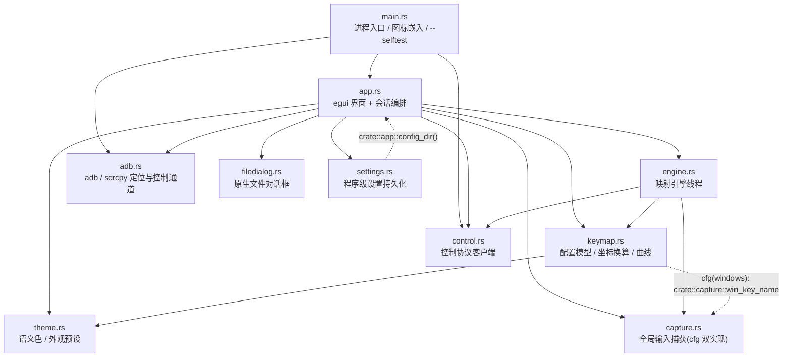
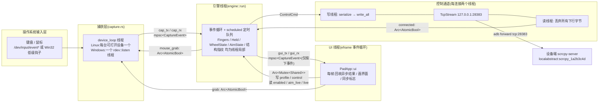
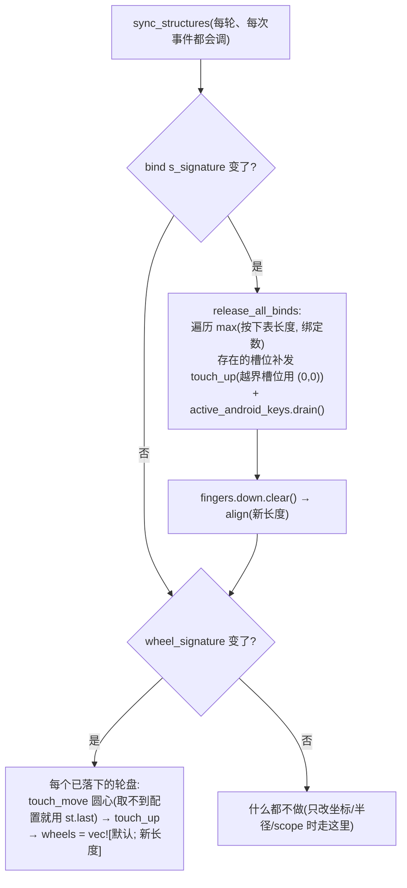
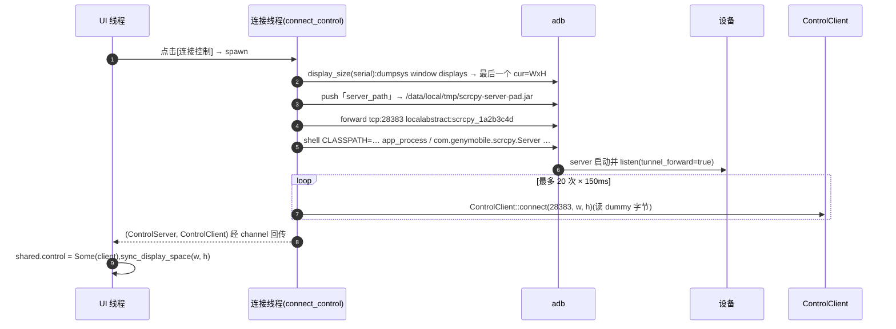
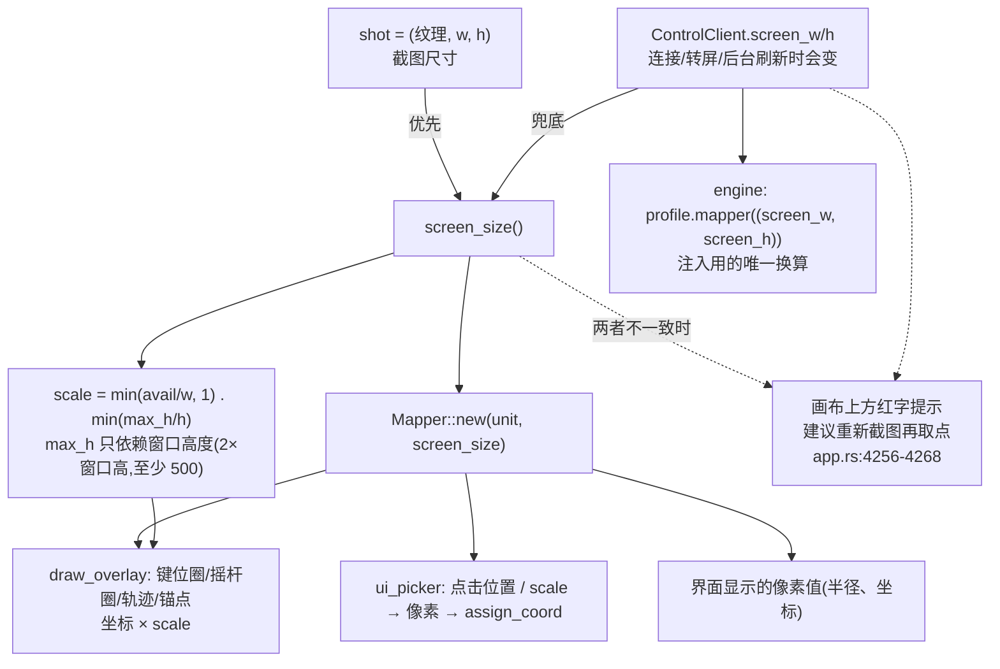

# scrcpy-pad 文件与执行逻辑

> **本文是三线文档中的第二线:文件与执行逻辑线。**
> 另两线为 `功能组分说明.md`(功能线:有哪些能力、怎么用)与 `设计思想与演进.md`(设计线:为什么这样做、踩过哪些坑)。
> 本文只回答四个问题:**有哪些文件**、**文件之间怎么互相调用**、**程序从上电到注入一次按键到底执行了什么**、**怎么构建与诊断**。
>
> **写作口径**:以 `D:\GitHub\scrcpy-pad-developing\src\` 为唯一权威源码。`scrcpy-pad\src\`(旧副本)与 `release\`(打包产物)不参与描述。
>
> **行号快照**:本文核对时的规模为 `main.rs` 177、`app.rs` 4865、`engine.rs` 1784、`keymap.rs` 1139、`capture.rs` 587、`adb.rs` 708、`theme.rs` 575、`control.rs` 243、`filedialog.rs` 81、`settings.rs` 479 行(`Get-ChildItem src\*.rs` 逐文件 `Get-Content` 计数)。这些文件在写作期间正被连续修改(接线陆续落地),因此行号仅作定位参考,**关键处优先给函数名**。
>
> **本文已计入的三批改动**:① 上一批:`Wheel.scope`、`settings.rs` 及其接线、引擎的"关闭映射收尾"重构;② 本批(2026-09-21):引擎的**共享触点池 + 物理按键镜像 + 归属对账 + 结构指纹**(§1.3 / §3.6 / §3.9)、`settings.rs` 的 **scrcpy 目录与 BOM 容错**(§1.3 / §3.2 / §7.2)、浮层的**键位显示亮度与画布坐标空间**(§1.3 / §3.2b / §7.4);③ 单测数量按 `#[test]` 实数更新(§8)。

---

## 1. 文件清单与职责

### 1.1 仓库根目录与构建元数据

| 路径 | 规模 | 职责 | 关键内容 | 被谁使用 |
|---|---|---|---|---|
| `Cargo.toml` | 41 行 | 包元数据 + 依赖 + release profile | `edition = "2024"`,`version = "0.1.3"`;依赖与 profile 见 §1.4 / §1.5 | `cargo build`,`release/build.sh`(awk 取版本号),`release/build.bat`(findstr 取版本号) |
| `Cargo.lock` | 4127 行 | 锁定全部传递依赖版本 | 直接依赖解析结果:eframe/egui `0.36.1`、evdev `0.13.2`、rdev `0.5.3`、rfd `0.15.4`、image `0.25.10`、serde `1.0.229`、serde_json `1.0.151`、anyhow `1.0.104`、directories `6.0.0`、pollster `0.4.0`、windows-sys `0.59.0`;间接:winit `0.30.13`、glow `0.17.0`、zbus `5.19.0`、ashpd `0.11.1` | cargo;不应手改 |
| `.gitignore` | 3 行 | 忽略构建产物与本地配置 | `/target`、`*.log`、`profile.json` | git |
| `.gitattributes` | 3 行 | 行尾规范化 | `* text=auto`、`*.bat text eol=crlf`(保证批处理不会因 LF 行尾出问题) | git |
| `icons/scrcpy-pad.png` | 34 534 字节 | 程序图标来源 | **编译期依赖**:`main.rs:35` 的 `include_bytes!` 直接把它烧进二进制,缺文件则编译失败(`release/build.sh` 的 `copy_common` 专门给了告警) | `main.rs::app_icon()`;发布包中另行复制一份到 `icons/` |
| `LICENSE` | 21 行 | MIT 许可证全文 | 同时被 `app.rs:25` 的 `include_str!("../LICENSE")` 嵌入,"关于"窗口内直接查看 | `app.rs::LICENSE_TEXT`;发布包 |
| `README.md` | 325 行 | 面向用户的总说明 | 不参与编译 | 发布包(`copy_common`) |
| `启动.bat` | 14 行 | 开发期 Windows 启动器 | 若 `release\windows-x86_64\scrcpy-pad.exe` 不存在则 `cargo build --release`,随后运行**发布目录里的** exe | 开发者本机 |
| `启动.sh` | 28 行 | 开发期 Linux 启动器 | 没有 `target/release/scrcpy-pad` 就先编译;再按三级策略处理 `/dev/input` 读权限(直启 → `sg input -c` → 报错退出) | 开发者本机 |

### 1.2 `src/` 模块总表

| 文件 | 行数 | 一句话职责 | 依赖的内部模块 | 被谁调用 |
|---|---|---|---|---|
| `main.rs` | 177 | 进程入口:解析 `--selftest`、构造窗口与图标、启动 eframe;声明全部 `mod`(adb, app, capture, control, engine, filedialog, keymap, **settings**, theme) | `app`、`adb`、`control`(+ 其余模块通过 `mod` 声明进入编译单元) | 操作系统(进程入口) |
| `app.rs` | 4865 | 界面与"会话指挥":egui 全量 UI、启动序列、连接编排、配置/外观/设置的读写、取点与浮层绘制 | `adb`、`capture`、`control`、`engine`、`keymap`、`theme`、`filedialog`、`settings` | `main.rs`(`app::PadApp::new`);eframe 事件循环回调 `eframe::App::ui` |
| `engine.rs` | 1784 | 映射引擎线程:消费捕获事件、优先级判定、定时动作队列、瞄准子系统、**共享触点池预算与归属对账**、把命令推进控制通道;并提供两条"关闭映射"路径共用的收尾实现 | `capture`、`control`、`keymap` | `app::PadApp::new` 里 `std::thread::spawn(\|\| engine::run(...))` |
| `keymap.rs` | 1139 | 配置数据模型与几何/曲线算法:相对坐标 ↔ 像素的 `Mapper`、动作/轮盘/瞄准/外观的 serde 结构、滑动轨迹与缓动、旧配置升级、**新建轮盘的半径与落点** | `theme`(windows 下另有 → `capture`) | `app`(UI 与绘制)、`engine`(注入换算) |
| `capture.rs` | 587 | 全局输入捕获(平台无关接口 + 两套 `#[cfg]` 实现),产出统一的 `CaptureEvent` | 无(叶子) | `app`(创建/持有 `Capture`)、`engine`(只消费 `CaptureEvent` 类型) |
| `control.rs` | 243 | scrcpy 控制协议客户端:连接、dummy 握手、序列化 32/14 字节消息、专用写线程 + 丢弃式读线程 | 无(叶子) | `app`(`ControlClient::connect`)、`engine`(每次注入) |
| `adb.rs` | 708 | adb/scrcpy 的定位(含**目录式定位与受限下探**)、查询与设备侧控制通道搭建;进程级 adb 路径静态变量 | 无(叶子) | `app`(定位/设备/截图/启动 scrcpy)、`main.rs`(`--selftest`) |
| `theme.rs` | 575 | 语义色、尺寸常量、配色/密度/背景图预设、**浮层亮度档位**,以及 `apply_style` 把外观刷进 egui 样式 | 无(叶子) | `app`、`keymap`(`Profile.look` 字段类型) |
| `filedialog.rs` | 81 | 非阻塞原生对话框(独立线程 + channel 回传),含**选择文件夹** | 无(叶子) | `app`(9 种对话框用途) |
| `settings.rs` | 479 | **程序级**设置持久化(scrcpy 目录 + 三件套路径 / 启动参数 / 上次设备),与可分享的键位配置分离;含死路径的"位置线索"保留 | `app`(取配置目录、读写文本,`crate::app::config_dir()` / `read_config_text`) | `app`(启动读取 + 帧末落盘 + 关键时刻立即落盘) |

### 1.3 逐模块公开符号

**`main.rs`**
- `fn main() -> eframe::Result<()>`
- `const APP_ICON_PNG: &[u8] = include_bytes!("../icons/scrcpy-pad.png")`
- `fn app_icon() -> Option<egui::IconData>`
- `fn selftest()`

**`app.rs`**
- 外部可见:`pub struct PadApp`、`pub fn PadApp::new(cc: &eframe::CreationContext) -> Self`、`pub fn config_dir() -> PathBuf`(配置目录的**唯一入口**:优先 `ProjectDirs` 标准目录,取不到则退化为 exe 所在目录(便携模式),最后 `.`;`profile_path`/`look_cache_path`/`settings::path` 全部由它派生)、`impl eframe::App for PadApp { fn ui(&mut self, ui: &mut egui::Ui, frame: &mut eframe::Frame) }`
- `PadApp` 私有方法(按用途分组):
  会话:`new` / `log` / `serial` / `test_scrcpy` / `connect_control` / `disconnect` / `take_screenshot` / `refresh_devices` / `effective_adb` / `resync` / `sync_suite` / `refresh_display_space` / `sync_display_space` / `screen_size` / **`inject_space`** / `stamp_profile_meta`
  编辑:`assign_key` / `assign_coord` / `begin_pick` / `begin_resize` / `cancel_draft` / `reset_draft_to_screen` / `push_undo` / `push_undo_snapshot` / `undo` / `redo` / `save_profile` / `reload_profile_from_current` / `apply_profile_switch` / `check_current_profile` / `set_res_preset` / `apply_start_preset`
  取值:`mapper` / `theme` / `look`
  程序级设置:`settings_snapshot` / `remember_now` / **`save_settings_now`** / `persist_settings` / **`apply_scrcpy_dir`** / `open_config_dir`
  界面:`ui_binds` / `ui_wheels` / `ui_aim` / `ui_aim_body` / `ui_picker` / `ui_look` / `ui_args_helper` / `arg_help_panel` / `ui_easing_editor` / `draw_overlay` / `paint_background` / `persist_look` / `key_button`(关联函数)
- 自由函数:`profile_path` / `look_cache_path` / `load_look_cache` / `load_profile` / `read_profile_at` / **`read_config_text`** / **`backup_broken_config`** / **`locate_remembered_scrcpy`** / `write_default_profile` / `fmt_timestamp` / `timestamp_compact` / `civil_from_days` / `set_circle_angle` / `circle_geometry` / `is_draft_slot` / `swipe_controls` / `draw_swipe_track` / `draw_easing_preview` / `install_cjk_font` / `egui_key_code`
- 私有类型:`StartPreset`、`ArgHelp`、`ArgEntry`、`KeySlot`、`CoordSlot`、`OverlayFilter`、`EasingEditTarget`、`DialogPurpose`(**含 `ScrcpyDir`**)、`DraftBind`(含 `Default`)
- 常量:`SCID = 0x1a2b3c4d`、`LOCAL_PORT = 28383`、`REPO_URL`、`AUTHOR`、`LICENSE_TEXT`、`BASE_SCRCPY_ARGS = "--stay-awake"`、`COORD_RANGE = -8192..=8192`

**`engine.rs`**
- `pub const DEVICE_MAX_POINTERS: usize = 10` —— 设备端 `PointersState.MAX_POINTERS`。普通绑定 / 轮盘 / 瞄准**共用**这一个池子,因此它是"按下会不会被服务端悄悄丢掉"的硬边界(见 §3.6 第 1b / 2 / 11 步)
- `pub struct EngineLive { pub pointers: usize, pub refused: u64, pub last_refused: u16 }` —— 引擎运行状态快照(当前占用触点数 / 因池满被放弃的按下次数 / 最近一次被放弃的键码;`0` 被界面解释为"瞄准")
- `pub struct Shared { pub profile: Profile, pub enabled: bool, pub control: Option<ControlClient>, pub aim_live: AimLive, pub live: EngineLive, pub toolbar_release: bool }` —— `toolbar_release` 是"顶栏[映射: 开/关]按钮请求一次关闭收尾"的**请求位**(见 §3.6 1b 与 §3.9),`live` 供左栏自检显示
- `pub struct AimLive`(公开字段:`motions/last_dx/last_dy/ox/oy/down/active/sent`)
- `pub type SharedState = Arc<Mutex<Shared>>`
- `pub fn run(shared: SharedState, rx: Receiver<CaptureEvent>, gui_tx: Sender<CaptureEvent>, mouse_grab: Arc<AtomicBool>)`
- 关闭收尾的共享实现:`pub(crate) struct EngineState<'a> { fingers: &'a mut Fingers, wheels: &'a mut Vec<WheelState>, active_android_keys: &'a mut HashSet<u16>, aim: &'a mut AimState }` 与 `pub(crate) fn release_all(ctl: Option<&ControlClient>, shared: &mut Shared, screen: (u32, u32), st: EngineState<'_>)` —— 把引擎线程独占的四份可变状态**按借用**打包,让总开关键与顶栏按钮共用同一份收尾逻辑
- 私有状态类型:`Fingers`(并发触点跟踪,`align/is_down/try_down/release/free_all`)、**`Held`(物理按键镜像,`set/has`)**、`AimState`、`SchedAct`、`WheelState`
- 私有函数:`bind_pid` / `wheel_pid` / `cancel_up_for` / `bind_point` / `point_at_progress` / `deactivate_wheel` / `release_conflicting_binds` / `update_wheel` / **`reconcile_binds`** / **`reconcile_wheels`** / **`key_owned_by_wheel`** / **`wheel_pointers`** / **`refuse`** / **`release_all_binds`** / **`sync_structures`** / **`binds_signature`** / **`wheel_signature`** / `aim_active` / `aim_lift` / `aim_release_local` / `aim_anchor` / `aim_target` / `aim_recenter` / `aim_on_motion` / `aim_tick` / `is_ctrl` / `is_alt` / `ctrl_alt_chord`
- 常量:`MAX_CONCURRENT_KEYS = 8`、`DEVICE_MAX_POINTERS = 10`、`AIM_PID = 3000`、`KEY_LEFTCTRL/RIGHTCTRL/LEFTALT/RIGHTALT`、`IDLE_FAST_MS = 4`、`IDLE_SLOW_MS = 16`

**`keymap.rs`**
- 常量:`PROFILE_VERSION = 2`、`DEFAULT_TAP_DURATION_MS = 40`、`DEFAULT_RADIUS = 0.0326`、`RADIUS_ZOOM_FACTOR = 1.12`、`BTN_RIGHT = 273`、`SCOPE_MIN = 0.2`、`SCOPE_MAX = 4.0`、`DEFAULT_WHEEL_SCOPE = 1.0`
- 函数:`zoom_radius`、`easing_apply`、`swipe_points`、`upgrade_profile`、`clamp_scope`、`key_name`(两套 `#[cfg]` 版本)
- 类型:`CoordUnit`、`Mapper`(`new/x/y/point/len/rel_x/rel_y/rel_len`)、`Easing`、`SwipePath`、`Action`(`kind_name`/`describe`)、`Swipe`(自定义 `Deserialize` 兼容旧 `points`)、`KeyBind`、`TempMode`、`TempWheel`、`Wheel`(`push_px`/`scope`)、`Profile`(`coord_unit`/`mapper`)、`RecenterMode`、`Aim`(`anchor_set`)

**`control.rs`**
- 常量:`ACTION_DOWN = 0`、`ACTION_UP = 1`、`ACTION_MOVE = 2`;私有 `TYPE_INJECT_KEYCODE = 0`、`TYPE_INJECT_TOUCH = 2`
- `pub enum ControlCmd { Touch { action, pointer_id, x, y }, Key { action, keycode } }`
- `pub struct ControlClient { tx, connected, pub screen_w, pub screen_h }`:`connect` / `is_connected` / `send` / `touch_down` / `touch_move` / `touch_up` / `key`
- 私有:`serialize(cmd, w, h) -> Vec<u8>`

**`adb.rs`**
- `set_adb_bin` / `adb_bin_now` / `adb_exe_name` / `list_devices` / `adb_version_at` / `screen_size` / `display_size` / `screencap_png` / `find_scrcpy` / `find_scrcpy_portable` / `scrcpy_exe_name` / **`find_scrcpy_explicit`**(文件或**目录**都认)/ **`find_scrcpy_in_dir`**(目录内按深度找)/ **`find_scrcpy_under`**(只往名字像 scrcpy 的子目录里下探,允许外面再套一层任意名字的文件夹)/ `find_adb_explicit` / `find_adb_in_dir` / `find_adb` / `find_server` / `scrcpy_version_at` / `device_info` / `start_control_server` / `launch_scrcpy`
- `pub struct DeviceInfo { serial, brand, model, android, screen, host_os, scrcpy }`
- `pub struct ControlServer { child, serial, port }` + `impl Drop`
- 私有:`static ADB_BIN: Mutex<Option<String>>`、`adb_bin`、`adb_cmd`、`find_in_path`、`find_scrcpy_portable_under`(**改为复用 `find_scrcpy_under`**)、`subdirs`、`scrcpy_named_subdirs`、`is_scrcpy_dir_name`、`program_base_dirs`、`find_file_recursive`、`parse_display_size`、`parse_size_token`

**`capture.rs`**
- `pub enum CaptureEvent { Button { code: u16, pressed: bool }, Motion { dx: f32, dy: f32 } }` + `pressed_code()`
- `pub struct Capture { pub grab, pub mouse_grab, pub mouse_found: Arc<AtomicBool>, stop }` + `start(tx)` + `impl Drop`
- 平台私有:Linux `platform_start`/`is_keyboard`/`is_mouse`/`device_loop`/`log_line`;Windows `platform_start`/`CURSOR_RECENTER_PX`/`cursor_center`/`move_cursor`/`set_cursor_visible`/`map_win_button`/`map_win_key`/`win_key_name`

**`theme.rs`**
- `pub mod size`(`KEY_STROKE/LABEL_FONT/SMALL_FONT/KEY_FONT/AIM_RING/AIM_ARM/WHEEL_RING`)
- `pub struct Theme`(`dark()`/`light()`/`nord()`/`catppuccin()`)
- `pub enum Preset` / `Density` / `BgFit`;`pub struct Look`(`theme`/`has_bg`/`clear_bg`,字段含 **`overlay_tone: f32`**)
- `pub fn apply_style`、`with_alpha`
- **浮层亮度档位**:`pub const TONE_MIN = -1.0` / `TONE_MAX = 1.0`、`clamp_tone`、`tone_color`、`tone_alpha`、`tone_text`、`tone_ring_fill`、`paint_label`
- 已删除:`outline_text` / `outline_stroke`(恒为白色,引入亮度档位后无调用点,原地留了说明注释)

**`filedialog.rs`**
- `pub struct FileDialogHandle` + `try_result() -> Option<Option<PathBuf>>`
- `pub fn pick_file()` / **`pick_folder()`** / `save_file(default_name: &str)`
- 私有:`Mode::{Open, Save, Folder}`、`spawn_dialog`、`run_dialog`(Windows 同步 `rfd::FileDialog`;Linux `pollster::block_on(rfd::AsyncFileDialog)`)

**`settings.rs`**
- `pub struct Settings { remember_paths, scrcpy_path, scrcpy_dir, server_path, adb_path, scrcpy_args, selected_serial, saved_at }` + `has_any_path` / `clear_paths` / **`content_eq`** / **`search_dirs`** / `sanitize`
- `pub struct SettingsCache { pending, saved, warned }` + `new(loaded)` / `mark_dirty(s)` / `save_if_dirty()`
- `pub fn path()` / `load()` / `stamped(s)`
- 私有:`default_true`(serde 默认函数)、**`nearest_existing_dir(path, max_up)`**(从死路径向上找最近一个确实存在的目录)

### 1.4 依赖清单与平台条件依赖

```toml
[dependencies]                      # 全平台
anyhow, directories, eframe(glow+default_fonts+x11+wayland),
egui, image(png+jpeg), serde(derive), serde_json

[target.'cfg(target_os = "linux")'.dependencies]
evdev = "0.13.2"                    # 全局键盘/鼠标捕获(/dev/input/event*)
rfd  = { xdg-portal, async-std }    # 原生对话框,纯 Rust zbus,无 GTK 构建依赖
pollster = "0.4"                    # 把 xdg-portal 的 async API 阻塞化

[target.'cfg(windows)'.dependencies]
rdev = "0.5.3"                      # WH_KEYBOARD_LL / WH_MOUSE_LL 低级钩子,免管理员权限
rfd  = { default-features = false } # Win32 原生对话框
windows-sys = { 0.59, Win32_Foundation, Win32_UI_WindowsAndMessaging }
                                    # 仅用于 FPS 鼠标捕获:SetCursorPos 回中、ShowCursor 隐藏光标
```

| 依赖 | 为什么要它 | 代价 / 注意 |
|---|---|---|
| `eframe` + `egui` 0.36.1 | 窗口、事件循环、立即模式 UI | `default-features = false`:只保留 `glow`(OpenGL)渲染后端,不含 wgpu → 二进制与编译时间都更小,但只有 GL 一条路径;`x11`+`wayland` 覆盖 Linux 两种会话 |
| `image` 0.25.10 | 图标解码(编译期 PNG)、截图解码、背景图 | 只开 `png`/`jpeg`,所以背景图仅支持这两种格式——`paint_background` 的报错文案与此一致 |
| `serde` + `serde_json` | `Profile`/`Look`/`Settings` 的落盘与兼容读取 | 所有"老字段缺失"的兼容都靠 `#[serde(default)]` 系列 |
| `directories` 6.0.0 | 跨平台配置目录(`ProjectDirs`) | Windows 上 `config_dir()` 落在 `%APPDATA%\<app>\config` |
| `anyhow` | 错误上下文(`{e:#}` 链式打印) | 仅用于 `Result`,不进入配置结构 |
| `pollster` | Linux 上把 async 对话框阻塞化 | 只在 `filedialog.rs` 的 Linux 分支使用 |
| `windows-sys` | `GetSystemMetrics`/`SetCursorPos`/`ShowCursor` | 只开两个 feature 子集,避免拖入整个 Win32 绑定 |

### 1.5 release profile:每一项的作用与代价

```toml
[profile.release]
lto = "thin"
codegen-units = 1
strip = true
opt-level = 2
```

| 设置 | 作用 | 代价 |
|---|---|---|
| `lto = "thin"` | 跨 crate 的 ThinLTO:允许跨 crate 内联(例如 `keymap` 的 `Mapper::point`、`control::serialize` 内联进 `engine` 的热循环),缩小体积、提升热路径速度 | 编译时间上升(需要跨 crate 汇总摘要);"thin" 比 "fat" 快很多,收益接近,是体积/时间的折中 |
| `codegen-units = 1` | 整个 crate 用一个代码生成单元 → 优化器能看到全貌,配合 LTO 得到最小最快产物 | **编译时间显著变长**,且无法并行 codegen;开发期不要开,只用于发布 |
| `strip = true` | 剥离符号表与调试信息 | 发布二进制的崩溃回溯只剩地址,线上排查 panic 变难。当前 `release/` 里的产物(Win 7.5 MB / Linux 12.6 MB)就是剥过的结果 |
| `opt-level = 2` | 比默认的 3 稍保守:少一些激进向量化/展开 | 编译更快、代码更小;对本项目(重 IO 与定时,不做重计算)运行时差异可忽略 |

> 记忆点:`codegen-units = 1` + `lto` 是"用编译时间换发布体积/性能",`strip` + `opt-level = 2` 是"用调试能力换体积"。两者都只在 `--release` 生效。

---

## 2. 模块依赖图



**为什么依赖基本是单向的**

1. **数据向下、事件向上**。配置(`Profile`)与坐标换算(`Mapper`)在 `keymap`;事件从 `capture` 流向 `engine`;命令从 `engine` 流向 `control`;`app` 处在最上层,只做"编排 + 展示",不参与执行路径。因此 `engine` 永远不会反过来调用 `app` 的界面代码。
2. **线程边界天然就是依赖边界**。`engine` 只拿到 `SharedState`、两个 channel 端点和两个 `Arc<AtomicBool>`,看不到 `PadApp`;`PadApp` 也拿不到引擎的局部状态(`scheduled`、`Fingers`、`WheelState`、`AimState` 全是引擎线程私有的栈变量)。想反向依赖都没有抓手。
3. **叶子模块零内部依赖**。`control`、`adb`、`capture`、`theme`、`filedialog` 都只依赖标准库 + 外部 crate,可以单独测试(见 §6 与各文件的 `#[cfg(test)]`)。

**有没有循环依赖?**

- **`app` ⇄ `settings`(符号级反向引用)**:`app` 调用 `settings::{load, path, stamped, SettingsCache}`;而 `settings::path()` 又调用 `crate::app::config_dir()` 来复用"配置目录"这唯一一处定义。Rust 模块之间不受 crate 依赖图的限制,这种引用完全合法,但代价是 `settings` 不再是一个能独立搬走的层。若将来要严格分层,把 `config_dir()` 提到独立模块(如 `paths.rs`)即可解除。
- **`keymap` ⇄ `capture`(仅 Windows)**:`keymap::key_name` 在 Windows 下就是 `crate::capture::win_key_name(code)`(反向映射表在 `capture.rs` 里,紧挨着 `map_win_key` 正映射,便于两表对照维护)。Linux 下走 `evdev::KeyCode(code)` 的 `Debug` 格式化,不存在这条边。
- **没有真正的调用环**:以上两处都是"借用对方的一个纯函数/常量",不存在 A 调 B、B 再回调 A 的执行环,不会出现重入或死锁。

**为什么 `keymap` 被 `engine` 和 `app` 同时依赖**

`keymap` 是**配置语义的唯一权威**——不只是"数据结构定义",还包含三样双方都必须一致的东西:

1. **坐标换算**:`Profile::mapper(space) -> Mapper`。`engine` 用它把配置里的相对坐标变成设备像素(注入),`app` 用它把像素变回相对坐标(DragValue 编辑、截图取点、浮层绘制)。两边各写一份迟早会错位(历史 bug 就是"界面显示的圈和实际手感对不上")。
2. **动作语义常量**:`DEFAULT_TAP_DURATION_MS = 40`、`DEFAULT_RADIUS = 0.0326`、`RADIUS_ZOOM_FACTOR = 1.12`、`SCOPE_MIN/MAX`、`DEFAULT_WHEEL_SCOPE`。UI 的默认值、缩放步进、引擎的判定范围必须同源。
3. **几何/曲线算法**:`swipe_points`(轨迹采样)、`easing_apply`(时间→进度的速率曲线)既被引擎用来排定每一步 `Move`,又被 `app::draw_swipe_track` / `draw_easing_preview` 用来画预览。同一函数保证"画出来的轨迹"就是"真正走出来的轨迹"。

于是依赖形态是:`app` 与 `engine` 都站在 `keymap` 之上,而 `keymap` 自己不依赖任何一方(除了 Windows 下借用 `capture` 的名字表)。

---

## 3. 程序构造与调用原理

### 3.1 `main()` 的两条执行路径

`main.rs:11` 只有一个分叉:

```rust
fn main() -> eframe::Result<()> {
    if std::env::args().any(|a| a == "--selftest") {   // 路径 A:无头自检
        selftest();
        return Ok(());
    }
    // 路径 B:GUI
    ...
    eframe::run_native("scrcpy-pad 游戏控制台", options,
        Box::new(|cc| Ok(Box::new(app::PadApp::new(cc)))))
}
```

**路径 A:`--selftest`(无头)** — 不创建窗口、不安装字体、不启动捕获与引擎线程,只做"环境 + 协议"体检(逐项见 §6),最后 `std::process::exit(0/1)`。适合 SSH/无桌面环境排障。

**路径 B:GUI** — 依次做四件事:

1. `egui::ViewportBuilder::default().with_inner_size([1180,760]).with_min_inner_size([900,600])`(main.rs:17);
2. 有图标就挂上:`viewport.with_icon(Arc::new(icon))`,图标来自 `app_icon()`;该函数把 `APP_ICON_PNG` 用 `image::load_from_memory` 解码 → `to_rgba8()` → 超过 256px 时用 Triangle 滤镜缩到 256(个别平台不接受超大图标)→ 组装 `egui::IconData`;失败返回 `None`,系统用默认图标。**因为用的是 `include_bytes!`,运行时不依赖任何外部图片文件**;
3. 组装 `eframe::NativeOptions { viewport, ..Default::default() }`(渲染后端由 Cargo feature 定为 glow);
4. `eframe::run_native(app_name, options, app_creator)`,闭包 `|cc| Ok(Box::new(PadApp::new(cc)))` 在事件循环装好窗口后调用一次,`eframe` 随后每帧调用 `PadApp` 的 `eframe::App::ui`。

> eframe 0.36 的 `App` trait 只有 `fn ui(&mut self, ui: &mut egui::Ui, frame: &mut Frame)` 是必须实现的(另有可选的 `fn logic(&mut self, ctx, frame)`,在每次 `ui` 之前、以及窗口隐藏时被调用)。本项目**没有实现 `logic`**,所有每帧工作都在 `ui` 里;因此窗口被隐藏时 eframe 不跑 egui pass,UI 侧的异步回收与开关同步会暂停——但引擎线程仍在独立运行,映射不会中断(这条是排查"最小化后行为变化"类问题的第一手线索)。

### 3.2 `PadApp::new()` 的启动序列(按代码实际顺序)

| # | 步骤 | 位置 | 做了什么 / 为什么这个顺序 |
|---|---|---|---|
| 1 | 安装 CJK 字体 | `install_cjk_font(&cc.egui_ctx)`,`app.rs:556`(`new()` 首行) | egui 内置字体不含汉字。按候选表逐个 `fs::read`:Linux 的 Noto CJK(3 个路径)、文泉驿、以及 `C:\Windows\Fonts\msyh.ttc`;都没命中再试 `~/.local/share/fonts/SourceHanSans.ttc`。命中就注册为 `"cjk"` 并追加到 `Proportional` 与 `Monospace` 两个族的**末尾**(作为回退,不改默认字体);全失败只打印一行警告,界面照常起 |
| 2 | 建两条通道 | `app.rs:557` | `(cap_tx, cap_rx): channel::<CaptureEvent>()`(捕获→引擎)、`(gui_tx, gui_rx)`(引擎→UI 的按键回传) |
| 3 | 读配置 | `load_profile().unwrap_or_default()`;`profile_path()` 同时取出 | 从 `config_dir()/profile.json` 读;文件缺失或 JSON 损坏 → 用 `Profile::default()`(内置一个 WASD 永久轮盘 + F8 总开关键),不阻塞启动。读取走 `read_config_text`(去 BOM),损坏时另存 `.broken` |
| 4 | 外观缓存覆盖 | `if let Some(cached) = load_look_cache() { profile.look = cached }`,`app.rs:573-575` | `look.json` 是"程序自用"的外观缓存:即使从未点过[保存配置],重启后外观也保持上次调好的样子。缓存优先于配置里的 `look` |
| 5 | 构造 `Shared` | `Arc::new(Mutex::new(Shared{ profile, enabled:false, control:None, aim_live:Default, live:Default, toolbar_release:false }))`,`app.rs:577-584` | 这是 UI 与引擎之间**唯一的共享可变状态**。`enabled` 起步为 false(必须按总开关键才开打),`control` 起步为 `None`;`live` 是引擎写、界面读的诊断快照 |
| 6 | 启动捕获层 | `Capture::start(cap_tx)`,`app.rs:587` | 成功 → `Some(Capture)`,失败 → `None` 并记下 `capture_err`(左栏会红字提示"输入捕获不可用")。随后克隆三个 `Arc<AtomicBool>`:`grab`、`mouse_grab`、`mouse_found`;捕获失败时用 `Arc::new(false.into())` 占位,保证后续代码不用到处判空 |
| 7 | 派生引擎线程 | `std::thread::spawn(move \|\| engine::run(shared, cap_rx, gui_tx, mouse_grab))`,`app.rs:604-609` | 顺序很关键:必须**先有捕获层(有事件源)、再有引擎(有消费者)**;引擎拿到 `cap_rx`、`gui_tx`、`mouse_grab` 后即进入自己的事件循环 |
| 8 | 读设置 + 目录线索 | `settings::load().unwrap_or_default()` → `clear_paths()`(未勾选时)→ `sanitize()`,`app.rs:611-631` | 先留一份 `loaded_raw`(磁盘上的真实内容,落盘判定以它为基准),再按 `remember_paths` 决定是否采用路径,最后 `sanitize()`:清死路径、把位置线索写进 `scrcpy_dir`。`SettingsCache::new(loaded_raw)` 把刚读出的内容当作"已落盘",避免启动时立刻回写 |
| 8′ | 启动定位 scrcpy | `app::locate_remembered_scrcpy(&saved)` → `adb::find_scrcpy()`;server 非空则直接用,否则 `adb::find_server(exe)`,`app.rs:633-684` | 三级兜底:记住的 exe(**目录也算**)→ 记住的目录里 `find_scrcpy_under` 重找 → 自动寻找。找 server 时**找不到就留空**:留给 `sync_suite` 按同目录补齐。`scrcpy_dir` 的初值取"记住的目录 > 由记住的 exe 推导出的目录" |
| 9 | 定位 adb | `adb::find_adb_explicit(saved.adb_path)` → `adb::find_adb(Some(exe))` → `adb::set_adb_bin(...)`,`app.rs:686-708` | 顺序:记住的手动路径 → scrcpy 同目录 → PATH → 平台常见安装位置。**必须在列设备之前**:Windows 上 scrcpy 正常但 `adb` 不在 PATH 时,不这样做设备列表会是空的 |
| 10 | 列设备 | `adb::list_devices()`,`app.rs:709` | 解析 `adb devices`,只收状态为 `device` 的行(offline/unauthorized 不计);结果进 `devices: Vec<String>` |
| 11 | 构造结构体 | `let mut app = Self { ... }`,`app.rs:711-775` | 关键字段:`scrcpy_args` 取记忆值(空则 `BASE_SCRCPY_ARGS = --stay-awake`);`suite_synced` 被**故意置成空四元组**,从而在首帧 `sync_suite()` 时强制做一次完整联动补齐;`settings_cache`、`settings_loaded`、`remember_paths`、`applied_suite: None`;`overlay_filter = All`、`draft = DraftBind::default()`、撤销/重做栈为空、`pending_undo = None`、`undo_frame_marked = false`;`dialog_purpose` 给个默认值仅为满足类型 |
| 12 | 写启动日志 | `app.rs:776-789` | ① 使用顺序提示"连接手机 → [连接控制] → [启动 scrcpy] → 按总开关键开启映射";② `found_msg`(自动找到 / 使用上次记住的 / 已在记住的目录里重新找到);③ 若开启了记住路径且确有路径,补一条"已读取记住的路径(<settings.json>)……";④ adb 路径(或"未找到 adb(设备列表将为空)")。日志上限 200 条(`log()` 内 `pop_front`) |
| 12b | 恢复上次设备 | `remembered.selected_serial` + `position()`,`app.rs:790-800` | 记住的序列号若仍在 `devices` 里就选中它,日志"已选中上次使用的设备: …"——省得每次重连都在下拉框里挑 |
| 13 | 交还 cc | `new()` 末尾的 `let _ = cc;` | `CreationContext` 至此已用完(只借了 `egui_ctx`),显式丢弃 |

**程序级设置插在哪**(`settings.rs`,实际代码在引擎线程 spawn 之后、寻找 scrcpy 之前)

上一版把这几步单列成"6b~12′"一张表;现在它们已经并进上面的主序列(第 8 / 8′ / 9 / 12 / 12b 步),这里只补充两处**容易搞错**的语义:

- **"关掉[记住路径]"不是"清空文件"**。启动时 `if !saved.remember_paths { saved.clear_paths() }`(`app.rs:617-620`)只是"本次不采用其中的路径",仍保留启动参数一类的偏好;真正落盘时 `settings_snapshot()`(`app.rs:1396-1416`)会在开关关闭的情况下把 `scrcpy_path / scrcpy_dir / server_path / adb_path` **换成磁盘上原有的值**——所以关掉开关不会把辛苦找好的 scrcpy 位置弄丢。
- **落盘判定的基准是"磁盘上的真实内容"**(`loaded_raw`,`app.rs:613-616`),不是"清空后的 saved"。这一点是必须的:若拿清空后的内容当基准,那么"关掉开关"这个动作本身永远算不出差异,于是**永远写不出去**,下次启动又变回"记住"并把旧路径读回来。

### 3.2b `PadApp::ui()` 的每帧执行顺序

`eframe` 每帧调用一次 `eframe::App::ui`;`PadApp::ui` 内部顺序固定(下面是逐段对照代码的清单,顺序本身有依赖关系,不可随意调换):

| # | 段落 | 做什么 | 为什么在这个位置 |
|---|---|---|---|
| 1 | 外观 | `ctx.all_styles_mut(|s| theme::apply_style(s, &look, look.has_bg()))` → `paint_background(ctx, &look)` → `persist_look(&look)` | 样式必须在任何控件绘制前刷好;背景画在 background 图层;`persist_look` 只在内容变化时写盘,放在这也是每帧调用 |
| 2 | 路径联动 | `sync_suite()` | 四元组 `(scrcpy, server, adb, scrcpy_dir)` 文本没变就直接返回;放在快捷键/界面之前,保证本帧用到的路径是补齐过的 |
| 3 | 全局快捷键 | `Ctrl+Z` 撤销、`Ctrl+Y` 重做、`Ctrl+S` 保存、`Ctrl+Shift+S` 另存为、`F5` 刷新设备 | 仅当 `waiting_key.is_none() && picking.is_none() && !ctx.egui_wants_keyboard_input()`:键位捕获或取点进行中、正在文本框里打字时不拦截,这样 `Ctrl+Z` 等本身也能被当作待绑定键 |
| 4 | 键位捕获(egui 兜底) | `waiting_key.is_some()` 时从 `ctx.input` 里找 `pressed && !repeat` 的 `Key`,优先取 `physical_key`(与全局捕获的物理键位口径一致),`egui_key_code(k)` 转 evdev 码后 `assign_key` | 与第 10 步的 `gui_rx` 形成**双路竞争**,`waiting_key` 只被消费一次,天然去重;Windows 上钩子会被 scrcpy 抢焦点,所以必须有这条兜底 |
| 5 | 响应范围缩放 | `ctx.options_mut(|o| o.zoom_with_keyboard = self.resizing.is_none())`;处于 `resizing` 时接管 `Ctrl++ / Ctrl+-`,对目标键位的 `radius` 做 `zoom_radius` 乘性缩放 | 不临时关掉 egui 内置的 Ctrl+/- 界面缩放,那个快捷键会先被 egui 吃掉(表现为"界面变大、圆圈纹丝不动") |
| 6 | 回收连接结果 | `connect_rx.try_recv()`:成功 → `server = Some(..)`、`shared.control = Some(client)`、日志触摸坐标空间、`sync_display_space(w,h)`;失败 → 日志 | 连接是后台线程做的,这里只做收尾;`sync_display_space` 必须赶在任何注入之前(引擎要到下一轮才可能用到新空间) |
| 7 | 回收截图 | `shot_rx.try_recv()` → `ctx.load_texture` → `shot = Some((tex,w,h))` → `sync_display_space(w,h)` | 截图尺寸就是"当前屏幕方向"下的真实坐标空间,顺手校正;**浮层绘制也因此优先用截图尺寸**(见 §7.4) |
| 8 | 回收文件对话框 | `dialog.try_result()` 拿到结果后按 `dialog_purpose` 分派:`ScrcpyExe`(选中的是目录就转 `apply_scrcpy_dir`) / **`ScrcpyDir`** / `ServerJar` / `AdbExe`(写入路径 + `resync()` + `test_scrcpy()`,后两者不测)、`SaveLog` / `SaveProfileAs`(写文件)、`ChooseProfile`(读入并切换,清空撤销栈)、`NewProfile`(写默认配置 + 切换)、`PickBackground`(设背景并做可见性自动调整)。选完路径/目录的分支都会追加一次 `save_settings_now()` | 每个分支都自带日志;`(_, None)` 统一记"已取消"。**选完立刻落盘 + 打日志**是刻意的:用户最在意的是"这次到底记住了没有" |
| 9 | 回收设备信息 | `loginfo_rx` 到手 → `build_log_content` → 打开"另存为"对话框(`timestamp_compact()` 生成文件名) | 两步式:先收集(步骤在线程里)再选路径 |
| 10 | 排空按键回传 | `while let Ok(ev) = self.gui_rx.try_recv() { … assign_key }` | 见第 4 步的双路去重 |
| 11 | 同步标志与状态 | `grab_flag.store(enabled && grab_enabled)`;由关到开且已连接时 `refresh_display_space()`;回收 `space_rx`;鼠标捕获状态变化时记一条日志;`server.is_some() && !connected && connect_rx.is_none()` → 判为断线并清空 | `mouse_grab` 由引擎维护,这里只读来显示;grab 只管键盘 |
| 12 | 顶栏 `egui::Panel::top("top")` | 撤销/重做、设备下拉 + [刷新]、scrcpy 参数框 + `[...]` 助手 + [启动预设]、[启动 scrcpy]、连接状态区([连接控制] / "连接中..." / ● 已连接 + [断开])、映射开关(显示总开关键名与开/关配色;点击时翻转 `shared.enabled`,若变成"关"则同时置 `shared.toolbar_release = true`,由引擎在下一轮(≤16ms)执行收尾,并记日志"映射已关闭: 正在抬起全部触点")、[关于] | 顶栏自带细滚动条样式,窗口窄时可横向滚动;按钮**不自己抬触点**——触点状态在引擎线程里,只能请求 |
| 13 | 左栏 `egui::Panel::left("left")` | 上部**可滚动的配置区**:"使用说明"折叠、捕获错误红字、**引擎状态自检**(`引擎: 触点 n/10 · 因触点池满被放弃 N 次(最近是哪个键)`,读 `Shared.live`)、[保存配置]/[另存为]/[重新加载]/[选用配置]/[新建配置]/[检测当前 json]/当前配置路径/[保存日志]、"外观"折叠(`ui_look`,含**键位显示亮度**滑块)、总开关键 + grab 复选框、"scrcpy 管理"(**scrcpy 目录输入框 + [浏览目录] + [应用]**、[自动寻找全部]/[测试并刷新]、[记住路径] / [打开配置目录]、三个路径输入框 + [浏览]/[自动]、当前 adb 与 server 版本);下部日志区(`stick_to_bottom`,固定高度,倒序取最近 200 条) | 配置区高度用 `available_height() - 150` 预留日志区,日志因此不会被顶出屏幕;引擎状态放在最前面,因为"按了没反应"是最高频的疑问 |
| 14 | 中央区 `egui::CentralPanel` | 双向滚动容器内依次:`ui_binds` → 分隔 → `ui_wheels` → 分隔 → `ui_aim` → 分隔 → `ui_picker` | 顺序即界面自上而下的顺序;截图取点(`ui_picker`)放最后,因为它绘制最重的浮层 |
| 15 | 浮窗 | 关于窗口 → 许可证窗口(`LICENSE_TEXT`);`ui_args_helper(ctx)`(随开随建、关窗丢弃临时修改);`ui_easing_editor(ctx)` | 都在中央区之后画,保证浮在最上层 |
| 16 | 帧末:撤销点 | `pending_undo` 取出并入栈(见 §3.5),`undo_frame_marked = false` | 必须在一帧所有 UI 改动之后,快照才代表"改动前" |
| 17 | 帧末:设置落盘 | `remember_now()` + `persist_settings()` | 与撤销点同批收尾;`save_if_dirty` 内部做内容比较(排除 `saved_at`),所以每帧调用无副作用。**即使关掉了[记住路径]也会登记**——开关状态本身也要落盘 |
| 18 | 请求重绘 | `ctx.request_repaint_after(Duration::from_millis(120))` | UI 至少每 120ms 醒一次去轮询那些 channel 与 `AtomicBool`;有输入时 egui 本来就会重绘 |

### 3.3 线程模型



各类线程一览:

| 线程 | 谁创建 | 生命周期 | 职责 |
|---|---|---|---|
| UI 线程 | `eframe::run_native`(进程主线程) | 到窗口关闭 | `PadApp::ui` 每帧:应用外观、`sync_suite`、回收 5 类异步结果、处理快捷键与按键捕获、画三大面板与浮窗、帧末统一入撤销栈、`request_repaint_after(120ms)` |
| 引擎线程 | `PadApp::new`(app.rs:597) | `rx` 断开(`Disconnected`)即退出,即捕获线程全停之后 | `engine::run`:定时动作调度、瞄准维护、优先级判定、注入 |
| 捕获线程(Linux) | `platform_start` 内每台设备 `spawn` | `stop == true` 时退出,退出前 `ungrab` | `device_loop`:`fetch_events` 轮询(非阻塞 + 2ms 睡)、同步 grab、把 `Key`/`RelativeAxis` 翻译成 `CaptureEvent` |
| 捕获线程(Windows) | `platform_start` 内 `spawn`,线程内再调 `rdev::listen`(rdev 自己还会起钩子线程) | `rdev::listen` 返回(通常等于进程结束) | 键盘/鼠标钩子回调、光标回中、`ShowCursor` |
| 控制写线程 | `ControlClient::connect` | `rx.recv()` 拿到 `Err`(所有 `Sender` 被丢)即退出 | 串行化命令并 `write_all`;失败即把 `connected` 置 false |
| 控制读线程 | `ControlClient::connect` | 读到 `Ok(0)`/`Err` 即退出 | 丢弃服务端下行(剪贴板等),防止接收缓冲把服务端写阻塞 |
| 短命任务线程 | `connect_control` / `take_screenshot` / `refresh_display_space` / 日志环境收集 / `filedialog::spawn_dialog` | 各自任务完成即结束 | 把阻塞操作(adb、解码、GUI 对话框)挪出 UI 线程,结果经 channel 回传 |

### 3.4 线程间通信清单

| 通道 / 原语 | 类型 | 方向 | 内容与语义 |
|---|---|---|---|
| `cap_tx` / `cap_rx` | `mpsc::channel::<CaptureEvent>` | 捕获 → 引擎 | 原始输入事件。Linux 侧 `Sender` 被 clone 进每台设备的线程;鼠标一次读取内的 `REL_X`/`REL_Y` 合并成**一个** `Motion`,减少消息数 |
| `gui_tx` / `gui_rx` | `mpsc::channel::<CaptureEvent>` | 引擎 → UI | **只转发按下事件**(`engine::run` 里的 `if ev.pressed { gui_tx.send(..) }`),供"按任意键绑定";鼠标位移不转发。UI 每帧 `try_recv` 排空 |
| `SharedState` | `Arc<Mutex<Shared>>` | 双向 | `profile`(UI 写、引擎只读并 clone 小结构)、`enabled`(引擎翻转、UI 显示与可点击)、`control`(UI 写、引擎借用)、`aim_live`(引擎写、UI 读来诊断显示)、`live: EngineLive`(引擎写、UI 读来显示"触点 n/10 · 被放弃 N 次"),`toolbar_release`(UI 置位请求关闭收尾、引擎取走并复位) |
| `connect_rx` | `Receiver<Result<(ControlServer, ControlClient), String>>` | 连接线程 → UI | 连接结果;UI 拿到后把 client 塞进 `Shared.control`,server 存进 `PadApp.server` |
| `shot_rx` | `Receiver<Result<egui::ColorImage, String>>` | 截图线程 → UI | 解码后的截图像素;UI `load_texture` 后 `sync_display_space(w,h)` |
| `space_rx` | `Receiver<(u32,u32)>` | 查询线程 → UI | 当前显示器尺寸;失败回传 `(0,0)` 被 `sync_display_space` 忽略,避免卡住后续刷新 |
| `loginfo_rx` | `Receiver<adb::DeviceInfo>` | 收集线程 → UI | 设备信息到手后组装日志文本并弹"另存为" |
| `FileDialogHandle.rx` | `Receiver<Option<PathBuf>>` | 对话框线程 → UI | `Some(None)` = 用户取消;`None` = 对话框仍开着(`try_result` 的 `Option<Option<..>>` 就是这个语义) |
| `ControlClient.tx` | `mpsc::channel::<ControlCmd>` | 引擎 → 写线程 | 无界队列、`send` 不阻塞:注入延迟与 UI 帧率解耦 |
| `ControlClient.connected` | `Arc<AtomicBool>` | 写/读线程 → 引擎/UI | 任一方出错置 false;`is_connected()` 用 `Relaxed` 读 |
| `Capture.grab` | `Arc<AtomicBool>` | UI → 捕获线程 | 每帧存 `enabled && self.grab_enabled`;Linux 据此 `EVIOCGRAB` |
| `Capture.mouse_grab` | `Arc<AtomicBool>` | 引擎 → 捕获线程 | 引擎每轮按"映射开 + 通道在线 + 瞄准启用 + 要捕获 + 锚点已设 + 门控满足 + 未被 Ctrl+Alt 释放"综合计算 |
| `Capture.mouse_found` | `Arc<AtomicBool>` | 捕获 → 引擎/UI | Linux 在 `platform_start` 里按"有 REL_X/REL_Y 设备"置位;UI 用于诊断提示 |
| `Capture.stop` | `Arc<AtomicBool>` | `Capture::drop` → 捕获线程 | 置 true 让所有 `device_loop` 退出(退出前 ungrab) |

### 3.5 锁的约定与三个陷阱

`Shared` 只有一把 `std::sync::Mutex`(标准库互斥锁**不可重入**),所以约定必须死记:

**约定 1:`PadApp::mapper()` 内部加锁,持锁时绝不能调它。**

```rust
fn mapper(&self) -> Mapper {                       // app.rs:3268
    let unit = self.shared.lock().unwrap().profile.coord_unit();
    Mapper::new(unit, self.screen_size().unwrap_or((1080, 2400)))  // screen_size 也加锁
}
```

它自己要 `lock()`,而 `screen_size()`(app.rs:3252)同样加锁 —— 已经拿着锁再调它,就是在同一线程二次 `lock` → **自锁死界面**。同一原因写在两处文档注释里:`keymap.rs` 的 `Mapper` 说明("调用方若已持有配置锁,必须先取好 Mapper 再加锁,否则会自锁")与 `draw_overlay` 的注释("坐标换算器必须**先**构造好……若先拿到配置锁再调 `self.mapper()` 会自锁,界面会直接卡死")。派生约定:`theme()`、`look()` 也加锁,同样不能在持锁块里调。

**约定 2:改配置前先取撤销快照,顺序是"先 `push_undo()`(它加锁),再进持锁块"。**

```rust
self.push_undo();                       // 加锁取快照,释放
{ let mut g = self.shared.lock().unwrap(); ... }   // 再上锁改
```

典型如 `assign_key`(app.rs:881)、`assign_coord`(app.rs:920)、删除键位/轮盘、`转长按`。反过来写就会自锁。

**约定 3(陷阱):`format!` 参数里的第二次加锁。**

`ChooseProfile` 分支特意先把两个计数取出来、放掉锁,再 `log(format!(...))`,注释写着"避免 format! 参数里两次 lock 死锁"(app.rs:1596)。这类"表达式里顺手再锁一次"的写法在本项目是明确禁止的。

**`pending_undo` 为什么存在**

界面里有大量**连续型控件**(`DragValue`、`Slider`):它们在拖动期间每帧都 `changed()`,但撤销点只能记"开始拖的那一帧"(记成修改**之前**的状态)。问题在于:这些控件往往是在**已经持锁**的块里改配置的(例如 `ui_binds` 里 `let mut g = self.shared.lock()...; if let Some(b) = g.profile.binds.get_mut(i)`),此时再调 `push_undo()` 就自锁。于是改为:进锁前先 `let before = g.profile.clone()`(那正是"修改之前"),在块内判定 `r.drag_started() || r.gained_focus()` 后把 `before` 存进 `self.pending_undo`(普通字段,不需要锁),**帧末**在 `ui()` 尾统一入栈:

```rust
// ui() 末尾(app.rs:2214 起)
let pending = self.pending_undo.take();
if let Some(before) = pending {
    // 帧中没有显式撤销点:这份快照代表整帧改动的"改动前"状态,直接入栈;
    // 帧中已有显式撤销点(某个按钮已压过栈):那份快照仍代表"更早"的状态,
    // 必须保留,否则连拖多次后撤销只能回到拖动中途。
    self.push_undo_snapshot(before);
}
self.undo_frame_marked = false;
```

即:**`pending_undo` 一律入栈**(它天然是"更早"的状态,丢掉反而会让连续拖动只能回退到中途);`push_undo_snapshot` 内部的 50 步上限负责防止栈无限增长。

**`undo_frame_marked` 的作用**

声明处的注释写着"本帧是否已有显式撤销点(用于避免与 `pending_undo` 重复记录)"(app.rs:397),由 `push_undo_snapshot()` 置 true、每帧末复位为 false。它是"本帧已经记过一个撤销点"的标记,供帧末逻辑判断是否需要再补一个 `pending_undo` 撤销点——注意当前版本的帧末实现选择**无条件保留** `pending_undo`(理由见上),因此这个标志现在只承担"记录本帧是否有显式撤销点"的职责;若将来改回"同帧去重"的合并策略,判定点就在这里。

其他与撤销相关的约定:`undo_stack` 上限 50(`if len > 50 { remove(0) }`);`apply_profile_switch`(切换/新建配置)会清空两个栈,因为旧快照指向的是别的文件的数据;`push_undo_snapshot` 接收现成快照,专供"已持锁"的调用点(如 `ui_look`、`ui_aim_body`、`PickBackground` 分支)。

### 3.6 一次按键的完整执行路径

```mermaid
sequenceDiagram
    autonumber
    participant H as 键鼠设备
    participant C as 捕获线程
    participant Q as cap 通道
    participant E as engine::run
    participant M as Mapper
    participant S as scheduled 队列
    participant W as ControlClient 写线程
    participant D as 设备端 server

    H->>C: evdev 事件 / rdev 回调
    C->>Q: CaptureEvent::Button(code, pressed)
    Q->>E: recv_timeout(wait ≤ 16ms) 取到事件
    E->>E: 顶部先清到期动作(整批一次加锁)
    E->>E: 读 enabled / toggle_key / aim 门控;Ctrl+Alt 组合判定
    E->>Q: 若为按下 → gui_tx 转发(供 UI 键位捕获)
    E->>E: held.set(code, pressed) —— 物理按键镜像
    E->>E: 总开关键 / 临时轮盘启用键 / 轮盘方向键 / 普通绑定
    E->>E: sync_structures: 结构指纹变了 → 先抬旧触点再重建
    E->>E: reconcile_binds / reconcile_wheels: 按 Held 补按或补抬
    E->>M: profile.mapper((ctl.screen_w, ctl.screen_h))
    M-->>E: 相对坐标 → 设备像素
    E->>E: 触点预算: fingers.count + 轮盘 + 瞄准 < 10 ?
    E->>S: Tap: push(now+max(duration,5)ms, Up)<br/>Swipe: push 每个 Move + 终点 Up
    E->>W: ControlCmd::Touch / ControlCmd::Key(mpsc, 不阻塞)
    W->>D: 32 字节触控 / 14 字节按键(大端)
    Note over E,S: 后续循环:到期的 Up/Move 用 swap_remove 取出并注入
    E->>SH: live = EngineLive { pointers, refused, last_refused }
```

**① 设备层 → `CaptureEvent`**

- Linux(`capture.rs::device_loop`):`device.fetch_events()` 非阻塞轮询,`WouldBlock` 时睡 2ms、其它错误睡 50ms;`EventSummary::Key` 的 `value` 为 2(自动重复)**丢弃**,否则发 `Button { code: key.0, pressed: value == 1 }`;鼠标设备的 `REL_X/REL_Y` 累加成一个 `Motion`。同一次循环里同步 grab 状态(`want != grabbed` 才调 `device.grab()/ungrab()`)。
- Windows(`platform_start` 的 `rdev::listen` 回调):`KeyPress/KeyRelease` → `map_win_key` → evdev 码;`ButtonPress/ButtonRelease` → `map_win_button`(272/273/274);`MouseMove` 统一按"上次位置→本次位置"求差发 `Motion`(抓取与否都发,瞄准要用);抓取中且光标离屏幕中心超过 `CURSOR_RECENTER_PX = 64` 像素才 `SetCursorPos` 回中,并用 `skip_next` 忽略回中自身触发的那一次事件。

**② 进入引擎循环**(`engine::run` 的主循环,每一轮顺序固定)

1. **清到期动作**:先把所有 `t <= now` 的计划动作用 `swap_remove(i)` 挑出来(`swap_remove` 后**不推进 `i`**,换过来的元素本轮继续检查,因此不会漏项;动作之间彼此无序依赖,顺序被打乱无害),然后**整批只加一次锁、只在这一小段里持锁**执行 —— 旧写法对每个到期动作都要加两次锁,而一次滑动会排入几十个 `Move`,等于几十轮加解锁。`Up` 且 pid 落在 `1000..2000` 时顺带 `fingers.release(pid-1000)`(轮盘/瞄准的 pid 不在此段,不会被误动)。
1b. **顶栏按钮的关闭请求(上升沿触发一次)**:`if g.toolbar_release && !toolbar_release_prev` 时,先把 `enabled` 置 false,再 `let ctl = g.control.take()` —— **临时把控制通道取出以拿到所有权**,这样既能读出 `screen_w/screen_h`、又能同时可变借用 `g`(借用检查器不会再抱怨);随后 `release_all(ctl.as_ref(), &mut g, screen, EngineState { fingers, wheels, active_android_keys, aim })`,最后把 `ctl` 放回 `g.control` 并复位 `aim.released`。`toolbar_release_prev = g.toolbar_release` 负责记账,使**一次点击只收尾一次**。为什么要有这条路:触点状态全部由引擎线程独占,顶栏按钮若只改 `enabled`,长按触点会永久留在屏幕上(俗称"卡键")。
2. **瞄准维护 + 同步鼠标捕获 + 刷新诊断快照**:在锁内 clone 一份 `Aim`(小结构),算 `mouse_grab` 的组合布尔值并 `store`;在线且已连接时 `aim_tick`(映射关/门控松 → 抬指;静止归中 → 回锚点),否则 `aim_release_local` 只清本地状态;把 `aim.ox/oy/down/active/sent` 抄进 `Shared.aim_live`;**同时重算 `live.pointers = fingers.count + wheel_pointers(&wheels) + usize::from(aim.down)` 并写回 `Shared.live`**(`engine.rs:890-891`)——界面左栏那行自检读的就是它。
3. **等事件**:先按状态选"轮询档位" —— `fast = (enabled && connected) || aim.down`,为真用 `IDLE_FAST_MS = 4`(归中与捕获状态必须及时),为假用 `IDLE_SLOW_MS = 16`(没连接/没开映射时上面两步什么也不做,按 4ms 空转等于白烧 250 次/秒的 CPU 与加锁);有未到期的计划动作时再与"最早到期时刻"取最小,使点按抬起/滑动每一步落在预定时刻(误差 ~1ms)。然后 `rx.recv_timeout(wait)`:`Timeout` → `continue`(回到第 1 步),`Disconnected` → `break`(捕获线程全没了 → 引擎退出)。事件到达会立刻唤醒 `recv_timeout`,所以退避只影响轮询精度,**不影响响应延迟**。
4. **Motion 分支**:更新 `aim_live` 计数/最近位移;开着映射且有在线通道时,`profile.mapper(...)` + `aim_on_motion(..., reserved = wheel_pointers + fingers.count)`(触点池满时**直接放弃**并 `refuse(&mut live, 0)`;否则累积偏移 → 落点钳制 → `touch_down/move` → 按策略归中),然后 `continue` —— 鼠标位移**不参与按键绑定流程**。
5. **转发按下事件给 UI**(键位捕获用:`if ev.pressed { gui_tx.send(...) }`)。
6. **读一次全局判定量**:`(enabled, toggle_key, aim_hold_key, aim_captured)`。
7. **瞄准门控键**:`ev.code == aim.hold_key` 时更新 `aim.gate_down`(如右键=开镜)。
8. **Ctrl+Alt 组合**:分别维护 `ctrl_down`/`alt_down`;`ctrl_alt_chord()` 要求"两者都按住 + 按下的正是 Ctrl 或 Alt",所以一次组合只触发一次;只在 `aim_captured` 时才翻转 `aim.released`(临时把鼠标交还系统)。
8b. **写物理按键镜像**:`held.set(ev.code, ev.pressed)`(`engine.rs:987-989`)。**位置在总开关键判定之前、且不受 `enabled` 与配置影响**——它是后面所有对账的唯一依据,漏掉这一次写入就等于"引擎以为用户没按这个键"。
9. **总开关键(最高优先级,任何时候都生效)**:翻转 `enabled`;**关闭瞬间**走与顶栏按钮完全相同的 `release_all`(`EngineState` 借用同一批状态):`aim_lift` 抬瞄准触点、遍历所有绑定 `fingers.release` 并按 `bind_point` 抬触点、`active_android_keys.drain()` 补发 `key(false)`、落下的轮盘先 `touch_move` 回圆心再 `touch_up`,最后 `fingers.free_all()` + 所有轮盘状态(含临时轮盘的 `active`)清零;没有控制通道时走 `None` 分支,只清本地状态(否则重开打时状态会残留)。**重新开启**时除了把 `aim.released` 复位,还要 `sync_structures` + `reconcile_binds` + `reconcile_wheels` **按物理按键状态把此刻仍按着的键补回来**(`engine.rs:1016-1056`)——这正是"关映射时全部触点被抬起,开映射后按着不放的键立刻生效"的实现。若此刻按钮也正好请求了收尾,则视为已一并处理(`toolbar_release = false`),避免下一轮再收一次。随后 `continue`。
10. **未开启 / 未连接直接跳过**:`if !enabled { continue }`;`let Some(ctl) = g.control.as_ref() else { continue }`;`if !ctl.is_connected() { continue }`。
11. **取换算器与结构对齐**:`let m = profile.mapper((ctl.screen_w, ctl.screen_h))` 是**唯一换算入口**;随后 `sync_structures(...)`(见 ②b)负责"结构变了先抬手再重建",再刷一次 `live.pointers`。这里不再有"轮盘数量变化 → `vec![默认值]`"的旧写法(它会漏抬触点)。
12. **临时轮盘启用键**:命中 `w.temp.key` 时,`Hold` 模式按下即 `active = true` 并 `release_conflicting_binds`(把与该轮盘四个方向键同键位的普通绑定/系统键先释放,免得方向输入被抢占、触点卡死),松开即 `deactivate_wheel`;`Toggle` 模式按下翻转。**只要 `active` 真的变了,就立刻 `reconcile_binds` + `reconcile_wheels` 对账一次**(`engine.rs:1131-1146`):启用方向把已按着的方向键补进摇杆,停用方向把仍按着的 `Hold`/系统键补回普通绑定。**命中即 `consumed = true` 并 `continue`** —— 启用键不会同时触发自己的其它绑定。
13. **轮盘方向键**:只处理"生效中"的轮盘(`temp.is_none()` 或 `active`);命中四向之一就调 `reconcile_wheels`(方向状态由"是否生效 × 是否按着"重算,内部再 `update_wheel`,`reserved` 带上普通绑定与瞄准的占用),**`handled = true` 并 `continue`**。
14. **普通绑定**:遍历 `profile.binds`,匹配 `bind.key == ev.code` 后按动作类型分派(下一节);申请触点时 `reserved = wheel_pointers(&wheels) + usize::from(aim.down)`,挤不进去就 `refuse(&mut live, bind.key)`;末尾刷新 `live.pointers`。

**②b 结构指纹与释放路径(本轮新增,专治"触点越攒越多")**



- **指纹只认结构**:`binds_signature` = 数量 + 每个键的键码 + 动作类型(`Tap` 还区分 `duration_ms == 0` 与否);`wheel_signature` = 数量 + 四个方向键 + 启用键与模式(`engine.rs:401-448`)。**只改坐标、半径、`scope` 不触发重建**——否则玩家一边调参一边打会被反复抬手。单测 `signatures_track_structure_not_geometry`(`engine.rs:1672`)锁死这条边界。
- **释放路径必须遍历"按下表本身"**:`release_all_binds`(`engine.rs:322-340`)取 `n = fingers.down.len().max(profile.binds.len())`,因为用户删掉的槽位里可能还记着"按着";越界槽位用 `(0,0)` 抬起——坐标一定在屏内,不会因"落在屏外"被系统整条丢弃。
- **轮盘先回中再抬**:旧圆心若在新配置里已经不存在,就用 `st.last` 兜底(`engine.rs:379-386`),同样是为了给出一个屏内坐标。
- **为什么必须这样**:索引位移之后,旧触点的"已按下"记录会被错记到别的键上(那个键于是"按了没反应"),而真正的旧触点永久留在设备上——触点池越用越少,最后所有按键都没反应。修法就是"宁可抬手重算,绝不带着旧状态跑"。

**③ `update_wheel` 的取值细节**(`engine.rs` 的 `update_wheel`)

```rust
let (wx, wy) = m.point(w.cx, w.cy);   // 圆心(像素)
let wr = w.push_px(m);                // 推出距离 = m.len(radius × clamp_scope(scope))
let dx = pressed[右] - pressed[左];  let dy = pressed[下] - pressed[上];
```

- 四个方向都没按:若触点还在屏幕上,先 `touch_move` 回圆心再 `touch_up`(回中后抬起);
- 斜向(`dx != 0 && dy != 0`)用 `1/√2` 归一化,保证斜向不"跑得更快";
- 首次按下:先看 `reserved >= DEVICE_MAX_POINTERS`,池满则**不注入**并返回 `true`(调用方 `refuse` 计数),否则 `touch_down(圆心)` 然后 `touch_move(目标)`(先落圆心再推,符合摇杆手感);
- 已在屏上且目标变了才发 `touch_move`(`st.last` 去重,省带宽)。

**④ 普通绑定的四种动作**(engine.rs 的 `match &bind.action`)

| 动作 | 按下 | 松开 | 说明 |
|---|---|---|---|
| `Tap { duration_ms > 0 }` | `fingers.try_down` 成功则 `touch_down` 并 `scheduled.push((now + max(duration_ms,5)ms, Up))` | **不处理**(统一由定时抬起收尾) | 若上一击尚未自动抬起又再次按下:先 `cancel_up_for(pid)` 撤掉旧排程、立即 `touch_up` 结束旧触点、再开新一轮 —— 保证极快连点/组合技每次点按都完整触发 |
| `Tap { duration_ms == 0 }` | 已按下则 `touch_up` + `release`(切换语义);否则 `try_down` + `touch_down` | 不处理 | "按住不松手,再按一次才抬起" |
| `Hold` | `try_down` → `touch_down` | `release` → `touch_up` | 全程实时跟随键盘 |
| `Swipe(s)` | `try_down` → 生成轨迹并排定全部步骤 | **不打断**(滑到终点由定时抬起清理状态) | 见下 |
| `AndroidKey { keycode }` | `active_android_keys.insert(kc)` 成功才 `ctl.key(true, keycode)` | `remove` 成功才 `ctl.key(false, keycode)` | 用 `HashSet<u16>` 抑制自动重复,保证按下/抬起成对 |

**⑤ 定时动作队列 `scheduled` 的调度机制**

- 结构:`Vec<(Instant, SchedAct)>`,`SchedAct::Up { pid, x, y }` 或 `SchedAct::Move { pid, x, y }`;引擎线程局部,不需要锁。
- 排定:
  - **点按**:`now + max(duration_ms, 5)ms` 一个 `Up`(默认 40ms 自动抬起);
  - **滑动**:`swipe_points(path, start_px, end_px, 64)` 采样折线(Line 只有 2 点、Rect 5 点、Circle 64 点),`point_at_progress` 按**弧长**插值,时间轴用 `easing_apply(s.easing, t)` 把 `t = k/(n-1)` 映射成进度 `prog`,第 k 步排在 `start + duration_ms * k / (n-1)`,最后再排一个 `start + duration_ms + 20ms` 的 `Up`(留 20ms 余量让手指真正停在终点)。一次滑动因此会排入最多 64 个 `Move`。
- 触发:每轮循环顶部(第 1 步)处理所有 `t <= now` 的动作。等待时长取"最近到期时刻"与**当前轮询档位**(`IDLE_FAST_MS = 4` / `IDLE_SLOW_MS = 16`)的较小值,所以点按的抬起/滑动的每一步能落在预定时刻(注释:误差由 ~4ms 降到 ~1ms);没有计划动作时退回当前档位轮询,保证瞄准维护与鼠标捕获状态及时刷新。
- 取消:`cancel_up_for(pid, &mut scheduled)` 用 `retain` 摘掉该 pid 尚未执行的 `Up`(仅被"连点抢占"使用)。
- 清理:`Up` 注入后,pid 在 `1000..2000` 范围内即普通绑定 pid,顺手 `fingers.release(pid-1000)`;轮盘(2000+)与瞄准(3000)的 pid 不受此影响。

**⑥ pid 空间划分**(避免不同子系统互相误抬)

| 用途 | pid | 生成函数 |
|---|---|---|
| 普通绑定(点按/长按/滑动) | `1000 + idx` | `bind_pid(idx)` |
| 虚拟轮盘 | `2000 + idx` | `wheel_pid(idx)` |
| FPS 瞄准触点 | `3000`(常量 `AIM_PID`) | 固定 |
| 自检用的无害 hover 指针 | `u64::MAX` | `--selftest` 内联 |

pid 分离只解决"互相误抬";**总量**另由共享触点池约束:`Fingers::try_down(idx, others)` 在"已按下、普通绑定并发已达 `MAX_CONCURRENT_KEYS = 8`、或加上轮盘与瞄准后达到 `DEVICE_MAX_POINTERS = 10`"时返回 false,调用方就不注入 `DOWN` 并 `refuse(&mut live, code)`;`release` 只在确有按下记录时返回 true,绝不误抬别的键。轮盘与瞄准的申请点同样带 `reserved` 参数(见本节的第 4 / 13 / 14 步与 §7.1)。

### 3.7 注入协议细节(control.rs)

**32 字节触控消息**(`TYPE_INJECT_TOUCH = 2`,对应 scrcpy `app/src/control_msg.c` 的 `sc_control_msg_serialize()`;所有多字节字段都是**大端**):

| 偏移 | 长度 | 字段 | 取值与含义 |
|---|---|---|---|
| 0 | 1 | `type` | 恒为 2 = 注入触摸 |
| 1 | 1 | `action` | 0=DOWN(`ACTION_DOWN`)、1=UP(`ACTION_UP`)、2=MOVE(`ACTION_MOVE`);自检另用 7=Android `ACTION_HOVER_MOVE`(只移动不点击) |
| 2..10 | 8 | `pointer_id` | 手指 id(u64 BE),即上文 pid 空间;同一次拖动必须复用同一 id |
| 10..14 | 4 | `x` | 设备像素横坐标(u32;`touch_*` 出口统一 `x.max(0)`,引擎侧还会把落点钳进屏幕) |
| 14..18 | 4 | `y` | 设备像素纵坐标 |
| 18..20 | 2 | `screen_size.w` | **注入坐标所属屏幕宽**(u16)。服务端据此判断坐标有效性;必须与当前屏幕方向一致,否则会被丢弃或落到错误位置 |
| 20..22 | 2 | `screen_size.h` | 屏幕高 |
| 22..24 | 2 | `pressure` | `action == UP` 时为 0,否则 `0xFFFF`(满压)。触摸屏不需要压感,但服务端要求字段存在 |
| 24..28 | 4 | `action_button` | 对触摸注入恒为 0(物理按键按钮掩码,触摸不涉及) |
| 28..32 | 4 | `buttons` | 同上,恒为 0 |

> `screen_size` 的来源:`ControlClient::connect(port, screen_w, screen_h)` 的入参来自 `adb::display_size()`(优先 `dumpsys window displays` 的最后一个 `cur=WxH`,失败才退回 `wm size`)。这是"当前显示器尺寸 = 触摸坐标空间"的落地方式——横屏时 `wm size` 返回自然方向(如 1280×2772)而真实坐标空间是 2772×1280,按自然方向钳制的坐标会落到屏幕外被系统丢弃。

**14 字节按键消息**(`TYPE_INJECT_KEYCODE = 0`):

| 偏移 | 长度 | 字段 | 取值与含义 |
|---|---|---|---|
| 0 | 1 | `type` | 恒为 0 = 注入按键 |
| 1 | 1 | `action` | 0=DOWN、1=UP |
| 2..6 | 4 | `keycode` | **Android keycode**(u32 BE),例如返回 4、主页 3;不是 evdev 码,由配置里的 `Action::AndroidKey { keycode }` 直接给出 |
| 6..10 | 4 | `repeat` | 恒 0(不做系统级重复) |
| 10..14 | 4 | `metastate` | 恒 0(不携带 Shift/Ctrl 等修饰状态) |

**`ControlClient::connect` 的三步**(control.rs:38):

1. `TcpStream::connect(("127.0.0.1", port))` → `set_nodelay(true)`(注入是小包,禁用 Nagle 降低延迟)→ 临时设 `read_timeout(500ms)`;
2. **读 1 个 dummy 字节**:`Ok(1)` 才算连接成立,`Ok(_)`(EOF)报"设备侧 socket 未就绪",`Err` 报超时。**为什么必要**:`adb forward` 的本地端口在**设备侧还没有监听时也会先完成 TCP 三次握手**,此时连接看起来是成功的,但设备侧随即 EOF;只有 server(以 `send_dummy_byte=true` 启动)真正 accept 后写出的那个字节到达,才证明整条链路(adb → 设备 → server)真的通了。读完把 `read_timeout` 复位为 `None`;
3. `try_clone()` 出第二条流,**起写线程**(`rx.recv()` → `serialize` → `write_all`,失败置 `connected = false` 并退出)与**读线程**(死循环读并丢弃,`Ok(0)`/`Err` 置 false 退出)。写线程的意义是把"序列化 + 可能阻塞的 socket 写"从引擎线程移走,使引擎的注入调用只是一次 `mpsc::send`。

### 3.8 设备侧通道细节(adb.rs::start_control_server)



1. **命名**:`let socket_name = format!("scrcpy_{scid:08x}")`,配合 `SCID = 0x1a2b3c4d` → `scrcpy_1a2b3c4d`;设备侧 jar 路径固定为 `const DEVICE_JAR: &str = "/data/local/tmp/scrcpy-server-pad.jar"`(自定义名字,避免与用户自己的 scrcpy 冲突)。
2. **push**:`adb -s <serial> push <server_path> /data/local/tmp/scrcpy-server-pad.jar`。路径作为**参数**传递而不经 shell,所以带空格/中文的路径也安全;stderr 非空且失败时 `bail!` 带上原文。server 必须推送到设备侧,这是 scrcpy 官方行为。
3. **forward**:`adb -s <serial> forward tcp:28383 localabstract:scrcpy_1a2b3c4d`。**必须先建 forward 再启 server** —— server 以 `tunnel_forward=true` 运行,它会 `listen` 并等待 accept,forward 先就位才不会错过连接。
4. **启 server**:`adb -s <serial> shell "CLASSPATH=/data/local/tmp/scrcpy-server-pad.jar app_process / com.genymobile.scrcpy.Server <version> scid=1a2b3c4d tunnel_forward=true video=false audio=false control=true send_device_meta=false send_frame_meta=false send_stream_meta=false send_dummy_byte=true cleanup=false power_on=false log_level=warn"`,以 `stdout = null / stderr = piped` **spawn**(不 wait,进程句柄存进 `ControlServer`)。要点:
   - `control=true` + `video=false` + `audio=false`:只开控制通道,"control-only" 模式;
   - 三个 `send_*_meta=false`:不推设备元信息/帧元信息/流元信息,因为这里没有音视频流;
   - `send_dummy_byte=true`:与 §3.7 的 dummy 握手配套;
   - `cleanup=false`:不动设备侧的显示器/电源状态;`power_on=false`:不主动点亮屏幕;
   - `<version>` 由 `adb::scrcpy_version_at()`(解析 `scrcpy --version` 第一行第 2 个词,如 `4.1`)提供,版本串必须与推送的 server jar 匹配。
5. **连接重试**:`for _ in 0..20 { ControlClient::connect(28383, w, h) … sleep(150ms) }` —— 给 server 启动留最多约 3 秒;全部失败把最后一次错误拼成"连接控制通道超时"。UI 侧用 `connect_rx` 轮询结果,期间顶栏显示"连接中..."。
6. **成功后**:`self.server = Some(server)`、`shared.control = Some(client)`,并立刻 `sync_display_space(w, h)` —— 用**连接时拿到的**坐标空间校正控制通道并顺手升级旧格式配置(`upgrade_profile`),保证"任何注入之前"坐标单位已经正确。

**`ControlServer::drop` 的三步清理**(adb.rs:484):`child.kill()` → `child.wait()`(回收僵尸,避免 `adb shell` 残留)→ `adb forward --remove tcp:28383`。三处都会触发它:`PadApp::disconnect()`(手动[断开])、UI 检测到 `!connected`(意外断线)、程序退出时 `PadApp.server` 作为字段被丢弃。

### 3.9 生命周期与资源清理

| 对象 | 创建 | 释放/清理动作 | 触发点 |
|---|---|---|---|
| `Capture`(字段 `_capture`) | `Capture::start` | `Drop` 置 `stop = true` → 各 `device_loop` 退出循环;Linux 侧退出前若处于 grabbed 会 `ungrab`;Windows 侧钩子随进程结束 | `PadApp` 被丢弃(退出)或字段被替换 |
| 键盘 grab | `device_loop` 内 `device.grab()` | `device.ungrab()`;映射关闭或 grab 复选框取消时也会立刻同步释放 | `grab_flag` 由 UI 每帧写(`enabled && grab_enabled`) |
| 鼠标抓取 | Linux `EVIOCGRAB` / Windows `SetCursorPos` 回中 + `ShowCursor(0)` | 条件不再满足即释放;Windows 靠 `want_grab != hiding` 只在**状态变化**时调用,保证 `ShowCursor` 的**内部引用计数成对**(只 hide 一次就只 show 一次),否则计数器失衡会导致光标永久消失 | 引擎每轮写 `mouse_grab` |
| `ControlClient` | `connect_control` 的连接线程 | 丢 `tx` → 写线程 `recv()` 得 `Err` 退出;读线程在 socket EOF 后退出;`connected` 供 UI 判定 | `shared.control = None`(`disconnect()` 或断线检测) |
| `ControlServer`(子进程 + forward) | `start_control_server` | `Drop`:`kill` → `wait` → `adb forward --remove tcp:28383` | 同上三处 |
| `adb` 路径静态量 | `adb::set_adb_bin` | 进程级,不清理 | 启动时与 `sync_suite` 里 adb 变化时 |
| 引擎线程 | `PadApp::new` | `cap_rx` 收到 `Disconnected` → `break` 退出(即捕获线程全停之后) | 进程退出前 `Capture::drop` |
| 映射关闭的收尾 | 两条路径:① 总开关键(引擎循环内直接调);② 顶栏[映射: 开/关]按钮(UI 置 `Shared.toolbar_release = true`,引擎在下一轮按上升沿取走) | 共用 `engine::release_all`:抬瞄准触点、按 `bind_point` 抬所有按下中的绑定触点、`key(false)` 松开系统键、落下的轮盘先 `touch_move` 回圆心再抬起,最后 `fingers.free_all()` + 轮盘状态清零;无通道时只清本地状态 | 关映射(按钮或总开关键) |
| `settings.json` | 启动时 `settings::load()`(见 §3.2) | 两条落盘路径:① **关键时刻立即落盘** `save_settings_now()`(选完路径/目录、点[应用]、[自动寻找全部]、勾选[记住路径],以及对话框回填路径的四个分支);② 帧末 `remember_now()` 登记 + `persist_settings()`。两者都走 `SettingsCache::save_if_dirty()`:内容与上次写出的**逐字段一致**(`content_eq` 排除 `saved_at`)则跳过。**关掉"记住路径"时照样登记并落盘**(只写开关状态,路径字段保持磁盘原值),否则"关掉了、下次又变回开着" | 路径/启动参数/选中设备的改动、以及"记住路径"开关的翻转 |
| 配置目录打开 | `open_config_dir()` | 先 `create_dir_all` 再 `Command::new(explorer/open/xdg-open).arg(dir).spawn()`;启动失败(没有文件管理器)退回日志里打印目录路径,由用户手开 | 左栏 scrcpy 管理区的[打开配置目录] |
| 程序退出 | 关闭主窗口 → `eframe::run_native` 返回 → 进程收尾 | `PadApp` 字段按**声明顺序**drop:`shared`(含 `control`)→ … → `_capture`(停捕获) → … → `server`(杀 server + 撤 forward)。注意:退出时**不会**强杀用户自己那个 scrcpy 画面窗口(`launch_scrcpy` 的注释明确写了由用户自行关闭) | 用户关闭窗口 |

补充两条容易踩的:

- **`disconnect()` 与断线检测**:`disconnect()` 只做 `shared.control = None; self.server = None;`(drop 顺序自然完成清理)。UI 每帧检查 `self.server.is_some() && !connected && self.connect_rx.is_none()` → 判为"控制通道已断开",同样清空并记日志。
- **映射关闭时的收尾优先级**:两条关闭路径(总开关键与顶栏按钮)都走 `engine::release_all`,都是**先抬触点再清状态**(见 §3.6 第 1b / 9 步),避免留下"手指按在屏幕上"的僵尸触点;`fingers.free_all()` 与轮盘状态清零是最后的兜底。**注意顶栏按钮只能置请求位**:触点的"已按下"记录是引擎线程的局部状态(`Fingers` / `Held` / `WheelState` / `AimState`),界面线程看不到也改不了。
- **结构变化时的释放**:与上面两条"关闭"路径并列的还有第三条释放路径 `sync_structures`(见 §3.6 ②b):绑定表/轮盘表结构一变,先抬旧触点再重建状态。三者共同的纪律是"**绝不漏抬**"——漏一个触点,设备端的 10 个名额就永久少一个。

### 3.10 坐标空间的两条分岔与浮圈绘制链路

界面里同时存在两个"屏幕尺寸",它们**用途不同、可以不一致**:

| 名字 | 取自 | 用途 | 代码位置 |
|---|---|---|---|
| 画布空间 | **优先截图尺寸**(`shot`),取不到才退回控制通道尺寸,再取不到返回 `None` | 浮层绘制、取点换算、草稿初始化、像素值显示 | `PadApp::screen_size`(`app.rs:3541-3554`) |
| 注入空间 | 控制通道的 `screen_w/screen_h` | 引擎把相对坐标换算成设备像素、注入消息里的 `screen_size` 字段 | `PadApp::inject_space`(`app.rs:3558-3564`) |



- **为什么画布必须优先截图**:浮层是**画在截图上**的。用会变的控制通道尺寸去画一张不变的图,观感就是"同一个摇杆毫无征兆地突然变大/移位"——这正是用户报的"创建新摇杆时旧摇杆瞬间变大"。
- **为什么缩放系数不能用 `available_height()`**:`ui_picker` 位于中央区滚动容器里,右侧多出一行轮盘设置就会让"剩余高度"变化,于是整张浮层跟着缩放。改成 `ui.ctx().content_rect().height()` 之后,窗口不变时同一张截图的缩放系数恒定(`app.rs:4273-4279`)。
- **不一致时不做任何自动纠正**:手机转过屏那一刻,截图与注入空间必然不同。程序只提示(红色告警 + "建议重新截取手机屏幕后再取点"),不改坐标、不改配置——自动纠正等于擅自改动用户取好的坐标(G9 那条铁律)。
- **注入这一侧不受影响**:引擎每轮自己 `profile.mapper((ctl.screen_w, ctl.screen_h))`,`screen_size()` 的变化不会渗进注入路径。

---

## 4. 平台分叉:`#[cfg]` 如何隔离差异

| 分叉点 | Linux | Windows | 统一接口 |
|---|---|---|---|
| 输入捕获实现 | `capture::platform_start`(evdev):`enumerate()` 遍历设备,`is_keyboard`(含 KEY_A/KEY_Z/KEY_ENTER)、`is_mouse`(含 REL_X/REL_Y);每台设备一个线程;`set_nonblocking(true)` + 2ms 轮询;无权限时直接探测 `/dev/input` 区分"没设备"与"没权限"并给出 `usermod -aG input` 指引 | `capture::platform_start`(rdev):单个 `rdev::listen`;键盘抓取标志保留但**不生效**(rdev 未实现 grab);鼠标改用"光标回中 + 隐藏"实现等效捕获;`mouse_found` 恒 true | `Capture { grab, mouse_grab, mouse_found, stop }` + `Capture::start()` + `Capture::drop`,产出 `CaptureEvent` |
| 键码 → 名称 | `keymap::key_name` = `format!("{:?}", evdev::KeyCode(code))`(如 `KEY_A`) | `keymap::key_name` = `capture::win_key_name(code)`,即反向查表得到 `rdev::Key` 的 `Debug` 名(如 `KeyA`),并特判 272/273/274 直接返回 `BTN_LEFT/RIGHT/MIDDLE` | 同签名 `pub fn key_name(code: u16) -> String` |
| 鼠标按键 | 内核已给 `BTN_LEFT/RIGHT/MIDDLE` = 272/273/274 | `map_win_button` 把 `rdev::Button` 映射到同一批码(`Unknown(n)` → `275 + n`) | 同一 evdev 码空间 |
| 文件对话框 | `pollster::block_on(rfd::AsyncFileDialog)`(xdg-portal,zbus 纯 Rust,无 GTK 构建依赖) | 同步 `rfd::FileDialog`(Win32 原生) | `pick_file()` / **`pick_folder()`** / `save_file()` + `FileDialogHandle::try_result()`(始终在独立线程里跑,UI 不卡) |
| 自检项 | 检查 `/dev/input/event*` 可读性 + 鼠标设备数量(REL_X/REL_Y) | 直接 `check("键盘捕获(rdev)", true, "(Windows 无需特殊权限)")` | 同一组 `check()` 与退出规则 |
| 平台依赖 | `evdev`、`rfd(xdg-portal, async-std)`、`pollster` | `rdev`、`rfd(default-features=false)`、`windows-sys` | `Cargo.toml` 的 `[target.'cfg(...)'.dependencies]` |
| adb/scrcpy 可执行名与候选路径 | `scrcpy`/`adb`;`/usr/bin`、`/usr/local/bin`、`/opt/scrcpy`、`/snap/bin`、`~/.local/bin`;server 另查 `/usr/share/scrcpy/scrcpy-server` | `scrcpy.exe`/`adb.exe`;`C:\Program Files\scrcpy`、`Program Files (x86)`、`%LOCALAPPDATA%\Programs\scrcpy`、scoop shims、chocolatey;adb 另查 `%LOCALAPPDATA%\Android\Sdk\platform-tools` | `find_scrcpy` / `find_adb` / `find_server`(用 `cfg!` 选表,签名一致) |

**"键码空间统一(rdev → evdev 码)"的设计意义**

- `CaptureEvent::Button.code` 在两平台都是 **Linux evdev 码**:键盘走 KEY_* 表(30=A、17=W……),鼠标键走 272/273/274,`win_key_name` 与 `map_win_key` 在同一文件里成对维护。
- 由此得到的直接好处:**`profile.json` 跨平台互通**。配置里 `key: 17`、`hold_key: 273` 这类数字在 Windows 与 Linux 上是同一个物理键,用户把配置文件发给别人、或在双系统之间同步,不需要任何转换;`Wheel`/`TempWheel` 的方向键、`toggle_key`、`Profile.aim.hold_key` 全都受益。
- 键位捕获也因此不必区分"键盘键"与"鼠标键":`CaptureEvent::Button` 一把抓,界面里只要展示 `key_name(code)`。显示名略有平台差异(`KEY_A` vs `KeyA`),但**数字语义完全一致**,这也是 `keymap::key_name` 允许两套实现的前提。
- Windows 上 `rdev` 的物理键位与 evdev 码一一对应,所以 `app.rs::egui_key_code`(egui `Key`/`physical_key` → evdev 码)成为捕获的第二条通路而不引入第二套编码:Windows 全局钩子会受 scrcpy 窗口抢焦点影响,于是绑定等待期优先用 egui 的 `physical_key`(注释:全局捕获按物理键位上报,优先 `physical_key` 保持一致),两条通路竞争同一个 `waiting_key`,"只消费一次,天然去重"。

---

## 5. 构建与发布链路

### 5.1 三个构建脚本的分工

| 脚本 | 平台 | 做什么 |
|---|---|---|
| `release/build.sh`(202 行) | Linux/macOS 主机 | 主链路:从 `Cargo.toml` 用 awk 取版本号(空则 `die`);`copy_common`(复制 `icons/scrcpy-pad.png`、`README.md`、`LICENSE`,图标缺失时给"编译期依赖"告警);`build_linux`(本地 `cargo build --release` → 复制 `target/release/scrcpy-pad` → `chmod +x` → 生成启动器);`build_windows`(先 `check_win_toolchain` 查 `x86_64-w64-mingw32-gcc` 与 `-dlltool`,缺则只告警并跳过;必要时 `rustup target add x86_64-pc-windows-gnu`;`cargo build --release --target x86_64-pc-windows-gnu` → 取 `target/<target>/release/scrcpy-pad.exe`);`make_archives`(`tar -czf` / `zip -qr`);`clean`;入口 `case "${1:-all}" in all\|linux\|windows\|clean)` |
| `release/build.bat`(73 行) | Windows 主机 | 只构建 Windows 版:`findstr /b "version"` 取版本(去掉引号,兜底 `0.0.0`)→ `cargo build --release` → 清空/重建 `windows-x86_64\` → 复制 exe、`icons\`、`README.md`、`LICENSE` → 生成启动器 → `Compress-Archive` 打 zip(失败则保留目录并提示)→ `pause`。脚本注释明确写着:Windows 主机无法交叉编译 Linux 版 |
| `release/Makefile`(22 行) | Linux/macOS | 极薄封装:`make` → `./build.sh all`,`make linux/windows/clean` 转发对应子命令;`.PHONY` 全部声明 |

发布用启动器是**脚本现场生成**的(不是仓库里的 `启动.sh`/`启动.bat` 的副本):

- Linux:`write_linux_launcher()` 写出一份"只做权限处理"的启动器(检查 `/dev/input/event0` → 直启 `./scrcpy-pad`;否则若已在 `input` 组则 `exec sg input -c "$PWD/scrcpy-pad"`;都不行打印 `usermod -aG input` 指引并 `exit 1`),再 `chmod +x`;
- Windows:`write_win_launcher()` 写出 `@echo off / chcp 65001 / cd /d %~dp0 / scrcpy-pad.exe`,并用 `sed -i 's/$/\r/'` 补 CRLF(与 `.gitattributes` 的 `*.bat eol=crlf` 呼应);`build.bat` 版本则用 `start "" "scrcpy-pad.exe"`。

### 5.2 产物结构

```
release/
├── build.sh / build.bat / Makefile / README.md
├── linux-x86_64/                     ← 自包含、可直接发布
│   ├── scrcpy-pad                    (strip 后的 ELF,约 12.6 MB)
│   ├── 启动.sh                       (现场生成,已 chmod +x)
│   ├── README.md  LICENSE  icons/scrcpy-pad.png
├── windows-x86_64/
│   ├── scrcpy-pad.exe                (约 7.5 MB)
│   ├── 启动.bat                      (现场生成,CRLF)
│   ├── README.md  LICENSE  icons/scrcpy-pad.png
├── scrcpy-pad-<版本>-linux-x86_64.tar.gz     (由 linux-x86_64/ 打包)
└── scrcpy-pad-<版本>-windows-x86_64.zip      (由 windows-x86_64/ 打包)
```

约定:脚本只往 `release/` 写产物,不改动项目根目录;两平台复用根目录的 `target/`(交叉编译走 `target/<target>/`),互不覆盖;压缩包名里的版本号来自 `Cargo.toml`。当前目录里能同时看到 `0.1.2` 与 `0.1.3` 的包,即版本升级后的历史产物。

**开发期 vs 发布期**:根目录的 `启动.sh` 会先编译再启动(`BIN=target/release/scrcpy-pad`),`启动.bat` 则以 `release\windows-x86_64\scrcpy-pad.exe` 为运行目标(因此首次使用需先跑一次 `release\build.bat` 生成发布目录)——这两份是"本机开发用",发布包的启动器才是"给用户用"。

---

## 6. 诊断入口:`--selftest`

`main.rs::selftest()`(main.rs:59)不建窗口、不开捕获线程,按**固定顺序**做 8 项检查,用闭包 `check(name, ok, detail)` 打印 `[PASS] / [FAIL] name detail`,任一 `FAIL` 把 `failed` 置 true:

| 顺序 | 检查 | 具体做什么 | 失败行为 |
|---|---|---|---|
| 1 | evdev 读取权限(Linux) | 遍历 `/dev/input`,只要有一个 `event*` 能被 `File::open` 即通过;失败给出 `sudo usermod -aG input $USER` 后**重新登录**的指引 | 记 FAIL,**继续** |
| 1 | 键盘捕获(rdev)(Windows) | 直接判 true,附"(Windows 无需特殊权限)" | 不会失败 |
| 1b | 鼠标设备(Linux) | `evdev::enumerate()` 过滤"支持 REL_X 且 REL_Y"的设备并计数;0 个时提示 FPS 瞄准不可用 | 记 FAIL,**继续** |
| 2 | 自动寻找 scrcpy | `adb::find_scrcpy()`(PATH → 平台常见位置 → 程序旁便携目录) | `None` → 打印 FAIL 后**立即 `exit(1)`** |
| 2 | scrcpy 版本 | `adb::scrcpy_version_at(&exe)`(解析 `scrcpy --version` 第一行) | `None` → **立即 `exit(1)`** |
| 2 | 定位 scrcpy-server | `adb::find_server(Some(&exe))`(同目录 → Linux 共享目录) | `None` → **立即 `exit(1)`** |
| 3 | 定位 adb | `adb::find_adb(Some(&exe))` 并 `set_adb_bin()`(同目录 → PATH → 平台常见位置);detail 显示实际路径,只走 PATH 时显示"(仅 PATH)" | `None` → **立即 `exit(1)`** |
| 4 | adb 设备在线 | `adb::list_devices()`,要求数量 > 0,detail 显示台数 | 为空 → **立即 `exit(1)`** |
| 5 | 读取分辨率 | `adb::screen_size(&serial)`(解析 `wm size` 的 `Physical size: WxH`) | 失败 → **立即 `exit(1)`** |
| 6 | 启动 control server | `adb::start_control_server(&serial, &server_path, &version, 0x1a2b3c4d, 28383)` —— 与 GUI 完全相同的 SCID/端口 | 失败 → 打印 `check(..., false, {err:?})` 后 **`exit(1)`** |
| 6 | TCP 连接控制通道 | `ControlClient::connect(28383, w, h)` 重试 **20 次 × 150ms**(≈3s),与 GUI 的重试策略一致 | 全失败 → **`exit(1)`** |
| 7 | 协议注入(hover) | 用 `pointer_id = u64::MAX`、`action = 7`(**Android `ACTION_HOVER_MOVE`**,只移动不点击,不会触发屏幕内容)发两帧 Touch(640,1386)与(700,1400),睡 500ms 后检查 `client.is_connected()` | 记 FAIL(不 exit) |
| — | 收尾 | `drop(client); drop(server)` → 触发 `ControlServer::drop`(kill 子进程 + `adb forward --remove tcp:28383`);打印 `全部通过` 或 `存在失败项` | `std::process::exit(if failed {1} else {0})` |

**退出码语义**:`0` = 全部通过;**`1` = 存在失败项,或在第 2~6 项中途硬退出**(硬退出时后面的检查与"全部通过/存在失败项"这行汇总都不会打印)。因此读自检输出时:**看到汇总行才代表跑完了全套**;只看到某个 FAIL 后面没了,说明是硬退出。

**两个值得记住的实现细节**:①`--selftest` 走的是 `screen_size`(自然方向)而 GUI 连接走的是 `display_size`(当前方向 `cur=`),因此自检只验证"能不能读到分辨率",不校验横竖屏坐标空间;②自检与 GUI 共用同一组常量(`0x1a2b3c4d` / `28383` / `scrcpy-server-pad.jar`),所以自检通过基本等于"GUI 的连接路径也能通",唯一差别是自检强制要求至少一台设备在线。

---

## 7. 附:能力清单(上一批 + 本批)

> 7.1~7.3 是上一批落地并逐行核对过的三处能力(`Wheel.scope`、`settings.rs` 及其在 app/main 的接线、引擎的"关闭映射收尾"重构);7.4 是本批(2026-09-21)新增能力的索引——它们的功能描述见 `功能组分说明.md`,复盘见 `设计思想与演进.md` §5.12,本文的机制描述在 §3.6 / §3.10。

### 7.1 `keymap.rs`:`Wheel.scope`(摇杆影响范围)

| 项 | 内容 |
|---|---|
| 新字段 | `Wheel { …, radius: f32, scope: f32, temp: Option<TempWheel> }`,`#[serde(default = "default_wheel_scope")]` → 老配置读入后 `scope = 1.0`,**行为与旧版逐一致** |
| 新常量 | `SCOPE_MIN = 0.2`、`SCOPE_MAX = 4.0`、`DEFAULT_WHEEL_SCOPE = 1.0`;下限不为 0 是因为"方向键按下却推不动 = 摇杆彻底失效",上限 4.0 是因为再大就推到屏幕外(超出部分被系统丢弃) |
| 新函数 | `clamp_scope(v)`(非有限值回落到默认,否则夹到 `SCOPE_MIN..=SCOPE_MAX`)与私有的 `default_wheel_scope()`(serde 默认值函数) |
| 新方法 | `Wheel::push_px(&self, m: &Mapper) -> f32` = `m.len(self.radius * clamp_scope(self.scope))` —— **"触点推多远"的唯一定义**;`Wheel::scope()` 返回已收敛的系数 |
| 语义 | `radius` 仍是界面上那个圆圈的半径(视觉),`scope` 单独放大/缩小"手指实际被推多远",从而让**视觉圈与游戏里真实摇杆的判定圈解耦**;`scope > 1` 摇杆更大幅度,`< 1` 更精细 |
| 消费点 | `engine.rs::update_wheel` 已改为 `let wr = w.push_px(m);`(`engine.rs:1427`,注释保留"半径 × 影响范围"的推导),斜向仍用 `1/√2` 归一化后乘 `wr`;凡"按方向后推多远"的计算都应走 `push_px`,避免某处漏乘导致界面圈与手感不符 |
| 兼容与测试 | `keymap.rs` 的 `wheel_scope_defaults_and_clamps`(老 json 无该字段 → 1.0;`clamp_scope` 对 0/负数/99/NaN 的收敛)与 `wheel_push_px_is_a_radius_scale`(scope 缩放与换屏幕尺寸的同比例性);`Profile::default()` 的默认轮盘显式写 `scope: DEFAULT_WHEEL_SCOPE` |
| 手工编辑 | `clamp_scope` 的注释明确覆盖"含手工编辑的 json":即便有人在 `profile.json` 里手填越界值,引擎侧也会被收敛到合法区间 |
| 与触点池的关系(本批补充) | 轮盘落触点前还要过共享触点池的预算(`reserved = 普通绑定 + 瞄准 + 其它轮盘`),池满时**放弃这次落下**并让调用方 `refuse` 计数(`engine.rs:1451-1455`) |

### 7.2 `settings.rs`:程序级设置持久化

| 项 | 内容 |
|---|---|
| 为什么单独一份 | `profile.json` 是**可传递、可另存**的用户资产(键位布局),而"我这台电脑上 scrcpy 装在哪"是本机私有环境信息 —— 混在一起,用户把配置发给别人时就带上了自己的绝对路径;`look.json` 同理 |
| 落盘位置 | `settings::path() = crate::app::config_dir().join("settings.json")`,与 `profile.json` / `look.json` **同目录**;模块注释列出各平台实际路径(Linux `~/.config/scrcpy-pad/`、Windows `%APPDATA%\scrcpy-pad\config\`、macOS `~/Library/Application Support/dev.scrcpy-pad/`),配置目录不可用时退化为"程序旁边的 settings.json"(便携模式) |
| 保存内容 | `scrcpy_path` / **`scrcpy_dir`** / `server_path` / `adb_path` / `scrcpy_args` / `selected_serial`(上次设备,重连同一台手机时优先选中),外加 `remember_paths`(默认 true)与 `saved_at`(epoch 秒,仅供查看,`#[serde(default)]` 兼容老文件) |
| scrcpy 目录字段 | `scrcpy_dir: String`(`settings.rs:28-34`)。存在的理由写在字段注释里:官方发行包换版本时目录名会变(`scrcpy-win64-v3.1 → v3.3`)、用户也常整个搬走;只记死的 exe 路径,一搬动就"重启后依旧找不到"。配套 `Settings::search_dirs()`(`settings.rs:108-124`)按"明确的目录 > 上次 exe 的所在目录"给出重找基准(去重) |
| 启动读取(实际代码) | `let mut saved = settings::load().unwrap_or_default();` ① 先留 `loaded_raw = saved.clone()`(磁盘真实内容,落盘判定以它为基准);② 若 `!saved.remember_paths` → `saved.clear_paths()`(不采用路径,但保留启动参数等偏好);③ `let remembered = saved.clone()`(供日志与字段初始化);④ `if saved.sanitize() && saved.remember_paths { eprintln!("[settings] 已修正…(死路径转为目录线索)") }`;⑤ 取出 `saved_args` 并 `SettingsCache::new(loaded_raw.clone())`(`app.rs:611-631`) |
| 怎么"跳过自动寻找" | scrcpy:先 `app::locate_remembered_scrcpy`(`app.rs:4458-4474`)——记住的 exe **或目录**里解析出可执行文件 → 到 `search_dirs()` 给出的目录里 `adb::find_scrcpy_under` 重找 → 都没有才 `adb::find_scrcpy()`;server:字段非空直接用,否则 `find_server`;adb:`adb::find_adb_explicit(saved.adb_path)`(只校验这条路径还在不在)→ `find_adb` → PATH → 平台常见位置。**版本号仍现场查一次**(`scrcpy_version_at`),只读且能顺带发现路径失效 |
| 失效回退 | `Settings::sanitize()`(`settings.rs:133-197`)去掉首尾空白,并**把死路径的位置信息保留下来**:① `scrcpy_dir` 栏若被填成文件,还给 `scrcpy_path` 按可执行文件校验;② 三个文件栏若填的是**目录**,记为 `scrcpy_dir`(用户就该这么填);③ 真死路径则清空该栏,同时用 `nearest_existing_dir(path, 2)` 向上找最近的现存目录(最多上溯两层)写进 `scrcpy_dir`。返回是否有改动 |
| 为什么"上溯两层" | 用户升级 scrcpy 常常是"把新版本解压到旁边、删掉旧版本目录"——旧 exe 的**父目录也没了**,只有再上一级还在。记着那一级,启动时就能在附近把新版本找回来;而搜索是 `find_scrcpy_under`(只往名字像 scrcpy 的子目录里下探),所以即便线索落到桌面/下载目录也不会拖慢启动 |
| 内容比较 | `Settings::content_eq(&self, other)`(`settings.rs:90-102`)把两份设置的 `saved_at` 归零后比较。**必要性**:`saved_at` 每次真正落盘都会被重新打上时间戳,若它参与比较,"已落盘内容"与"下一帧登记的内容"永远不相等 → **每 120ms 写一次盘**;`mark_dirty` 也会把时间戳归零,真正落盘时才 `stamped()` 打上 |
| 写盘策略(UI 侧方法) | `settings_snapshot()`(`app.rs:1396-1416`)把界面上的路径/目录/参数/选中设备打成一 `Settings`;`remember_now()` **无条件** `mark_dirty(...)`(登记,不写盘;即使关掉了[记住路径]也要登记,否则开关状态永远写不出去);帧末 `persist_settings()` 调 `SettingsCache::save_if_dirty()` —— 内容与上次写出的逐字段一致直接返回 `None`,所以每帧调用也不会反复写盘;失败记一条并说明"本次改动只在本次运行内有效"。`SettingsCache::new(loaded)` 把刚读出的内容当作"已落盘",避免启动时立刻回写 |
| 立即落盘 | `save_settings_now()`(`app.rs:1431-1453`):`remember_now()` + `save_if_dirty()` + 明确日志("设置已保存: <路径>" / "设置内容未变,无需写盘" / 未勾选时说明路径不会写入)。调用点:选完 scrcpy 文件/目录、选完 server、选完 adb、[自动寻找全部]、勾选[记住路径](`app.rs:1680/1693/1699/2276/2319`),以及 `apply_scrcpy_dir()` 末尾 |
| 界面入口(左栏 scrcpy 管理区) | ① **`scrcpy 目录` 输入框 + [浏览目录] + [应用]**(`app.rs:2246-2264`);[应用] 走 `apply_scrcpy_dir()`:校验是目录 → `find_scrcpy_under` 解析 exe → 补齐 server/adb → `resync()` + `test_scrcpy()` + `save_settings_now()`;② `ui.checkbox(&mut self.remember_paths, "记住路径(下次启动直接用)")`,勾选状态变化即 `save_settings_now()`,日志说明"关掉它只是下次启动不再使用,文件里已记住的内容保留";③ `small_button("打开配置目录")` → `open_config_dir()`(explorer / open / xdg-open) |
| 辅助方法 | `has_any_path()`(**含 `scrcpy_dir`**)、`clear_paths()`(清空三个路径 + 目录 + 序列号,保留 `remember_paths` 与启动参数) |
| 测试 | `legacy_settings_json_still_loads` / `sanitize_drops_nonexistent_paths_but_keeps_location_hint` / `sanitize_accepts_a_directory_as_scrcpy_location` / `cache_skips_identical_content`(其中"只有时间戳不同必须判定为没变"正是防"每帧写盘"的回归锁)/ `path_helpers` / `search_dirs_prefers_explicit_dir` |
| BOM 容错 | `settings::load()`(`settings.rs:313-324`)不再直接 `fs::read_to_string`,而是走 `app::read_config_text`(去 UTF-8 BOM);真解析失败时 `app::backup_broken_config` 另存 `xxx.json.broken` 并打印原因。`load_profile` / `load_look_cache` / `read_profile_at` 同样改走这条通路 |
| 依赖方向与实际接线 | `settings → app::{config_dir, read_config_text, backup_broken_config}`。`app.rs` 把配置目录收敛为唯一的 `pub fn config_dir() -> PathBuf`(`app.rs:4369-4379`:`ProjectDirs` → exe 同级目录(便携模式)→ `.`),`profile_path()` / `look_cache_path()` / `settings::path()` 均由它派生;`main.rs:8` 声明 `mod settings;`。`PadApp` 相关字段:`settings_cache: SettingsCache`、`settings_loaded: Settings`、`remember_paths: bool`、`scrcpy_dir: String`、`applied_suite: Option<(String,String,String)>` |

### 7.3 `engine.rs`:关闭映射的收尾重构(两条路径共用一份实现)

| 项 | 内容 |
|---|---|
| 要解决的问题 | 触点状态(`Fingers` 的按下表、`WheelState.down`、`AimState.down`、`active_android_keys`)全部是**引擎线程的局部变量**。早期只有总开关键做关闭收尾,顶栏[映射: 开/关]按钮直接改 `Shared.enabled` —— 于是"用按钮关映射"会把仍按着的触点永久留在屏幕上(俗称卡键) |
| 新字段 | `Shared.toolbar_release: bool`,UI 侧的**请求位**:按钮把映射关掉时置 true;引擎每轮读它,按**上升沿**(`toolbar_release && !toolbar_release_prev`)执行且只执行一次收尾 |
| 新类型 | `pub(crate) struct EngineState<'a> { fingers: &'a mut Fingers, wheels: &'a mut Vec<WheelState>, active_android_keys: &'a mut HashSet<u16>, aim: &'a mut AimState }` —— 用**可变借用**把四份状态打包,借用范围只覆盖收尾那一瞬间,因此不与调用点上对 `Shared` 的借用冲突 |
| 新函数 | `pub(crate) fn release_all(ctl: Option<&ControlClient>, shared: &mut Shared, screen: (u32, u32), st: EngineState<'_>)`:参数取 `screen` 而不是从 `shared.control` 里读,是为了让调用点能在**不额外持锁**的情况下先取好尺寸 |
| 借用技巧 | 引擎侧要同时拿到 `screen_w/h` 与 `&mut shared`,于是先 `let ctl = g.control.take()` 取出所有权、算出 `screen`,再 `release_all(ctl.as_ref(), &mut g, screen, ..)`,最后 `g.control = ctl` 放回 |
| 顺带的健壮性 | 收尾时轮盘按 `shared.profile.wheels.get(j)` 取配置(配置可能刚被编辑,轮盘数量以取得到的那一个为准);无通道(`None`)分支只清本地状态,保证"没连接时关映射"也不会留下"临时轮盘仍被视为已启用"之类的残留 |
| 同一批的引擎优化 | ① 到期动作改为"先收集 `due` 再**整批一次加锁**"(旧写法每个到期动作加两次锁,而一次滑动会排入几十个 `Move`);② 等待时长从"固定 4ms 轮询"改为**两档退避**:`fast = (enabled && connected) || aim.down` → `IDLE_FAST_MS = 4`,否则 `IDLE_SLOW_MS = 16`(空闲时不再 250 次/秒空转)。事件到达会立刻唤醒 `recv_timeout`,所以退避只影响轮询精度,不影响响应延迟 |

### 7.4 本批(2026-09-21)新增能力的索引

本文不重复功能描述,这里给出"新东西落在哪个文件、哪个函数"的对照,便于按图索骥:

| 能力 | 关键符号 | 代码位置 | 本文的机制描述 |
|---|---|---|---|
| 共享触点池 | `DEVICE_MAX_POINTERS`、`Fingers::try_down(idx, others)`、`update_wheel(..., reserved)`、`aim_on_motion(..., reserved)`、`wheel_pointers`、`refuse` | `engine.rs:42-46`、`123-138`、`306-314`、`1451-1455`、`588-590` | §3.6 第 4 / 11 / 13 / 14 步、§3.6 ⑥ |
| 引擎状态自检 | `EngineLive`、`Shared.live`、左栏展示 | `engine.rs:188-195`、`647-664`、`890-891`;`app.rs:2214-2235` | §3.4(通道清单)、§3.6 第 2 步、§3.2b 第 13 步 |
| 物理按键镜像 | `Held::set/has` | `engine.rs:168-184`、`987-989` | §3.6 第 8b 步 |
| 归属对账 | `reconcile_binds`、`reconcile_wheels`、`key_owned_by_wheel` | `engine.rs:210-303` | §3.6 第 9 / 12 / 13 步 |
| 结构指纹与释放路径 | `binds_signature`、`wheel_signature`、`sync_structures`、`release_all_binds` | `engine.rs:322-448` | §3.6 ②b |
| 越界防御 | `Fingers::try_down` 内的补格 | `engine.rs:130-134` | §3.6 ⑥ |
| scrcpy 目录记忆 | `Settings::scrcpy_dir`、`search_dirs`、`nearest_existing_dir`、`adb::find_scrcpy_explicit/in_dir/under`、`app::locate_remembered_scrcpy` | `settings.rs:28-34`、`108-124`、`209-223`;`adb.rs:208-258`;`app.rs:4458-4474` | §3.2 第 8 / 8′ 步、§7.2 |
| 读配置容错 | `app::read_config_text`、`app::backup_broken_config` | `app.rs:4425-4442` | §3.2 第 3 步、§7.2 |
| 浮层亮度档位 | `Look::overlay_tone`、`tone_color/tone_alpha/tone_text/tone_ring_fill/paint_label` | `theme.rs:271-274`、`417-499`;`app.rs:3065`、`3723-3741` | §7.4(本节)、功能线 §1.8 |
| 画布坐标空间 | `screen_size`(优先截图)、`inject_space`、`ui_picker` 的 scale 计算 | `app.rs:3541-3564`、`4256-4268`、`4277-4279` | §3.10 |
| 新建轮盘几何 | `NEW_WHEEL_RADIUS_PX`、`Wheel::new_default`、`next_wheel_spot`、浮层编号 | `keymap.rs:485-493`、`560-614`;`app.rs:3024-3046`、`3240-3242` | §1.3、功能线 §2.4.2 |
| 选择文件夹 | `filedialog::pick_folder`、`Mode::Folder`、`DialogPurpose::ScrcpyDir` | `filedialog.rs:20-44`、`55-81`;`app.rs:2246-2264` | §3.2b 第 8 步 |

---

## 8. 附录:测试与速查
**单元测试分布**(按 `#[test]` 实数 **39** 个,全部是纯逻辑、不需要设备):

| 文件 | 个数 | 测试 | 锁住的行为 |
|---|---|---|---|
| `engine.rs` | 12 | `aim_target_clamps_to_screen` / `aim_target_clamps_anchor_into_screen` / `aim_active_needs_anchor_and_gate` / `ctrl_alt_chord_fires_once_per_press` / `released_blocks_aim` / `point_at_progress_is_arclength_based` / `fingers_enforces_concurrency_and_pairing` / **`fingers_respects_shared_device_pointer_pool`** / **`fingers_align_grows_only`** / **`signatures_track_structure_not_geometry`** / **`wheel_ownership_follows_engagement`** / **`held_key_resumes_its_normal_bind_the_moment_the_wheel_deactivates`** | 落点与锚点钳制、生效条件(锚点 + 门控)、Ctrl+Alt 一次组合只触发一次、交还鼠标后不瞄准、弧长插值、`Fingers` 并发与成对性、**共享触点池(轮盘/瞄准占掉的名额必须从普通绑定额度里扣)**、**补长不丢状态**、**结构指纹只认结构不认几何(改坐标不触发重建、换键码/增删条目必须触发)**、**归属判定(启用键永远归临时摇杆、未启用不占方向键)**、**用户实测场景:松开启用键的瞬间,仍按着的 K 必须立刻回到普通绑定** |
| `keymap.rs` | 8 | `zoom_radius_actually_changes` / `upgrade_refuses_mismatched_orientation` / `upgrade_profile_keeps_pixel_positions` / `legacy_json_still_loads_as_pixels` / `wheel_scope_defaults_and_clamps` / `wheel_push_px_is_a_radius_scale` / **`new_wheel_radius_is_always_150px`** / **`new_wheels_do_not_stack_on_each_other`** | 半径缩放真的生效(曾经的"绝对差判默认值"bug)、方向不匹配时拒绝升级、升级不改像素位置、旧 json 仍可读、scope 缺省与收敛、**新建摇杆在 1080/2772/720 三种空间上都是 150px 且默认 WASD + 永久**、**连续新建 8 个摇杆两两不重叠且落在画面内** |
| `settings.rs` | 6 | `legacy_settings_json_still_loads` / `sanitize_drops_nonexistent_paths_but_keeps_location_hint` / **`sanitize_accepts_a_directory_as_scrcpy_location`** / `cache_skips_identical_content` / `path_helpers` / **`search_dirs_prefers_explicit_dir`** | 老设置可读(缺 `scrcpy_dir` 缺省为空)、死路径清理**且位置线索保留**、**目录被填进"路径"栏时按目录接受**、缓存不重复写盘(只差时间戳必须算没变)、路径辅助方法、`search_dirs` 的优先级与去重 |
| `adb.rs` | 5 | `find_scrcpy_portable_in_sibling_and_nested_dirs` / `ignore_dirs_not_starting_with_scrcpy` / **`explicit_path_accepts_a_directory`** / **`find_scrcpy_under_handles_wrapped_and_versioned_dirs`** / `parse_display_size_prefers_current_orientation` | 便携目录两种摆放都能找到、非 scrcpy 目录不误认、**给目录/给 exe/再套一层都能命中且空目录不凭空造**、**只往 scrcpy 名字的子目录下探**、`cur=` 优先于 `init=`(横屏坐标空间) |
| `theme.rs` | 4 | **`look_overlay_tone_defaults_to_neutral`** / **`tone_changes_lightness_but_keeps_hue`** / **`tone_text_switches_for_dark_tone`** / **`tone_ring_fill_is_identity_at_zero`** | 老配置读入 `overlay_tone = 0`;档位只改明暗不改色相、填充透明度反向微调、`clamp_tone` 对 NaN/越界的收敛;加深档换近黑字;`tone == 0` 时逐字节不变(默认观感与旧版一致) |
| `control.rs` | 3 | `touch_message_layout_matches_scrcpy` / `touch_message_clamps_negative_coords_and_release_pressure` / `key_message_layout_matches_scrcpy` | 32 字节触控与 14 字节按键消息的逐字节布局、负坐标夹 0、UP 压力为 0 |
| `app.rs` | 1 | **`remembered_scrcpy_location_survives_restart_and_move`** | 启动定位三级兜底:记住目录能找回、记住 exe 能找回、**exe 与它的父目录都被删掉时靠再上一级的线索找回新版本**、位置彻底不存在时不误报 |

> 本文上一版把总数写作 18;按现在磁盘上的 `#[test]` 实数重新点了一遍,是 **39** 个(分布见上表)。其中 `settings.rs` 的 `sanitize_drops_nonexistent_paths` 已按新语义改名为 `sanitize_drops_nonexistent_paths_but_keeps_location_hint`(死路径不再"一丢了之"),同批还新增了引擎侧 5 个、路径与配置侧 6 个测试。

**"想改某处该去哪个文件"速查**

| 想做的事 | 去这里 |
|---|---|
| 加一种按键动作(如双击、长按+滑动) | `keymap::Action`(数据 + `kind_name`/`describe`)→ `engine.rs` 的 `match &bind.action` → `app.rs::ui_binds` 的编辑控件 |
| 改注入协议 / 支持新控制消息 | `control.rs`(`ControlCmd` + `serialize`) |
| 改 scrcpy 启动参数 / 设备侧 server 行为 | `adb::start_control_server` 的 args 串;界面侧 `BASE_SCRCPY_ARGS`、`StartPreset`、`ArgHelp::defaults` |
| 改捕获行为(新设备类型、新平台) | `capture.rs` 的对应 `#[cfg]` 分支;新平台需在 `Cargo.toml` 加 `[target.'cfg(...)'.dependencies]` 并在 `keymap::key_name` 补一套 |
| 改按钮/面板布局 | `app.rs::ui`(三大面板与浮窗)+ `ui_binds`/`ui_wheels`/`ui_aim_body`/`ui_picker`/`ui_look` |
| 改浮层绘制(圈、轨迹、锚点) | `app.rs::draw_overlay`、`draw_swipe_track`、`draw_easing_preview`(颜色取 `theme::Theme` 语义色,再经 `theme::tone_*` 过一遍亮度档位) |
| **改触点相关的行为(上限、分配、释放)** | `engine.rs`:`Fingers` / `DEVICE_MAX_POINTERS` / `refuse` / `release_all_binds` / `sync_structures`——**改这里必须同时想清楚"结构变化时旧触点怎么抬"** |
| **改归属判定(哪个键归谁)** | `engine.rs::key_owned_by_wheel` + `reconcile_binds` / `reconcile_wheels`——两条路径(事件分支与对账)必须保持同一口径 |
| **改 scrcpy 定位/记忆** | `adb::find_scrcpy_explicit / in_dir / under` + `settings::Settings::search_dirs / sanitize` + `app::locate_remembered_scrcpy`(三处要一起改,否则"记住的目录"与"自动寻找"会打架) |
| 改配色/密度/背景图/浮层亮度 | `theme.rs`(`Theme` 的四个预设、`Preset::panel/window`、`apply_style`、`Look`、`TONE_MIN/MAX` 与 `tone_*`) |
| 改坐标语义 / 配置格式 | `keymap.rs`(`PROFILE_VERSION`、`CoordUnit`、`Mapper`、`upgrade_profile`)——**改这里必须同时想清楚旧配置升级路径** |
| **改画布尺寸/缩放** | `app.rs::screen_size`(画布用,优先截图)、`inject_space`(仅显示)、`ui_picker` 的 scale 计算——**别把两者弄反** |
| 加"程序级(本机私有)"的设置项 | `settings.rs::Settings` + `app.rs` 的 `SettingsCache` 接线(记得给 `content_eq` 覆盖到,否则不会落盘) |
| 改定时/延迟手感 | `engine.rs` 的 `scheduled` 排定处与 `wait` 计算;点按默认时长在 `keymap::DEFAULT_TAP_DURATION_MS` |
